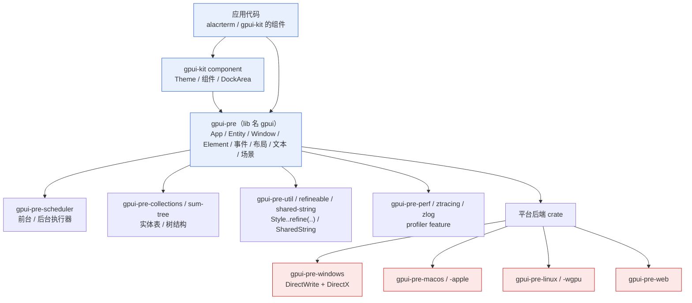
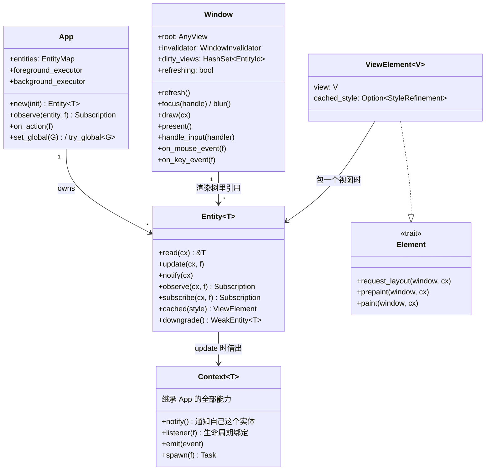
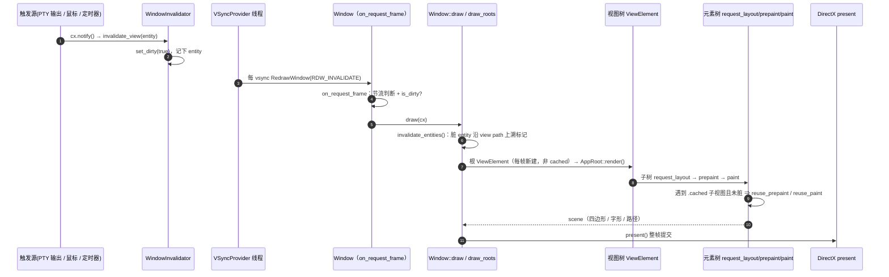
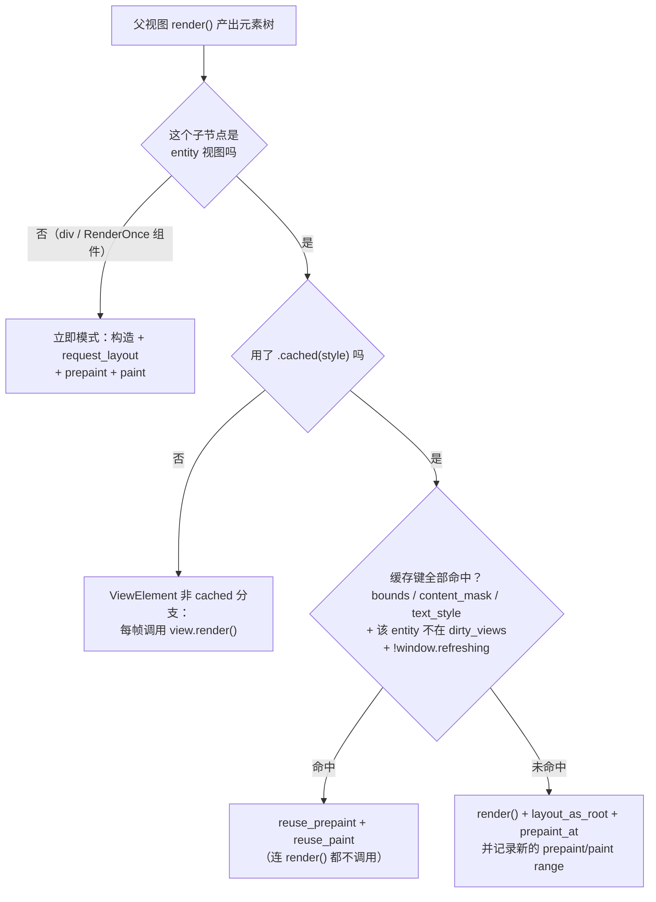
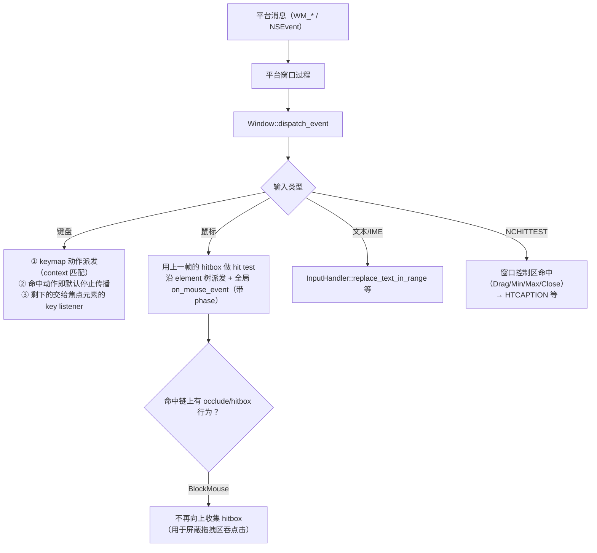

# GPUI 架构分析（源码级）

> GPUI 实现剖析：缓存覆盖哪一层、一帧里发生什么、哪些地方容易写错。
>
> - 版本：`gpui-pre` 0.3.5（lib 名就是 `gpui`），Windows 后端 `gpui-pre-windows` 0.3.5；组件库 `gpui-kit`（git main `27ab8e76`）→ `gpui-component`。
> - 源码：`~/.cargo/registry/src/*/gpui-pre-0.3.5/src`、`gpui-pre-windows-0.3.5/src`、`~/.cargo/git/checkouts/gpui-kit-*/27ab8e76/crates`；文中行号以这份源码为准，标 `≈` 为区间近似。
> - 与本仓库的落地对应见 [`terminal-architecture.md`](./terminal-architecture.md)、渲染细节见 [`terminal-view-rendering.md`](./terminal-view-rendering.md)。

## 1. 一句话总结

GPUI 是**两层混合**架构：

| 层 | 模式 | 是否默认生效 | 决定"没变要不要重做" |
|---|---|---|---|
| **状态层**：`Entity<T>` + `App` 的实体表 | **保留式（retained）** | ✅ 默认 | 不决定。状态跨帧存在，与渲染无关 |
| **渲染层**：`Render::render` 产出 `Element` 树 | **立即式（immediate）** | ✅ 默认 | 决定。**每帧重建**，除非显式 `.cached(..)` |

再叠一条容易误解的事实：**gpui 没有"脏矩形 / 局部重绘"**。一帧 = 根视图整棵元素树走完 `request_layout → prepaint → paint` + 整帧提交。`dirty_views` 只用来决定"**缓存能否复用**"，不用来决定"只画哪一块"。

## 2. crate 拓扑

要点：

- **`gpui-pre` 是纯逻辑核心**（`App` / `Entity` / `Window` / `Element` / 布局 / 文本 / 场景），平台相关代码在 `gpui-pre-<平台>` crate 里，通过 `Platform` / `PlatformWindow` trait 与核心解耦。
- **gpui-kit 不是 gpui 的一部分**，它是"组件 + 主题"层（全部是 `RenderOnce` builder），只用到 gpui 的公开能力（`Global`、`use_state`、`deferred`、`spring` 动画等）。
- Windows 路径上真正干活的是 **DirectWrite（文本）+ DirectX（绘制）**，不是 wgpu（wgpu 后端在别的平台 crate 里）。

## 3. 对象模型

关键点：

- `Entity<T>` 只是 `App.entities`（实体表）里的一个强引用句柄；**状态由 `App` 持有**。`WeakEntity<T>` 是弱引用，异步任务里常用。
- `Context<T>` 是"带 `T` 身份的应用上下文"：`cx.notify()` ⇒ **通知 `T` 这个实体**（而不是"某个元素"）。`Context` 里也能 `spawn` / `emit` / `observe`。
- `Window` 是"一帧"的舞台：它持有根视图、脏集合、缓存开关（`refreshing`）、以及平台窗口句柄。
- `Element` 是所有可视原语的 trait（`Div`、`Text`、`Svg`、以及自己实现的 `TerminalElement`）。

## 4. 帧循环（Windows）

逐步说明与代码位置：

1. **标脏**：任何 `cx.notify()` → `WindowInvalidator::invalidate_view`（`window.rs:166`）；`window.refresh()`（`window.rs:2248`）会额外把 `refreshing = true` 一直保持到本次 draw 结束。
2. **谁要求出帧**：Windows 后端的 VSync 线程每 vsync 对所有窗口 `RedrawWindow(RDW_INVALIDATE)`（`gpui-pre-windows/src/platform.rs:366-407`）→ `WM_PAINT` → `draw_window`（`gpui-pre-windows/src/events.rs:1329`）→ 回调 `request_frame(...)`。
3. **门控 + 节流**（`gpui-pre/src/window.rs` 的 `on_request_frame`，≈1700–1830）：
   - 若正在 draw（嵌套消息泵导致重入）→ `ValidateRect` 后直接返回；
   - 节流：窗口非活动 ⇒ `inactive_frame_interval`（约 30fps）；thermal Serious/Critical ⇒ 16.67ms；有 next-frame 回调（动画）时不节流；
   - **只有 `invalidator.is_dirty() || force_render` 才真正 `window.draw(cx)` + `window.present()`**，否则仅 `present()`（若需要）。
4. **`Window::draw`**（`window.rs:3143`）：`invalidate_entities()` 把累积的脏实体交给 `mark_view_dirty`（`window.rs:2140`），它沿**上一帧记录的 view path 反向**给该实体的所有祖先打脏（已脏就提前 break）。
5. **`draw_roots`**（`window.rs:3387`）：
   - `let mut root_element = self.root...into_any_element();` ← **每帧新建的 `ViewElement`，且没有 `cached_style`** ⇒ 必然调用根视图的 `render()`（这就是"根视图每帧都重画"的根源）；
   - `request_layout` → `stretch_auto_size_to_fill` → `prepaint_as_root` → 其它层（prompt / drag / tooltip / inspector）→ `paint`。
6. **元素三阶段**：每个自定义元素实现 `Element::{request_layout, prepaint, paint}`；`Div`/`Text` 等由框架提供。注意 `window.handle_input(...)` 只能在 **Paint** 阶段调用（debug 断言 `DrawPhase::Paint`）。
7. **提交**：`present()` → 平台 `draw(scene)`（Windows 走 DirectX）。**没有脏矩形**，整帧。

## 5. 元素生命周期与缓存决策

代码依据（`gpui-pre/src/view.rs`）：

- `AnyView::cached`（:39）/ `Entity::cached`（:232）—— **唯一的公开入口**；`ViewElement::cached` 是 crate-private，注释明确说"缓存只对 entity-backed 视图安全"，因为**缓存失效的契约是 `Context::notify`**，无状态视图没有这个契约。
- `ViewElement`（:240）、`ViewElementState`（:285）、`ViewElementCacheKey`（:292）。
- `request_layout`（:314）两条分支：`cached_style` 有值 ⇒ 只 `window.request_layout(root_style, ..)`（**不进子树**）；无值 ⇒ `self.view.render(window, cx)`。
- `prepaint`（≈370–460）缓存命中判定（含 `!window.dirty_views.contains(&entity_id) && !window.refreshing`）⇒ `reuse_prepaint`（`window.rs:3700`）。
- `paint` → `paint_view`（:487–520）⇒ 命中时 `reuse_paint`（`window.rs:3763`）。

### 三条"容易踩"的推论

1. **`Entity` ≠ 渲染会被跳过。** `.child(entity)` / `into_any_element()` 走的是非 cached 分支，**每帧都会 `render()`**。想省必须显式 `.cached(...)`，而且要给**确定尺寸**（cached 视图不会从内容测量）。
2. **`Window::refresh()` 会让所有缓存失效。**（`refreshing` 为真的那一帧，所有 ViewElement 都跳过复用）⇒ 主题切换、窗口尺寸变化、GPU 设备恢复这类帧是全量重建，属正常。
3. **布局没有缓存。** `Window::request_layout`（`window.rs:4928`）每次都调 `layout_engine.request_layout(style, rem_size, scale_factor, children)` 新建 taffy 节点；`taffy.rs` 里也没有缓存。所以**一帧的布局是整棵树重算**，即使元素内容没变。

## 6. 布局层（taffy 集成）

- 样式类型：`Style` / `StyleRefinement`（`refineable` crate 生成的 `..refine(..)` 链）→ `Div::style()`。gpui-kit 的 `h_flex()`/`v_flex()` 只是 `div().flex().flex_row()/flex_col()` 之类的糖。
- 常见坑（本仓库实际踩过）：
  - **`display` 默认是 Block**；`div().flex_row()` 只设了 `flex-direction`，容器仍是块级 ⇒ `items_center`/`justify_center` 全失效，必须 `.flex()`（或 `h_flex()`）。
  - 块级父容器里子元素的 `flex_1()` 不生效 ⇒ 百分比高度无从解析（终端被压成 0 高的经典翻车）。
  - `min-height: auto` 会让"内容想多大就多大"，虚拟列表/终端这类需要 `.min_h(px(0.))` 才能被压缩。
- 布局调用链：`Element::request_layout` → `window.request_layout(style, children, cx)` → `LayoutEngine`（taffy）→ `Window::draw` 里 `stretch_auto_size_to_fill(root_layout_id, viewport, scale_factor)`。

## 7. 事件系统

要点：

- **键盘是"动作优先"**：`keymap` 先按 key context 派发 `Action`，命中动作后**默认在 bubble 阶段停止传播**（`window.rs` ≈6138 的注释），然后才轮到 key listener。本仓库的 Tab 键就是被 `Root` context 的绑定抢走的，解决办法是在更深的 `"Terminal"` context 用 `NoAction` 压掉绑定。
- **鼠标命中用"上一帧"的 hitbox 集合**（`window.mouse_hit_test`），所以元素的命中区域滞后一帧；拖拽/悬停的状态判断都基于它。
- **`occlude()` 会阻断命中链**（`HitboxBehavior::BlockMouse`），这是"标题栏拖拽区吃掉子元素点击"的解法（本仓库标题栏「设置」按钮必须包 `div().occlude()`）。
- **`window.on_mouse_event`** 是窗口级监听（所有元素都能收到，带 `DispatchPhase`），适合"需要全局状态"的交互（终端拖选就用了它 + 元素级 `interactivity` 监听混合）。
- **焦点**：`FocusHandle` + focus path + tab stops；`window.focus(handle)` 内部会 `refresh()`；不要用 `window.blur()`（tab 遍历会失去起点）。

## 8. 调度、订阅与生命周期

| 机制 | 用途 | 注意 |
|---|---|---|
| `cx.spawn(|this: WeakEntity<Self>, cx: &mut AsyncApp| async move { .. })` | 前台异步任务，可安全 `this.update(cx, ..)` | 闭包里要先 clone `cx` 再进 `async` 块（借用问题） |
| `background_executor().timer(..)` | 定时器（光标闪烁、指标采样） | 定时回调里用 `this.update`，不要 `update_in`（拿不到窗口） |
| `cx.observe(&entity, f)` | **通知**订阅：`notify()` 时回调 | 返回的 `Subscription` 是 RAII，必须存字段或 `.detach()` |
| `cx.subscribe(&entity, f)` | **事件**订阅：`cx.emit(ev)` 时回调 | 与 observe 是两条独立通道 —— 只 subscribe 收不到 notify（本仓库拖选 bug 的根因） |
| `cx.on_action(f)` | 全局动作监听（不依赖焦点路径） | 回调只有 `&mut App`，要窗口得配合 `defer` 让出一拍 |
| `Global`（`cx.set_global` / `try_global` / `Global::global_mut`） | 无实体归属的全局状态（主题、配置） | 值改变后要显式 `refresh_windows()` / `notify()` 才能反映到界面 |

## 9. 渲染后端（Windows）

- **文本**：DirectWrite（`gpui-pre-windows/src/direct_write.rs`）；`TextSystem` 负责字体解析、`shape_line`（按 `TextRun` 塑形）、字形光栅化并写入**字形 atlas**、复用 `ShapedLine`（形状缓存）—— 所以"重新 paint"≠"重新光栅化"。
- **绘制**：DirectX（`directx_renderer.rs`）：四边形、字形 sprite、路径、阴影、surface 都在这里提交；`scene.rs` 是后端无关的场景描述（`PaintQuad / PaintGlyph / PaintPath / PaintSurface`）。
- **帧同步**：`vsync.rs` 的 `VSyncProvider`（阈值 1ms，默认 16.6ms 兜底）+ `platform.rs::begin_vsync_thread` 每 vsync 失效所有窗口；`present()` 提交。
- **profiler**（feature `profiler`）：`window.frame_duration_snapshot()` / `input_latency_snapshot()` / `debug_frame_overlay`（可在窗口里叠 FPS/帧耗时）。

## 10. 性能模型

**贵的是"每帧把整棵树重建一遍"**（taffy 全量布局 + prepaint 构造 hitbox/样式/文本 + paint 录制 scene），终端自己的绘制只占小头。

### 优化清单（按收益排序）

1. **把每帧不变的子树做成 entity + `.cached(...)`**（侧边栏、状态栏、标题栏、大块面板）：命中缓存时连 `render()` 都不调用，prepaint/paint 直接复用。
2. **减少标脏源**：不是每个消息都需要 `notify()`（例如"标题没变就别 notify 根视图"）；注意 `Window::refresh()` 会绕过所有缓存，别滥用。
3. **别在 `render()` 里做重活**（文件 IO、正则、大量分配）；`render()` 每帧都会被调用。
4. **避免每帧的 syscall**：如 `window.set_window_title()`（`SetWindowTextW`）应只在标题变化时调用。
5. **动画用 gpui 的 spring/`request_animation_frame` 机制**，它会在动画期间维持帧；别自己写忙轮询。

### 常见误解

| 误解 | 事实 |
|---|---|
| "用了 `Entity` 就不会重复渲染" | 渲染复用只由 `.cached(..)` 决定；`.child(entity)` 每帧 `render()` |
| "gpui 会只重绘脏的那块" | 没有脏矩形；一帧 = 根视图整棵树 + 整帧提交 |
| "`cx.notify()` 是让某个元素重绘" | 它是"通知**该实体**的观察者 + 让窗口变脏"；没观察者等于没通知 |
| "数据改了界面就会更新" | 必须 `notify()`（或经 observe/subscribe 桥接） |
| "`display:flex` 是默认的" | 默认 Block；`flex_row()` 只设方向 |

## 11. 与本仓库的对应关系

| GPUI 机制 | 本仓库对应位置 | 相关坑（见 `terminal-architecture.md`） |
|---|---|---|
| 根视图 + `Render` | `crates/alacrterm/src/main.rs::AppRoot::render` | 每帧重建整棵树；dock/侧边栏/状态栏都没 cached |
| `Element` 三阶段 | `crates/terminal_view/src/terminal_element.rs` | `handle_input` 只能在 paint；自定义 Element 才有"完全控制" |
| `notify` / `observe` / `subscribe` | `TerminalView::new`（`cx.subscribe` 收事件 + `cx.observe` 收通知） | **只 subscribe 会导致拖选不跟手**（§4.4） |
| `.cached(..)` | dock 面板 `panel.cached(..)`（`crates/alacrterm/src/tab_bar.rs`） | 它让终端不再"顺便"重绘，暴露了上面的缺陷 |
| `Global` | 主题 / 配置（`crates/alacrterm/src/config.rs`） | 改完要 `refresh_windows()` |
| key context / `NoAction` | `"Terminal"` context 压掉 Tab 绑定 | 动作优先于 key listener |
| `occlude()` | 标题栏「设置」按钮 | 否则被拖拽区吞点击 |
| `h_flex()` / `flex()` | 侧边栏、状态栏、标签栏 | 只写 `flex_row()` 会让居中失效 |
| gpui-kit dock | `DockArea` + `SessionPane` + 自绘标签栏 | `PanelStyle::TabBar`、`panel_handle`、`set_locked` 的语义 |

## 12. 源码索引（本文引用到的关键位置）

| 机制 | 位置 |
|---|---|
| 标脏 / 窗口级刷新 | `gpui-pre/src/window.rs:166`（`invalidate_view`）、`:2248`（`refresh`） |
| 脏集合与上溯 | `gpui-pre/src/window.rs:125`（`dirty_views`）、`:2140`（`mark_view_dirty`）、`:3313`（`invalidate_entities`） |
| 帧绘制 | `gpui-pre/src/window.rs:3143`（`draw`）、`:3387`（`draw_roots`） |
| 缓存复用 | `gpui-pre/src/window.rs:3700`（`reuse_prepaint`）、`:3763`（`reuse_paint`） |
| 视图元素与缓存 | `gpui-pre/src/view.rs:39/232`（`cached` 入口）、`:240`（`ViewElement`）、`:314`（`request_layout`）、`≈370`（`prepaint` 判定）、`≈487`（`paint_view`） |
| 布局（无缓存） | `gpui-pre/src/window.rs:4928`（`request_layout`）、`gpui-pre/src/taffy.rs` |
| Element trait | `gpui-pre/src/element.rs:73`（定义）、`:666`（`AnyElement` 实现） |
| 帧门控 / 节流 | `gpui-pre/src/window.rs` `on_request_frame`（≈1700–1830） |
| Windows 后端 | `gpui-pre-windows/src/platform.rs:366`（vsync 线程）、`events.rs:1329`（`draw_window`）、`:959`（`handle_hit_test_msg`）、`direct_write.rs`、`directx_renderer.rs` |
| gpui-kit 组件层 | `gpui-kit/crates/component/src/{theme,title_bar,sidebar,dock}/*.rs` |
