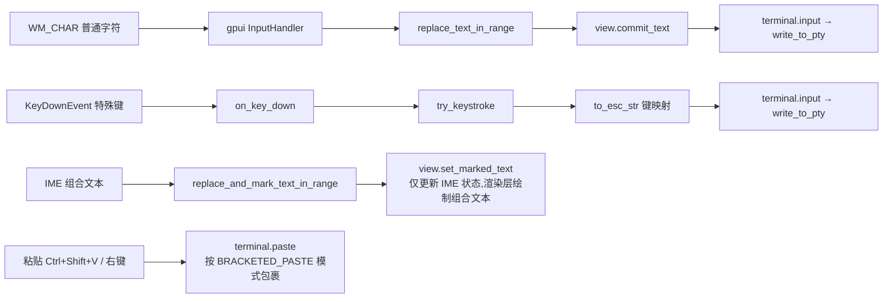

# alacrterm 终端实现分析

> 生成日期:2026-08-06(最近更新 2026-09-10)
> 分析对象:工作区 `d:\WorkSpace\alacrterm` 全部源码
>
> 说明:§4 起为**终端核心**(仿真/渲染/事件循环),不随应用外壳变化;§3 为**应用外壳**
> (多会话、侧边栏、标签栏、弹窗、右键菜单、状态栏指标),随功能演进更新。

---

## 1. 项目概述

`alacrterm` 是一个基于 **`gpui-pre 0.3`**(依赖名仍为 `gpui`,由 gpui-kit 配套提供)做 UI、**`gpui-kit 0.6`**(包名 `gpui-component`,自绘组件库)做标题栏 / 侧边栏 / 标签页等组件、**`alacritty_terminal 0.26`**(Alacritty 的纯终端仿真核心)做仿真的独立终端模拟器:终端核心由 Zed 的 `terminal` / `terminal_view` crate 精简而来,应用外壳(多会话 + 远程连接)是自建部分。

**核心特征:**

- 移除 Zed 的 `settings` crate 依赖:`TerminalColors` 本地定义(XTerm 深色默认)、`CursorShape` / `AlternateScroll` 本地枚举
- `TerminalBuilder::new` 精简签名:`new(working_directory, shell, env, cx) -> Task<Result<TerminalBuilder>>`,PTY 在后台线程就绪后经 `subscribe(cx)` 启动事件循环
- 渲染完全由 gpui 的 `StyledText` / `paint_quad` 逐 cell 驱动,与 Alacritty 网格模型通过 `Content` 快照解耦
- 集成 `gpui-kit` 自绘标题栏(`TitleBar`),隐藏系统标题栏(主窗口标题为固定文案 `Alacrterm`;终端 OSC 标题只用于标签页 / 侧边栏显示)
- 保留完整功能:事件循环、批量事件处理、选择/复制、vi mode、超链接、鼠标协议、进程标题检测
- **多会话外壳**:左右两条可拖拽侧边栏(左:会话列表 / 右:会话信息)夹着中间的标签栏 + 终端;标签可全部关闭,关闭后中间容器一并消失;任一侧折叠时该侧让位给终端。**窗口底部是三条并列的状态栏**:左右两条各属于对应侧边栏(宽度随侧边栏,内含各自的折叠按钮与图标),中间那条是公共状态栏(会话指标;某侧折叠时暂代它的「展开」按钮)(见 §3.2)
- **远程连接**:「新建终端」对话框收集 IP / 端口 / 名称 / 用户名 / 密码,填了 IP 即用 `ssh -p <端口> [user@]IP` 启动(依赖本机 OpenSSH 客户端);密码字段目前只收集、不参与建连(见 §3.4)
- **会话显示名**:用户填写的名称优先(`Session::title`),否则回退到终端 OSC 标题
- **状态栏指标**:连接状态 / 连接目标 / 会话进程 CPU / 内存 / 系统网络速率,每 1.5s 采样(见 §3.6)
- **独立设置窗口**:自绘标题栏的独立窗口,重复点击只激活已有窗口(见 §3.5)
- **右键菜单**:侧边栏会话条目使用 Action 风格菜单项(见 §3.7)
- **会话结束不退出应用**:进程结束只标记「已断开」(见 §5 事件表)

**依赖栈:**

| 依赖 | 用途 |
|---|---|
| `gpui`(crate `gpui-pre 0.3`,lib 名仍为 `gpui`) | UI 框架、窗口、文本布局、事件分发 |
| `gpui-kit 0.6`(`features = ["component"]`) | 自绘标题栏、Sidebar / Tabs / StatusBar / Settings / Resizable、`icon_named!` 图标、主题系统 |
| `alacritty_terminal 0.26` | VT 序列解析、网格模型、PTY 封装(`tty` 模块) |
| `portable-pty 0.9` | 经 alacritty `tty` 间接使用的跨平台 PTY |
| `sysinfo 0.39` | `terminal`:前台进程信息 / 工作目录 / 标题检测;`alacrterm`:状态栏指标的 CPU / 内存 / 网络采样 |
| `rust-embed` | 内嵌 `assets/icons` 资源(图标、主题等) |
| `windows 0.62`(Windows) | `SearchPathW` 路径解析、`GetProcessId` |
| `futures 0.3` / `parking_lot 0.12` | 事件循环 `select_biased!` 批处理、`FairMutex` Term 锁 |
| `schemars` / `serde` | `TerminalColors` 等配置结构的 JSON Schema 支持;`serde` 另供 `alacrterm` 自定义 Action 派生 `Deserialize` |

---

## 2. 整体架构

```mermaid
graph TB
    subgraph app层[crates/alacrterm]
        MAIN[main.rs<br/>入口 + AppRoot:共享状态/布局装配/指标采样任务]
        SBAR[status_bar.rs<br/>中间列底部公共状态栏:会话指标 + 折叠侧的展开按钮<br/>STATUS_BAR_HEIGHT 统一三条状态栏高度]
        SIDE[sidebar_panel.rs<br/>左/右侧边栏]
        TPANEL[terminal_panel.rs<br/>中间容器:自绘标签栏 + 终端]
        TBAR[tab_bar.rs<br/>自绘标签栏(不用 gpui-kit 的 TabBar/Tab)]
        DIALOG[connection_dialog.rs<br/>「新建终端」对话框(ssh)]
        SETWIN[settings_window.rs<br/>独立设置窗口]
        METRICS[status_metrics.rs<br/>CPU / 内存 / 网络采样]
        ACT[actions.rs<br/>自定义 Action + 全局监听器]
        ASSET[assets.rs<br/>rust-embed 图标 + icon_named! 宏]
    end

    subgraph view层[crates/terminal_view]
        VIEW[lib.rs<br/>TerminalView 实体:生命周期/输入/焦点]
        ELEM[terminal_element.rs<br/>TerminalElement 渲染管线]
        CONTRAST[contrast.rs<br/>APCA 对比度算法]
    end

    subgraph core层[crates/terminal]
        TERM[terminal.rs<br/>Terminal 实体 + 事件循环]
        ALAC[alacritty.rs<br/>封装 alacritty_terminal]
        PTYINFO[pty_info.rs<br/>sysinfo 前台进程查询]
        HYPER[alacritty/hyperlinks.rs<br/>URL/路径检测]
        MAP[ mappings/<br/>keys.rs mouse.rs colors.rs]
    end

    subgraph util层[crates/util]
        SHELL[shell.rs<br/>Windows shell 探测]
        PATH[paths.rs / rel_path.rs]
    end

    MAIN --> VIEW
    MAIN --> SIDE
    MAIN --> TPANEL
    MAIN --> SBAR
    MAIN --> DIALOG
    MAIN --> SETWIN
    MAIN -->|注册全局监听器| ACT
    SBAR -->|读采样值| METRICS
    MAIN -->|gpui-kit TitleBar 等组件| GPUIC[gpui-kit 0.6<br/>gpui-component]
    VIEW --> TERM
    TERM --> ALAC
    ALAC --> PTYINFO
    ALAC --> HYPER
    TERM --> MAP
    TERM --> SHELL
    HYPER --> PATH
    ALAC -.tty::Pty.-> OS[OS 伪终端<br/>conpty/winpty]
```

### 目录结构

```
Cargo.toml                      # workspace 根,统一依赖版本(resolver = "3", edition 2024)
assets/
  icons/                        # rust-embed 内嵌的图标资源(含 SquareTerminal 等)
  keymaps/ settings/            # 保留自 Zed 的配置模板(当前未使用)
crates/
  alacrterm/                    # 应用层(见 §3):入口 + 多会话外壳 + 弹窗 + 状态栏指标
    src/
      main.rs                   # 入口 + AppRoot:共享状态、布局装配、指标采样任务、defer 辅助
      status_bar.rs             # 中间列底部的公共状态栏(会话指标 + 折叠侧的展开按钮);`STATUS_BAR_HEIGHT` 统一三条状态栏高度
      sidebar_panel.rs          # 左侧边栏(会话列表 + 右键菜单) / 右侧边栏(会话信息) + 两枚折叠开关
      terminal_panel.rs         # 中间容器:自绘标签栏(见 tab_bar.rs) + 终端区(无边框卡片)
      tab_bar.rs                # 自绘标签栏:只用 gpui 原语(div/svg)绘制的标签、关闭按钮与右端「+」
      welcome.rs                # 终端容器关闭后的欢迎页(空态背景板:logo + 标题 + 开始使用)
      connection_dialog.rs      # 「新建终端」对话框:表单 + ssh 参数组装 + 页脚按钮
      settings_window.rs        # 独立设置窗口(自绘标题栏、窗口句柄复用)
      status_metrics.rs         # sysinfo 采样:连接状态 / CPU / 内存 / 网络 + 字节格式化
      actions.rs                # 自定义 Action(NewTerminal / CloseSession) + 全局监听器
      assets.rs / build.rs      # 图标资产 / Windows 版本资源
  terminal_view/                # 视图层(独立 crate):
    src/
      lib.rs                    # TerminalView:终端创建/事件订阅/键盘输入/焦点/IME/滚动
      terminal_element.rs       # TerminalElement:三阶段渲染管线(核心,约 1800 行)
      contrast.rs               # APCA 最小对比度算法(自 Zed 移植)
  terminal/                     # 核心层:终端仿真 + PTY + 事件循环
    src/
      terminal.rs               # Terminal 实体、事件系统、输入/鼠标/滚动逻辑(约 2600 行)
      alacritty.rs              # alacritty_terminal 的桥接层(类型别名 + 转换函数)
      alacritty/hyperlinks.rs   # OSC 8 / URL 正则 / 路径猜测
      pty_info.rs               # sysinfo 进程信息查询
      mappings/                 # keys.rs(按键→转义) mouse.rs(鼠标协议) colors.rs
  util/                         # shell 探测、路径工具(shell.rs / paths.rs / rel_path.rs / util.rs)
```

---

## 3. 应用外壳:启动、布局与会话

### 3.1 应用入口(`main.rs`)

```rust
fn main() {
    gpui_kit::application()
        .with_assets(assets::Assets)                 // rust-embed 嵌入 assets/icons
        .with_quit_mode(QuitMode::LastWindowClosed)  // 全部窗口关闭即退出
        .run(|cx: &mut App| {
            gpui_kit::init(cx);                      // 初始化组件库(主题、图标等)
            Theme::change(ThemeMode::Dark, None, cx); // 终端为深色背景,界面跟随暗色主题

            let bounds = Bounds::centered(None, size(px(1100.), px(700.)), cx);
            cx.open_window(
                WindowOptions {
                    window_bounds: Some(WindowBounds::Windowed(bounds)),
                    // 隐藏系统标题栏,改用 gpui-kit 的 TitleBar 自绘(拖拽/双击最大化由它处理)
                    ..TitleBar::window_options()
                },
                |window, cx| {
                    // 建窗即新建一个本地会话(PTY 在后台启动)
                    let root = cx.new(|cx| AppRoot::new(window, cx));
                    // 注册全局 action 监听器(右键菜单项会派发这些 action)
                    AppRoot::register_actions(root.downgrade(), cx);
                    // 外层包 gpui-kit Root(弹窗/通知/焦点恢复的宿主)
                    cx.new(|cx| Root::new(root, window, cx))
                },
            )
            .expect("failed to open window");
        });
}
```

要点:

- 窗口 1100×700;`gpui_kit::init` 必须先于任何组件渲染调用
- `TitleBar::window_options()` 返回「隐藏系统标题栏」的 `WindowOptions` 片段(内部 `appears_transparent` + `app_owns_titlebar_drag`)
- 根视图外层包一层 gpui-kit `Root`(弹窗 / 通知 / 焦点恢复的宿主);**`Root` 不会自动渲染 Dialog 层**,需在渲染树里显式 `.children(Root::render_dialog_layer(window, cx))`
- `assets.rs` 中 `icon_named!(IconName, "../../assets/icons")` 宏扫描 `assets/icons` 生成图标枚举,并实现 `From<IconName> for AnyElement` / `RenderOnce` 使其可作组件渲染
- 建窗即新建一个本地会话;退出策略交给 `QuitMode::LastWindowClosed`

### 3.2 布局装配(左右侧边栏 / 分栏 / 终端容器 / 底部三条状态栏)

根视图 `AppRoot::render` 只负责装配;两侧边栏、中间列与它们的底部状态栏各自在独立模块里渲染:

- **左侧边栏**(`sidebar_panel::render_sidebar_container`):列容器 = `v_flex[Sidebar, 本栏状态栏]`,因此**它下面那条状态栏的宽度天然跟着侧边栏**(拖分隔条时实时跟随,无需手动同步宽度)。状态栏里放本栏的折叠按钮 + 视图图标(终端会话 / 关于);宽度记忆仍在 `ResizableState`(存在 `AppRoot` 上,折叠再展开后宽度不丢)
- **右侧边栏**(`sidebar_panel::render_right_sidebar_container`):同样 `v_flex[Sidebar, 本栏状态栏]`,用 `Side::Right` 构造,当前展示当前会话的只读信息(名称 / 连接 / 进程 / 状态);状态栏里放标识(图标 + 名称)与折叠按钮(在右端,与左栏镜像)
- **中间列**(在 `AppRoot::render` 里装配):`v_flex[终端区, 公共状态栏]`——终端区在标签页全关时改成渲染**欢迎页**(`welcome` 模块,见下),而**这条公共状态栏常驻**
- **公共状态栏**(`status_bar::render_status_bar`):右端 = 当前会话指标(无会话时显示「无会话」);两端**只在某一侧被折叠时**才出现该侧的「展开」按钮——折叠后那一侧连同它自己的状态栏整块不渲染,否则就没有恢复入口了。左侧的按钮放**最左端**、右侧的放**最右端**(指标之后),与它们展开时各自状态栏里的位置一致
- **折叠开关的位置**:默认长在各自侧边栏的状态栏里;侧边栏折叠后由中间那条公共状态栏接管「展开」按钮(见上一条)。⚠️ **可见性只由这两枚折叠按钮改变**——活动栏图标、会话条目等其余按钮都不会折叠 / 展开侧边栏(与右侧边栏一致,那边也只有它自己那枚开关)
- **两层嵌套分栏组**:内层 `main-split` = 左侧边栏 | 中间列,外层 `right-split` = 内层 | 右侧边栏。**刻意不把三个面板塞进同一组**——面板宽度按**下标**存在 `ResizableState` 里,三面板共存时任一侧折叠都会让另一侧的下标漂移、拖出来的宽度丢失
- **活动栏图标**(`sidebar_panel::render_activity_icons`):终端会话 / 关于两个图标,**横向排在左栏自己的状态栏里**(原先是侧边栏左侧一条 44px 竖栏,已取消)。点击**只切换视图**(`set_sidebar_view`;点击当前视图图标是空操作),**不会折叠 / 展开侧边栏**——折叠只归折叠按钮管。「设置」入口则在**标题栏右侧的文字按钮**(见 §3.5)
- **终端容器**(`terminal_panel::render_terminal_container`):**自绘标签栏**(`tab_bar` 模块) + 终端区,放在中间列的终端区里;**标签全部关闭后终端容器整体不再渲染**,中间列改显示欢迎页(`welcome::render_welcome`),两侧边栏与两条状态栏仍在
- **欢迎页**(`welcome` 模块,`AppRoot::render_welcome`):版式参考 zed 的欢迎页——内容居中、列宽固定(`w_full().max_w(420px)`,中间列再窄也只会被裁掉)、列内元素左对齐;内容 = 圆角方块 logo(`h_flex` + `svg`) + 标题 + 斜体副标题 + 一节「开始使用」(小号灰字分节标题 + 一条横贯内容列的分隔线 + 操作行)。操作行 = 左图标 + 名称 + 右端快捷键,整行可点、hover 提亮:「新建终端」(快捷键跟随平台:macOS 显示 `⌘ N`,其余 `Ctrl N`,派发 `NewTerminal`)与「打开设置」(`open_settings_window`)。背景直接用主题 `background`(与终端区同色,开关终端时不会有颜色跳变);**没有「最近项目」一节**——本应用没有项目 / 历史会话概念
- ⚠️ 终端区**刻意不画卡片边框 / 圆角**:标签栏已经贴边并自带一条底边线,再画一圈卡片边框就会在它下方 8px(pane 的 `p_2()`)处多出一条平行横线,看着像重复的分隔线。不画边框后终端背景与 pane 背景同色,选中标签的底色与下方自然连成一体
- **自绘标签栏**(`tab_bar`):结构与配色参考 zed(`crates/ui/src/components/tab.rs` / `tab_bar.rs` / `terminal_view.rs` 的 `tab_content`),**不使用 gpui-kit 的 `TabBar` / `Tab` / `Button` / `Icon` 组件**——标签、关闭按钮、右端「+」全部用 gpui 原语绘制(图标用 `svg().path(...)`,显式 `.text_color(...)` 着色)。固定 200px 宽、32px 高;选中标签用 `tab_active`/`tab_active_foreground` 且底部留 1px 盖住栏底分隔线(zed 的 `pb_px()` 技巧),未选中用 `tab_foreground` 且 hover 提亮;关闭按钮只在标签被悬停/选中时渲染(悬停态存在 `AppRoot::hovered_tab`,因为 gpui-pre 没有 `visible_on_hover`,而 `opacity(0)` 会留下可点击的隐形热区);中键点击标签也能关闭;`overflow_x_scroll()` + `track_scroll()` 支持标签横向滚动,右端「+」派发 `NewTerminal`;**相邻标签之间有竖分割线**(照 zed `TabPosition` 规则:每条边界只画一条线,且选中标签两侧都有线——`0 < ix <= active` 画左线、`ix >= active` 画右线,首个标签不画左线)
- **新建会话入口**:左侧边栏会话条目的右键菜单「新建终端」(派发 `NewTerminal`,见 §3.7);侧边栏底部**已无常驻按钮**、空白区也**不挂**右键菜单——因此全部会话关闭后(列表为空)当前缺少可点击的恢复入口(已知限制)
- `sidebar_panel` 两个列容器统一是 `v_flex[Sidebar(flex_1), 本栏 StatusBar(w_full)]`:**宽度同步靠同列布局天然完成**,不要去给状态栏算面板宽度(拖分隔条时 `ResizableState` 只在 MouseUp 更新,手动同步会滞后)
- 状态栏里的图标按钮必须显式 `h(px(16.))`:gpui-kit 的 `Button` 图标按钮最小 20px 高,会把状态栏撑高(`text_xs` 行高≈16px)
- **三条状态栏必须等高**(`status_bar::STATUS_BAR_HEIGHT` = 28px):`StatusBar` 的高度由内容撑出,而三栏内容不同——含一行文字的那两条(指标 / 「会话信息」)自然高≈28px,只有 16px 图标按钮的那一条只有≈24px;三栏底边对齐,矮的那条看上去就“短了一截”。定死同一个高度最省事(图标按钮靠 `items_center` 垂直居中)
- **分栏边界竖线统一由拖拽条画**:`ResizeHandle` 静止时会在边界处画一条 1px 线(`h_full` 贯穿整列,包括两侧状态栏行),所以**不再**在侧边栏自己那边重复画线:两条侧边栏状态栏都**没有** `border_*_1`(`Sidebar` 内部那条固定边框则通过主题关掉),否则左边界会变成 2 个设备像素(`border_r_1` 画在左栏盒子内 = `[B-1,B)`,拖拽条画在 `[B,B+1)`,两者相邻;而右边界 `border_l_1` 恰好与拖拽条重合 = `[B,B+1)`,所以只有左边会变粗)。具体做法:`main.rs` 的 `change_theme()` 在 `Theme::change` 之后执行 `Theme::global_mut(cx).sidebar_border = transparent`(`sidebar_border` 默认 = `border`,与拖拽条同色,置透明后边界就只剩拖拽条那一条)。⚠️ **换主题必须走 `crate::change_theme(mode, cx)` 这个统一入口**(设置窗口的深浅色开关已改用它):`gpui_component::Theme::change()` 会把整套配色**投影**回主题 global,只在启动时压一次不够。⚠️ 副作用:`sidebar_border` 兼作侧边栏菜单「嵌套项缩进导线」的颜色(见 gpui-component `sidebar/menu.rs`),它也会一起消失。⚠️ 若将来出现两侧都没拖拽条的相邻面板,边界会缺少竖线
- 容器渲染方法统一返回 `AnyElement`:edition 2024 下 `impl Trait` 会捕获 `&mut Context` 生命周期,装箱可避免同一渲染树里连续调用多个 `&mut cx` 方法时的借用冲突

### 3.3 会话模型(`Session` / `SessionRequest` / `SessionTarget`)

```rust
struct Session { view: Entity<TerminalView>, name: Option<SharedString>, target: SessionTarget }
enum SessionTarget { Local, Ssh { user: String, host: String, port: String } }
struct SessionRequest { name: Option<SharedString>, shell: Shell, target: SessionTarget }
```

- `Session::title(cx)`:用户填写的名称优先,否则回退 `TerminalView::title()`。注意后者取自终端 **OSC 标题**(`breadcrumb_text`),**不是** `Shell::WithArguments` 的 `title_override`——所以自定义名称必须自己存
- 新建会话统一走 `AppRoot::spawn_session(SessionRequest { .. })`;`spawn_terminal` 只是「本地系统 shell」的快捷封装
- 生命周期:`set_active_tab` / `close_terminal`(移除实体 → `Terminal` 的 Drop 关闭 PTY 并终止子进程);所有下标访问先 `get()`(允许标签为空)
- **会话结束不退出应用**:进程结束时 `TerminalView` 只标记 `exited` 并 `notify`,由状态栏显示「已断开」,标签与终端内容都保留(见 §5)

### 3.4 新建终端对话框(`connection_dialog.rs`)

- 触发路径:侧边栏会话条目右键菜单「新建终端」→ `NewTerminal` action → 全局监听器 → `AppRoot::open_new_terminal_dialog`
- 表单 5 个字段:IP / 端口(默认 22) / 名称 / 用户名 / 密码(`.masked(true)`,**只影响渲染**,`value()` 仍返回明文)
- 建连规则:**IP 留空 → 本地系统 shell;填了 IP → `ssh -p <端口> [user@]IP`**(依赖本机 OpenSSH 客户端);名称作为会话显示名
- 密码字段目前**只收集不参与建连**——系统 ssh 不接受命令行传密码(需改用 SSH 库或 `sshpass` 才能免交互)
- 输入框实体必须在打开对话框**之前**创建:对话框构建闭包是 `Fn`(每帧调用),在闭包内创建会每帧重置输入
- 页脚按钮用 `DialogFooter` + `DialogClose`(取消) / `DialogAction`(连接):**`Dialog` 不会自动生成确定/取消按钮**(`button_props` 只被 `AlertDialog` 使用),不设 footer 就没有按钮

### 3.5 设置窗口(`settings_window.rs`)

- **入口是主窗口标题栏右侧的文字按钮「设置」**(`Button::new("open-settings").text().small().label("设置")`,`AppRoot::render`)——原先在活动栏 / 状态栏里的齿轮图标已删除
- ⚠️ 标题栏里的按钮必须包一层 `div().occlude()`:gpui-kit 的 `TitleBar` 内容区整体带 `WindowControlArea::Drag`,gpui 的 `WM_NCHITTEST` 一旦命中该 hitbox 就返回 `HTCAPTION`,点击会被系统当成「拖标题栏」而**不会派发给子元素**(表现为点了完全没反应)。`occlude`(`HitboxBehavior::BlockMouse`)让这块区域不进入命中链,于是按普通客户区(HTCLIENT)处理,点击正常派发给按钮
- **是独立顶层窗口(像一个单独的程序)**:创建时用 `WindowOptions { kind: WindowKind::Normal, .. }`——任务栏里有自己的条目、不受主窗口置顶约束、**不模态**(打开期间主窗口照常可用),可以单独最小化 / 切换;窗口标题设为「设置」(自绘标题栏不显示系统标题,这个标题只影响任务栏 / Alt-Tab)
  - ⚠️ **不要改回 `WindowKind::Dialog`**:那是「主窗口的从属(模态)子窗口」——Windows 后端会取**当前活动窗口**作 owner 传给 `CreateWindowExW`,并 `EnableWindow(parent, false)` 锁住主窗口;虽然它能「不占任务栏 + 始终压在主窗口之上 + 随主窗口一起关闭」,但又变回了模态从属窗口
  - ⚠️ `WindowKind` 在 Windows 后端里只有 `Dialog`(owner + 模态)与 `PopUp`(`WS_EX_TOOLWINDOW|WS_EX_TOPMOST`:不占任务栏,但对**所有**窗口置顶)有特殊处理;其余(含 `Normal` / `Floating`)都会拿到 `WS_EX_APPWINDOW` = 普通顶层窗口(任务栏里有条目)
- **「主程序退出 → 设置窗口一并关闭」由窗口自己负责**:独立之后系统不再替我们绑定两者,而 `QuitMode::LastWindowClosed` 会因为设置窗口还开着而留着进程不放(主窗口关了、任务栏里还挂着一个空壳)。做法:`SettingsWindow::new` 记下主窗口句柄,用 `App::on_window_closed` 盯住它——主窗口一关就 `App::quit()`,主程序连同设置窗口一起退出(⚠️ `Subscription` 是 RAII 的,存为视图字段否则订阅会被立即解除)。实测(枚举本进程顶层窗口 + `GetWindow(main, GW_OWNER)` / `GWL_EXSTYLE & WS_EX_APPWINDOW` / `IsWindowEnabled`):设置窗口 owner=0、APPWINDOW=True、主窗口 enabled=True ✓;开设置窗口时关主窗口 → 进程退出 ✓;只关设置窗口 → 主程序继续运行 ✓
- 仍是**独立窗口**而非应用内对话框:可以自由调整大小、不与终端挤在同一条渲染树里
- **暗色应用不要用系统标题栏**:Windows 下系统标题栏颜色跟随系统「浅色/深色」设置,会出现一条白条;只用 `appears_transparent` + 自绘 `TitleBar`
- 窗口句柄存在 `AppRoot::settings_window`:重复点击设置入口只 `activate_window`,窗口被用户关闭后下次点击重新开窗
- 内容为 gpui-kit `Settings` 组件(外观 / 深色主题开关);主题是全局状态,切换后 `cx.refresh_windows()` 刷新所有窗口

### 3.6 状态栏指标(`status_metrics.rs` 采样 / `status_bar.rs` 渲染)

- `SystemMonitor` 持有 sysinfo 的 `System` + `Networks`,每 1.5s 采样一次;`SessionMetrics` 是渲染只读快照
- 驱动:`AppRoot::start_metrics_sampling` 里的 `cx.spawn` 循环(用 `update` 即可,不需要窗口)
- 渲染在**中间列底部那条公共状态栏**的右端(`status_bar::render_status_bar`);没有会话时只显示「无会话」
- **CPU / 内存 = 当前会话那个进程**(PID 由 `TerminalView::pid()` 提供);存活状态是三态(`None` 未采样 / `Some(true)` 运行中 / `Some(false)` 已结束),避免启动初期误报「已断开」
- **网络 = 系统整体速率**(`Networks` 累计值差分);按进程统计流量需要平台 API(如 Windows ETW),sysinfo 不提供
- 每轮采样都 `cx.notify()`:网络速率本就是实时值、每轮都在变,「无变化不重绘」的门控实测无效(已否决)

### 3.7 右键菜单与 Action(`actions.rs`)

- 菜单项按官方写法 `menu.menu("标签", Box::new(SomeAction))`,点击后由菜单 `dispatch_action` 派发
- 自定义 Action:`actions!(alacrterm, [NewTerminal])`(零字段);带数据的 `CloseSession { index }` 需派生 `Deserialize`(`#[action(namespace = .., no_json)]` 免掉 schemars)
- 接收方用**全局监听器** `App::on_action`:在 action 冒泡阶段必然触发,不依赖焦点(菜单是同一窗口内的浮层)
- 需要窗口的操作(如打开对话框)配合 `defer_after_update`;不需要窗口的直接 `root.update(cx, ..)`
- **不要嵌套 `context_menu`**:gpui 的 hitbox 默认是 `Normal`(只有 `.occlude()` 才阻断),父容器与子条目都挂会**同时弹出两个菜单**——因此目前只有会话条目有右键菜单,侧边栏空白区不弹

### 3.8 Terminal 异步创建(`TerminalView::new`)

采用**后台任务 + 异步事件订阅**模式:

```rust
let builder = TerminalBuilder::new(working_directory, shell, env, cx);   // 后台任务
cx.spawn(|this: WeakEntity<Self>, cx: &mut AsyncApp| {
    let mut cx = cx.clone();
    async move {
        let builder = match builder.await { ... };                       // 等待 PTY 就绪
        let terminal = cx.new(|cx| builder.subscribe(cx));               // 启动事件循环
        let subscription = cx.subscribe(&terminal, |_t, event, cx| ...); // 订阅 Event
        cx.update(|app| { ... });                                        // 写回视图
    }
}).detach();
```

**`TerminalBuilder::new` 的后台流程**(`cx.background_spawn`):

1. 移除 `SHLVL`(让子 shell 自己初始化为 1,对齐 iTerm2/Kitty/Alacritty 行为)
2. `LANG` 缺失时兜底 `en_US.UTF-8`
3. 注入 `TERM=xterm-256color`、`COLORTERM=truecolor`(`insert_zed_terminal_env`)
4. `Shell::System` 在 Windows 下解析为 `get_windows_system_shell()`(见 §7);Unix 下为 `None`(直接用用户登录 shell)
5. 计算 `shell_kind`(决定 `tty_escape_args`),`pty_options` 传入前台线程的信号掩码(保证后台创建 PTY 时 Ctrl-C 等信号仍正常)
6. `open_pty` 打开 PTY(滚动历史 `DEFAULT_SCROLL_HISTORY_LINES = 10_000`)→ `new_term` 创建 `Term<ZedListener>` → `spawn_event_loop` 启动 IO 线程(返回 `pty_tx`)
7. 组装 `Terminal` 结构(含 `TerminalPty`、`PtyProcessInfo`、`CopyTemplate` 等),返回 `TerminalBuilder { terminal, events_rx }`

### 3.9 关键异步约定与 gpui 坑

- `cx.spawn` 中必须**先在闭包内 `clone` 再进 `async` 块**,否则 lifetime 报错
- 错误路径:`builder.await` 失败时通过 `this.update` 写回 `error` 字段并 `cx.notify()`,UI 显示红色错误文本
- `TerminalBuilder::subscribe(cx)` 启动事件循环后返回 `Terminal` 实体;事件循环 task 存在 `event_loop_task` 字段中
- **回调里不要直接 `update_in`**:对话框 `on_ok`、全局 action 监听器执行期间,目标窗口仍在「更新栈」上,`WeakEntity::update_in` 会返回 `Err("entity has no current window")`(**同帧内的 `window.defer` 也一样**)→ 统一用 `AppRoot::defer_after_update`(`App::spawn` + 1ms 定时器 + `update_in`),让出后窗口已放回
- `sample_metrics` 这类定时任务用 `update`(不需窗口)即可,不必用 `update_in`
- gpui-kit 的 `h_flex()` 默认交叉轴居中:放在 `h_flex` 里的满高列必须显式 `.h_full()`,否则只取内容高度并垂直居中

---

## 4. 核心数据流

### 4.1 读取路径(PTY → 屏幕)

```mermaid
sequenceDiagram
    participant PTY as 子进程/PTY
    participant IO as alacritty EventLoop IO线程
    participant TERM as Term<ZedListener>
    participant CH as UnboundedChannel
    participant LOOP as subscribe 事件循环
    participant V as TerminalView

    PTY->>IO: 输出字节
    IO->>TERM: 解析 VT 序列写入网格(Processor)
    TERM->>CH: ZedListener.send_event(TerminalBackendEvent)
    CH->>LOOP: 批量收集(4ms 窗口 / 100 条上限)
    LOOP->>V: cx.emit(Event::Wakeup)
    V->>V: cx.notify() → 触发 render
```

**事件循环的双缓冲批处理**(`TerminalBuilder::subscribe`)是性能关键设计:

```rust
// ① 先同步处理第一个事件,降低首帧延迟
terminal.process_pty_event(event, cx)?;
// ② 进入批处理窗口:4ms 定时器 + futures::select_biased!
//    期间堆积事件,超过 100 条提前 break;Wakeup 事件单独标记(wakeup 标志)
//    若窗口内无事件且无 wakeup → yield_now 并退出外层循环
// ③ 批处理完后统一 update:先处理 Wakeup,再逐个 process_pty_event
//    最后 yield_now().await 让出线程,避免独占 UI 线程
```

> 批处理窗口默认 4ms,事件上限 100 条。`Wakeup` 与其他事件分两条路径处理,保证渲染通知不因批量堆积而延迟。

### 4.2 渲染路径(网格 → 屏幕)

`TerminalView::render()` 触发路径:`Event::Wakeup` / `SelectionsChanged` → `cx.notify()` → `render()`:

```rust
fn render(&mut self, window: &mut Window, cx: &mut Context<Self>) -> impl IntoElement {
    // 仅当窗口内没有任何元素持有焦点时(启动 / 焦点真空)才接管——不能无条件抢占,
    // 否则会打断设置弹窗输入框、以及靠焦点路径分发 Cancel 的弹窗关闭按钮(见 §6 焦点)
    if window.focused(cx).is_none() { window.focus(&self.focus_handle, cx); }
    window.set_window_title(&self.title);    // 同步原生窗口标题(自绘标题栏固定显示 Alacrterm)
    let focused = self.focus_handle.is_focused(window);
    let cursor_visible = self.should_show_cursor(focused, cx);   // 闪烁相位判断
    // 根 div:bg(terminal_background) + track_focus + on_key_down + on_mouse_down(右键)
    //   └─ TerminalElement::new(terminal, view, focus, focused, cursor_visible, settings)
}
```

> `set_window_title`(不是 `set_title`)在视图层同步**原生窗口标题**;自绘 `TitleBar` 固定显示文案 `Alacrterm`,终端 OSC 标题只作标签页 / 侧边栏的**会话显示名**——`AppRoot::spawn_session` 里对每个 `TerminalView` 做 `cx.observe(.., |_, _, cx| cx.notify())`,标题变化时重绘标签页与侧边栏。

**`TerminalElement::prepaint` 内(`self.terminal.update`)执行**:

```rust
terminal.set_size(dimensions);   // 对比新旧行列数,变化才排队 Resize(避免拖动窗口刷屏)
terminal.sync(window, cx);       // ① 处理 InternalEvent 队列 ② 快照网格
```

**`sync()` 两阶段**(`terminal.rs`):
1. `while let Some(e) = self.events.pop_front()` 逐个执行 `process_terminal_event`(`InternalEvent` 向下事件)
2. `make_content(&terminal, &self.last_content)` 把 Alacritty 网格(持 `FairMutex` 锁)快照成自有 `Content` 结构

**`set_size` 防抖细节**:比较 `num_lines / num_columns / cell_width / line_height`,任一变化才入队 `Resize`;若队尾已有 pending 的 `Resize` 则**原地覆盖**它(`events.back_mut()`),避免窗口拖动时产生大量 SIGWINCH。

`Content` 快照字段:`cells`(所有 `IndexedCell`)、`mode`(TermMode 位集)、`display_offset`、`selection`、`cursor` + `cursor_char`、`terminal_bounds`、`scrolled_to_top/bottom`、`last_hovered_word` 等。渲染层完全基于快照、不触碰 `Term` 锁(只有 `sync` 短暂持锁)。

**逐 cell 渲染**(`layout_grid`,详见 `docs/terminal-view-rendering.md` §4):

- 每个 `IndexedCell` 转成一个 `TextRun`,按行 `chunk_by(point.line)` 遍历,相邻同风格 cell 合并进同一个 `BatchedTextRun`(减少 shape 调用)
- **宽字符占位跳过**:`ic.cell.is_wide_char_spacer()` 直接跳过不渲染(中文占两列,占位格是空格)
- gap 与行尾用空格补齐到 `num_columns`
- 渲染优先级叠加:inverse(交换 fg/bg)→ 光标块(光标格 = 背景色作前景 + 终端背景作背景)→ 选中(半透明覆盖)→ 块字符矩形
- 每个 run 的 `len` 必须精确等于字符 UTF-8 字节数(gpui `StyledText::with_runs` 硬性要求)
- 零宽字符(`cell.zerowidth()`)追加进同一 run 但不计 cell 数

**cell 尺寸测量**(`TerminalElement::prepaint`):
- `cell_width = text_system.advance(font_id, font_size, 'm')` —— 字体中 `m` 的 advance 宽度
- `line_height = font_size × line_height_multiplier`(默认 15px × 1.3),渲染层按设备像素取整对齐

> 历史注记:早期版本曾用 `shape_text("M")` 测量 + `(ascent+descent)×1.2` 保险系数(为容纳 fallback 中文字形),并给每行 `div().h(line_height).line_height(line_height)` 防重叠 —— 现已在 `TerminalElement` 内部统一处理,不再依赖行 div 样式。

### 4.3 输入路径(按键 → PTY)



**`TerminalElement` 的关键技巧**:`window.handle_input` 只能在 `paint` 阶段调用(debug 断言 `DrawPhase::Paint`),而 `render()` 是 Prepaint 阶段。因此自定义 `TerminalElement` 元素,在 `paint()` 中注册 `InputHandler` 后再委托内部 div 的 `request_layout / prepaint / paint`。

**InputHandler 实现**:
- `replace_text_in_range` → `view.clear_marked_text` + `view.commit_text(text)` → `terminal.input`(普通字符直写 PTY)
- `replace_and_mark_text_in_range` → `view.set_marked_text`(只更新 `ime_state`,组合文本由渲染层绘制,不写 PTY)
- `selected_text_range` 恒返回 `0..0`(IME 候选窗定位锚点);`bounds_for_range` 用光标矩形 + 列偏移定位候选窗

**`try_keystroke` 流程**(`TerminalView::on_key_down` → `terminal.try_keystroke`):
1. Ctrl+Shift+V → 读剪贴板走 `terminal.paste`(直接处理并 `stop_propagation`)
2. vi mode 开启 → `vi_motion`
3. 否则 `to_esc_str(keystroke, mode, option_as_meta)` 把 gpui `Keystroke` 转成 ANSI 转义:
   - 方向键按 `APP_CURSOR` 模式区分 `\x1b[A`(普通)与 `\x1bOA`(应用模式)
   - 修饰组合:`enter+shift → \x0a`、`tab+shift → \x1b[Z`、`ctrl+space → \x00`、`ctrl+backspace → \x08`
   - Ctrl 字母 → caret 记号(`ctrl+a → \x01` …)
   - **普通字符(无修饰)→ 返回 `None`**,交回 InputHandler 的 WM_CHAR 路径 —— 这就是必须注册 input handler 才能输入的原因
4. 处理成功则 `stop_propagation`,避免 gpui 其他元素再消费按键

**`Terminal::input` 的副作用**:入队 `InternalEvent::Scroll(Scroll::Bottom)` + `SetSelection(None)`(输入即回到底部并清空选择),置 `keyboard_input_sent = true`,再 `write_to_pty`。`keyboard_input_sent` 用于 Shell 关闭判定(见 §6)。

**粘贴双路径**:Ctrl+Shift+V 与鼠标右键都从剪贴板读文本 → `terminal.paste`。`paste()` 按 `BRACKETED_PASTE` 模式决定是否包裹 `\x1b[200~ ... \x1b[201~`,非 bracketed 模式把 `\r\n` / `\n` 统一成 `\r`。

### 4.4 鼠标路径

| 事件 | 行为 |
|---|---|
| `mouse_down`(左键) | 点击即 `window.focus`;左键按 `click_count` 决定选择类型(1=Simple, 2=Semantic 词选择, 3=Lines 行选择);shift+点击 → `UpdateSelection` 扩展选择;**mouse 协议模式**(vim/tmux 开启)下编码成 X10/SGR 报告写入 PTY;`modifier+点击` 命中超链接则记录 `mouse_down_hyperlink` |
| `mouse_down`(右键) | `TerminalView::on_mouse_down`:非鼠标模式下右键粘贴(读剪贴板 → `paste`);鼠标模式下交给 `TerminalElement` 上报给应用 |
| `mouse_move` | mouse 模式 → `mouse_moved_report`;否则按住 modifier 时做**节流超链接检测**(移动 >5px 或距上次 >100ms 才入队 `FindHyperlink`) |
| `mouse_drag` | 自动滚屏(`drag_line_delta`:距离的 1.1 次幂平滑、clamp ±3 行)+ 去重排队 `UpdateSelection`(先移除旧 UpdateSelection 再入队,对齐 Alacritty 顺序) |
| `mouse_up` | 选择结束时自动复制(`COPY_ON_SELECT = true`,保留选择);按下/抬起在同一超链接 → `ProcessHyperlink`(打开);否则 modifier+点击 → 查找并打开;普通点击命中 cell 内联超链接 → `cx.open_url` |
| `scroll_wheel` | 触控板像素滚动累积(`scroll_px %= height` 防方向切换迟钝);优先级:mouse 协议 → alt screen 的 alternate scroll(`alt_scroll`)→ 普通 `Scroll::Delta`;`determine_scroll_lines` 按 `touch_phase` 分派:`Started` 清零、`Moved` 计算增量、`Ended | Cancelled` 返回 `None`(不滚动) |

**超链接检测**(`hyperlinks.rs`)三来源:
1. OSC 8 超链接(Alacritty `Hyperlink`)
2. `URL_REGEX` 正则(`https://`、`file://`、`mailto:`、`git://` 等)
3. 文件路径猜测(`path_match`,配合 `PathStyle` 判断绝对/相对路径 + 行号 `file.rs:1:23`)

结果缓存于 `RegexSearches`(上限 5000)。

### 4.5 标题 / 进程信息(`pty_info.rs`)

- `ProcessIdGetter`:Unix 用 `tcgetpgrp` 取前台进程组;Windows 用 `GetProcessId(handle)`,为 0 时回落 `fallback_pid`
- `emit_title_changed_if_changed`(每次 `Wakeup` 触发):后台用 `sysinfo` 刷新进程信息,比较 `cwd` / `name` 变化后才发 `Event::TitleChanged`
- Windows 特判:`shell_program == title` 时忽略 shell 自身的 OSC 标题事件(否则 breadcrumb 会显示 `pwsh.exe` 路径)

---

## 5. 事件系统

**向下事件**(`InternalEvent`,排入 `self.events` 队列,`sync()` 时消费):

`Resize` / `Clear` / `Scroll` / `ScrollToPoint` / `SetSelection` / `UpdateSelection` / `Copy` / `FindHyperlink` / `ProcessHyperlink` / `ToggleViMode` / `ViMotion` / `MoveViCursorToPoint`

**向上事件**(`Event`,`cx.emit` 给视图):

`TitleChanged` / `BreadcrumbsChanged` / `CloseTerminal` / `Bell` / `Wakeup` / `BlinkChanged` / `SelectionsChanged` / `NewNavigationTarget` / `Open`

**后端事件**(`TerminalBackendEvent`,alacritty 回调 → channel):

`MouseCursorDirty` / `Title` / `ResetTitle` / `ClipboardStore` / `ClipboardLoad` / `ColorRequest` / `PtyWrite` / `TextAreaSizeRequest` / `CursorBlinkingChange` / `Wakeup` / `Bell` / `Exit` / `ChildExit`

> **顺序敏感设计**:`ColorRequest`(OSC 4/10/11 颜色查询)必须在事件循环里处理而不是 `sync()`,否则响应乱序 —— 例如应用发送 `OSC 11;?ST`(颜色请求)后紧跟 `CSI c`(设备属性请求),后者的响应会先到。

**视图层消费**(`TerminalView::handle_terminal_event`):

| Event | 处理 |
|---|---|
| `Wakeup` / `SelectionsChanged` | 仅 `cx.notify()` 触发重绘 |
| `TitleChanged` / `BreadcrumbsChanged` | 读 `terminal.breadcrumb_text`(空则回退 `"终端"`)写入 `self.title` 并 `notify` → 原生窗口标题刷新、标签页 / 侧边栏的会话显示名同步更新 |
| `CloseTerminal` | 标记 `exited = true` 并 `notify()`(**不退出应用**)→ 状态栏显示「已断开」,标签与终端内容保留 |

---

## 6. 关键实现细节与坑

| 主题 | 实现 |
|---|---|
| **Term 锁** | `Arc<FairMutex<Term>>`,后台线程与 UI 线程共享;渲染只读快照不持锁 |
| **resize 防抖** | `set_size` 只比较行/列/cell 尺寸,变化才合并进队尾 `Resize`(覆盖前一个 pending),避免拖动窗口时疯狂 SIGWINCH |
| **行列数浮点精度** | `num_lines() / num_columns()` 用 `raw.next_up().floor()`,防止 `N*h/h == N-ε` 时少算一行 |
| **写输出 LF→CRLF** | `write_output` 手动转换:非 PTY 管道输出只带 `\n` 时,Alacritty 光标会下移不回列首 |
| **bracketed paste** | 粘贴文本中转义 `\x1b`,包裹 `\x1b[200~` / `\x1b[201~` |
| **退格差异** | `backspace → \x7f`(DEL),`ctrl+backspace → \x08`(BS),对齐 Alacritty 行为 |
| **颜色体系** | `TerminalColors::dark()` 本地 XTerm 深色默认;256 色映射含 6×6×6 立方体(公式 `index = 16+36r+6g+b` 求逆)与 24 级灰阶(8..238 步长 10);NamedColor 变体来自 vte 0.15(Black..BrightWhite / Foreground / Background / Cursor / Dim* / BrightForeground / DimForeground) |
| **vi mode** | `Terminal::vi_motion` 支持 `h/j/k/l/w/b/e/%/$/0/^/H/M/L` 移动;`g→Top`、`G→Bottom`、`ctrl+b/f→PageUp/PageDown`、`ctrl+d/u→半页滚动`;`v` 进入选择、`y` 复制、`i` 退出。每次移动先入队 `UpdateSelection(cursor_pos)`(把光标换算成像素坐标)再入队 `ViMotion`,保证选择起点正确 |
| **焦点** | render 中**仅当 `window.focused(cx).is_none()`**(启动 / 焦点真空)才 `window.focus()` 兜底;不能无条件抢占——终端会随 PTY Wakeup / 光标闪烁频繁重渲染,抢占会打断设置弹窗输入框与靠焦点路径分发 `Cancel` 的弹窗关闭按钮。点击终端区域由 `TerminalElement` 左键 `on_mouse_down` 聚焦;焦点进出经 `FOCUS_IN_OUT` 模式向应用发 `\x1b[I` / `\x1b[O` |
| **窗口标题** | `window.set_window_title(&str)`(不是 `set_title`)同步原生窗口标题;自绘标题栏固定显示 `Alacrterm`,终端 OSC 标题只用于标签页 / 侧边栏的会话显示名 |
| **标题栏集成** | 用 `TitleBar::window_options()` 作为 `WindowOptions` 基础(内部 `appears_transparent` + `app_owns_titlebar_drag`,隐藏系统标题栏);`gpui_kit::init` 必须在 `run` 回调开头调用,`Theme::change(Dark)` 保证终端深色背景与标题栏配色一致 |
| **Shell 关闭判定** | `register_task_finished`:用户输入过(`keyboard_input_sent`)或退出码为 0 才 `CloseTerminal`(区分用户主动退出与 spawn 失败) |
| **Drop 清理** | `pty_tx.shutdown()` + `terminate_child_process()`(Unix `killpg(SIGTERM)`),100ms 后 `kill_child_process()` 兜底强杀 |
| **OSC 52 剪贴板** | `ClipboardStore` → `cx.write_to_clipboard`;`ClipboardLoad` → 读剪贴板经格式化回调写回 PTY |
| **ANSI 文本工具** | `parse_ansi_text` / `strip_ansi_text` 用 vte `Processor<StdSyncHandler>` 解析,`PlainAnsiTextHandler` 正确处理 `\r` 截断 |

---

## 7. Windows 特有逻辑

### 7.1 Shell 探测(`util/src/shell.rs`)

`get_windows_system_shell()` 查找顺序(全部缓存到 `LazyLock`):

1. `ProgramFiles\PowerShell\` 下版本号目录中最大的 `pwsh.exe`
2. `ProgramFiles(x86)\PowerShell\`(32 位备选)
3. MSIX 安装(`LOCALAPPDATA\Microsoft\WindowsApps\Microsoft.PowerShell_*\pwsh.exe`)
4. Preview 版本(ProgramFiles → MSIX)
5. scoop shim `pwsh.exe`
6. `which pwsh.exe` / `which powershell.exe`
7. 兜底 `cmd.exe`

另有 `get_windows_bash()` 优先找 scoop / git 自带的 bash;`ShellKind` 用于确定 tty 转义参数(Windows 下传入 `tty::Options.escape_args`)。

### 7.2 路径解析

`TerminalBuilder::resolve_path` 用 `SearchPathW`(Windows API)解析 shell 程序路径,非含分隔符路径加 `\\?\` 前缀。

### 7.3 构建脚本

`build.rs`(仅 Windows)用 `embed-resource 3.0` 编译手写的 `.rc` 内容:图标 + `VERSIONINFO` 资源(FileDescription/FileVersion/ProductName 等,CompanyName 为 `zeal`)。`assets/app-icon.ico` 不存在时跳过 `ICON` 行避免 `RC2135` 编译错误;debug 构建版本号追加 `-dev`。

---

## 8. 数据流总览

```mermaid
flowchart TD
    A[alacritty EventLoop IO线程] -->|TerminalBackendEvent| B[unbounded channel]
    B --> C[subscribe 事件循环<br/>4ms 批处理 / 100 条上限]
    C -->|Event::Wakeup| D[TerminalView.handle_terminal_event]
    D -->|cx.notify| E[render]
    E -->|set_size + sync| F[InternalEvent 队列处理]
    F -->|make_content| G[Content 快照]
    G --> H[layout_grid 逐 cell → runs/rects/blocks]
    H --> I[TerminalElement.paint<br/>注册 InputHandler + 绘制]

    J[键盘/IME] --> K[InputHandler / try_keystroke]
    K -->|to_esc_str| L[write_to_pty]
    M[鼠标] -->|mouse_down/move/up/scroll| N[选择/超链接/鼠标协议]
    N --> L

    E -->|window.set_window_title| T[原生标题]
    E -.cx.observe.-> B2[AppRoot → 标签栏 / 侧边栏显示会话名]
```

---

## 9. 总结

该终端本质上是 **Zed terminal 的「最小可用裁剪版」+ 自建多会话应用外壳**:

- **保留**:完整的事件循环、4ms 批量事件处理、选择/复制(含自动复制)、vi mode、超链接(OSC 8 + 正则 + 路径猜测)、鼠标协议(SGR/X10)、滚动(含 alternate scroll)、进程标题检测、OSC 52 剪贴板、颜色查询
- **砍掉**:settings 依赖、主题系统、搜索 UI
- **替换**:本地 `TerminalColors`(XTerm 深色默认)+ 手写 Windows shell 探测替代 Zed 的 settings 依赖;`BlinkManager` / `HighlightedRange` 等 editor 依赖用本地 `paint_quad` 实现替代
- **新增**:自建应用外壳 —— gpui-kit 自绘标题栏、活动栏 + 侧边栏 + 可拖拽分栏、多会话标签栏、`ssh` 建连对话框、独立设置窗口、状态栏指标(连接状态 / CPU / 内存 / 网络)、Action 风格右键菜单(见 §3)

**架构精髓**:`Term` 网格与 UI 渲染通过 `Content` 快照解耦 —— UI 线程每次 render 只做一次 `make_content` 快照克隆,`sync()` 中消费 `InternalEvent` 队列,后台 IO 线程与 UI 线程通过 unbounded channel + 4ms 批处理窗口通信,使 UI 线程几乎不阻塞在仿真器锁上。

---

## 附录:常用命令

```bash
cargo run -p alacrterm        # 运行终端
cargo test -p alacrterm       # 单元测试(格式化等纯函数)
cargo check --workspace       # 编译检查
cargo build -p alacrterm      # 构建(Windows 下 build.rs 生成版本资源)
```

## 附录:仓库记忆要点(历史修复)

- 行高与 cell 宽:行高 = `font_size × line_height_multiplier`(默认 15×1.3),cell 宽 = `text_system.advance(font, size, 'm')`;早期「(ascent+descent)×1.2 + 行 div `.h/.line_height` 防重叠」的做法已废弃(改由 `TerminalElement` 内部统一处理)
- 宽字符 spacer cell 跳过渲染只 `col+1`
- `window.handle_input` 只能在 paint 阶段调用 → 自定义 Element 在 `paint()` 注册
- `terminal.input` 参数是 `impl Into<Cow<'static, [u8]>>`,`String` 需 `.into_bytes()`
- `gpui`(包名 `gpui-pre`)、`gpui-kit` 均来自 crates.io;本地 registry 源码:`D:\Toolchains\Rust\cargo\registry\src\rsproxy.cn-e3de039b2554c837\`
- 标题栏集成三要素:`gpui_kit::init` → `Theme::change(ThemeMode::Dark)` → `WindowOptions` 用 `TitleBar::window_options()` 片段(隐藏系统标题栏;Windows 下系统标题栏颜色跟随系统浅色/深色设置,暗色应用必须自绘)
- 窗口标题双轨:`window.set_window_title`(原生) + 标签页 / 侧边栏显示 `Session::title()`(用户命名优先,否则终端 OSC 标题);自绘 `TitleBar` 固定显示 `Alacrterm`
- 滚动 `touch_phase`:`Ended | Cancelled` 均返回 `None`,只 `Moved` 计算滚动增量
