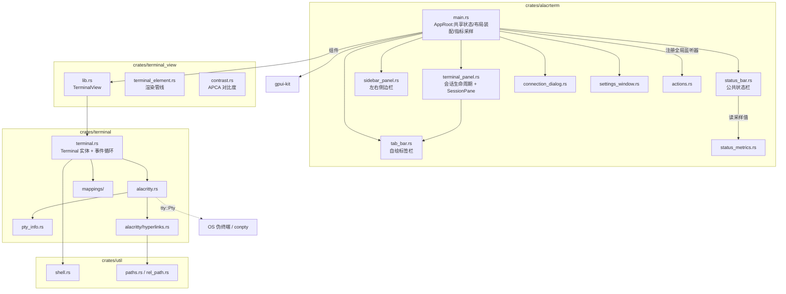
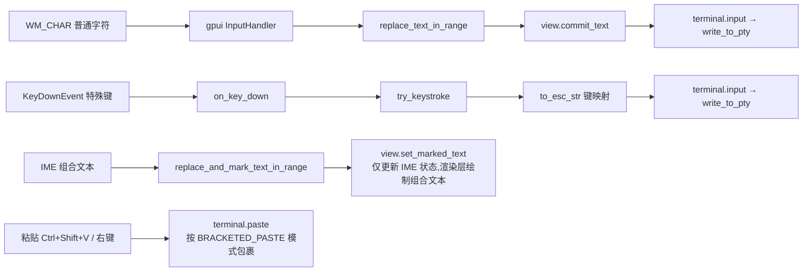

# alacrterm 终端实现分析

> 生成日期:2026-08-06(最近更新 2026-09-17) | 分析对象:`d:\WorkSpace\alacrterm` 全部源码
>
> 本文只写**结论与契约**不写论证:为什么这么改、实测数据、A/B 对比一律不记。
> §3 = 应用外壳(多会话 / 侧边栏 / 标签栏 / 弹窗 / 状态栏指标),§4 起 = 终端核心(仿真 / 渲染 / 事件循环)。

---

## 1. 项目概述

`alacrterm` = **`gpui-pre 0.3`**(依赖名仍为 `gpui`)做 UI + **`gpui-kit 0.6`**(包名 `gpui-component`,自绘组件库)做组件 + **`alacritty_terminal 0.26`** 做仿真。终端核心由 Zed 的 `terminal` / `terminal_view` 精简而来,应用外壳(多会话 + 远程连接)自建。

**核心特征:**

- 终端核心:去掉 Zed `settings` 依赖 / 主题系统 / 搜索 UI,保留事件循环、4ms 批量事件、选择复制、vi mode、超链接、鼠标协议、进程标题检测
- 渲染由 gpui 的 `StyledText` / `paint_quad` 逐 cell 驱动,与 Alacritty 网格通过 `Content` 快照解耦(§4.2)
- `TerminalBuilder::new(working_directory, shell, env, cx) -> Task<Result<TerminalBuilder>>`:PTY 后台就绪后经 `subscribe(cx)` 启动事件循环
- 多会话外壳:两侧可拖拽侧边栏夹着中间 dock 会话区(自绘标签栏 + 终端),会话可全部关掉(全关显示欢迎页);底部三条并列状态栏(左右两条属于对应侧边栏,中间放会话指标)
- 远程连接:「新建终端」对话框收集 IP / 端口 / 名称 / 用户名 / 密码,填了 IP 就用 `ssh -p <端口> [user@]IP`(密码只收集、不参与建连)
- 独立设置窗口 + 自绘标题栏;状态栏指标(连接 / 目标 / CPU / 内存 / 网络,每 1.5s 采样);Action 风格右键菜单
- 会话显示名:用户填的名称优先,否则回退终端 OSC 标题;进程结束只标记「已断开」、不退出应用

**依赖栈:**

| 依赖 | 用途 |
|---|---|
| `gpui`(`gpui-pre 0.3`) | UI 框架、窗口、文本布局、事件分发 |
| `gpui-kit`(`features = ["component"]`) | 标题栏 / Sidebar / Tabs / StatusBar / Settings / Resizable、`icon_named!`、主题系统 |
| `alacritty_terminal 0.26` | VT 解析、网格模型、PTY 封装(`tty`) |
| `portable-pty 0.9` | 经 alacritty `tty` 间接使用的跨平台 PTY |
| `sysinfo 0.39` | 前台进程 / 工作目录 / 标题检测;状态栏指标采样 |
| `rust-embed` | 内嵌 `assets/icons` |
| `windows 0.62` | `SearchPathW`、`GetProcessId` |
| `futures` / `parking_lot` | 事件循环 `select_biased!` 批处理、`FairMutex` Term 锁 |
| `schemars` / `serde` | `TerminalColors` 等配置的 Schema;自定义 Action 的 `Deserialize` |

---

## 2. 整体架构



### 目录结构

```
Cargo.toml                      # workspace 根(resolver = "3", edition 2024)
assets/
  icons/                        # rust-embed 内嵌(含 SquareTerminal 等)
  keymaps/ settings/            # 保留自 Zed 的配置模板(未使用)
crates/
  alacrterm/                    # 应用层(§3)
    src/
      main.rs                   # 入口 + AppRoot
      terminal_panel.rs         # 会话生命周期 + SessionPane
      tab_bar.rs                # 自绘标签栏
      status_bar.rs             # 公共状态栏;STATUS_BAR_HEIGHT 统一三条高度
      sidebar_panel.rs          # 左右侧边栏 + 两枚折叠开关
      welcome.rs                # 无会话时中间列的欢迎页
      connection_dialog.rs      # 「新建终端」对话框
      settings_window.rs        # 独立设置窗口
      status_metrics.rs         # sysinfo 采样 + 字节格式化
      actions.rs                # 自定义 Action + 全局监听器
      assets.rs                 # 图标资产
  terminal_view/                # 视图层
    src/
      lib.rs                    # TerminalView:创建/订阅/输入/焦点/IME/滚动
      terminal_element.rs       # TerminalElement:三阶段渲染管线(约 1800 行)
      contrast.rs               # APCA 最小对比度
  terminal/                     # 核心层:仿真 + PTY + 事件循环
    src/
      terminal.rs               # Terminal 实体、事件系统、输入/鼠标/滚动(约 2600 行)
      alacritty.rs              # alacritty_terminal 桥接层
      alacritty/hyperlinks.rs   # OSC 8 / URL 正则 / 路径猜测
      pty_info.rs               # sysinfo 进程查询
      mappings/                 # keys.rs mouse.rs colors.rs
  util/                         # shell 探测、路径工具
```

---

## 3. 应用外壳:启动、布局与会话

### 3.1 应用入口(`main.rs`)

```rust
fn main() {
    gpui_kit::application()
        .with_assets(assets::Assets)
        .with_quit_mode(QuitMode::LastWindowClosed)   // 全部窗口关闭即退出
        .run(|cx: &mut App| {
            gpui_kit::init(cx);                       // 必须先于任何组件渲染
            Theme::change(ThemeMode::Dark, None, cx);

            let bounds = Bounds::centered(None, size(px(1100.), px(700.)), cx);
            cx.open_window(
                WindowOptions {
                    window_bounds: Some(WindowBounds::Windowed(bounds)),
                    ..TitleBar::window_options()      // 隐藏系统标题栏,改自绘
                },
                |window, cx| {
                    let root = cx.new(|cx| AppRoot::new(window, cx));  // 建窗即建一个本地会话
                    AppRoot::register_actions(root.downgrade(), cx);   // 全局 action 监听器
                    cx.new(|cx| Root::new(root, window, cx))           // 外层包 gpui-kit Root
                },
            )
            .expect("failed to open window");
        });
}
```

- 窗口 1100×700;`Assets` 来自 `assets.rs` 的 `icon_named!(IconName, "../../assets/icons")`(扫描图标目录生成枚举,并实现 `From<IconName> for AnyElement` / `RenderOnce`)
- `Root` 是弹窗 / 通知 / 焦点恢复的宿主,但**不会自动渲染 Dialog 层**:需在渲染树里显式 `.children(Root::render_dialog_layer(window, cx))`
- `TitleBar::window_options()` 内部为 `appears_transparent` + `app_owns_titlebar_drag`
- 标题栏内容区(`TitleBar::new().child(..)`,见 §3.5)三段:左端 = 「设置」文字按钮([`AppRoot::open_settings_window`]),中段 = `flex_1` 的标题「Alacrterm」,右端 = 两枚侧边栏折叠开关(`AppRoot::render_sidebar_toggles`,左 / 右各一枚)。⚠️ 内容区整体是窗口拖拽区(`WindowControlArea::Drag`),其中的按钮都必须包 `div().occlude()`,否则点击被当成「拖标题栏」而收不到

### 3.2 布局装配(左右侧边栏 / 分栏 / dock 会话面板 / 底部三条状态栏)

`AppRoot::render` 只负责装配:`h_resizable("right-split")[h_resizable("main-split")[左栏, 中间列], 右栏]`;容器渲染方法统一返回 `AnyElement`(edition 2024 下 `impl Trait` 会捕获 `&mut Context` 生命周期,同一渲染树里连续 `&mut cx` 会借用冲突)。

- **两侧边栏**(`sidebar_panel`):列容器 `v_flex[Sidebar(flex_1), 本栏状态栏(w_full)]`,宽度同步靠同列布局完成,不给状态栏算面板宽度。**两条侧边栏顶部都有视图切换栏**(`Sidebar::header` 里的 `TabBar::segmented()`):左栏两段(会话 / 关于,只切视图)、右栏一段(会话信息);⚠️ **单段也照画**(`view_tabs` 不因只有一项而隐藏),固定不滚动、随侧边栏折叠一起隐藏。选中态是组件自带的**滑动胶囊**(`tokens.background` + `raised_shadow()`,spring 动画),槽色 = `tokens.tab_bar_segmented`(⇒ 浅色主题下即 libadwaita 那种「浅槽 + 白胶囊」;深色主题下是否「胶囊更亮」由主题 token 决定)。⚠️ `Tab` 设了 `icon` 就**不再画 label**(gpui-kit 行为)⇒ 想要图标+文字得自己拼。两条侧边状态栏**当前都是空条**,保留只为与中间那条等高;两栏都不放折叠开关(已移到标题栏)。宽度记忆在 `AppRoot` 的 `ResizableState` 上。
- **中间列**:`v_flex[终端区 dock, 公共状态栏]`;公共状态栏在 dock 外面且常驻。**无会话时整块 dock 换成欢迎页**(`welcome`:内容居中、列宽 `max_w(420px)`,「新建终端」/「打开设置」两行操作)。
- **分两层嵌套**:`main-split` = 左栏 | 中间列,`right-split` = 内层 | 右栏(面板宽度按下标存在 `ResizableState`,三面板同组会互相挤)。
- **终端区 = dock,只用 center**(左右侧边栏不进 dock):每个会话一块 `SessionPane`,`add_panel_view(.., DockPlacement::Center, ..)` 挂入;`AppRoot::build_dock` 里 `set_locked(false)`。面板覆写 `title_bar(false)` / `inner_padding(false)` / `zoomable(false)` / `zoom_control() -> None`,`closable` 为真。⚠️ 注册必须走 `panel_handle`(裸 `Entity<P>` 时 skin 取不到表现层 trait,标签会退化成只写 `panel_name` 的标题栏)。
- **拖动**:组内横向拖 = 换位;拖到终端区边缘 = 把 center 分成两个标签组(各带一条标签栏与自己的 `+`)。dock 里最后一块面板拖不动 ⇒ 只有一个会话时拖不起来;面板拖不出 center。
- ⚠️ 分屏后 `add_panel_view` 只塞进 center 的**第一个**标签组:标签栏 `+` 先 `AppRoot::set_pending_session_group`,由 `spawn_session` 取用后 `move_panel` 过去。
- **标签栏自绘**:`tab_bar.rs::TerminalDockSkin` 只换标签栏,区级外观全部委托 `DockSkin`。可用接口只有 `DockAreaRenderer::tab_group_renderer()` 与 `TabGroupRenderer::render_tab_bar()`(`TabGroupSkin` 未导出、`DockSkin::shared()` 是 `pub(crate)`,皮肤不可继承)。
- **`TerminalTabBar` 内容**:标签条(`h_flex` + `overflow_x_scroll` + 自持 `ScrollHandle`,活动标签变化时 `scroll_to_item`)+ 右端工具栏(`group.active_panel()` 的 `Panel::toolbar_buttons` = `+`)。标签定宽 200px:图标 + 单行省略名 + 固定 16px 关闭槽位;选中 `tab_active` / `tab_active_foreground` 且底色盖掉栏底 1px 线,未选中 `tab_foreground`、hover 变 `muted`;相邻竖线按 zed `TabPosition` 规则。⚠️ `render_active_panel` 必须自己写:`tab-content` + `overflow_*` + `panel.cached(StyleRefinement::default().absolute().size_full())`。
- **关闭按钮只在悬停 / 选中时出现**(gpui-pre 无 `visible_on_hover`):标签 `on_hover` 把下标记进 `TabBarState::hovered`(`Cell`)。⚠️ 重绘只能通知**根视图**(`DockArea::notify()` 不重绘标签组);⚠️ 别用 `div().occlude()` 包关闭按钮(会吃掉标签的 hover-leave),用 `cx.stop_propagation()`。
- **接线**(`TabGroupContext` 是只读快照):点标签 → `select_tab(ix, ..)`;拖 → `on_drag(group.drag_panel(ix, cx)?)` + 自绘 `TabDragPreview`;落点 → `drag_over::<DragPanel>(..)` + `on_drop` 调 `group.drop_panel(drag.clone(), Some(ix), true, ..)`;中键 → 关会话。
- **关会话三条路**:标签 `×` / 中键 / 侧边栏右键菜单(按下标)。前两条走 [`AppRoot::close_panel_id`](`AppRoot::close_panel_id`)(按面板 id 找下标);不走 dock 的 `TabGroup::close_panel`(它拒绝关最后一块面板,而本应用要支持全关到欢迎页)。
- **会话表是 dock 的镜像**:`AppRoot::terminals` 顺序 = `dock.layout(Center).panels()`,成员 = dock 里还在的面板,由 `sync_sessions_with_dock` 在 `DockEvent::LayoutChanged` 与新建 / 关闭后同步。
- **公共状态栏**(`status_bar::render_status_bar`):只放当前会话指标(无会话时「无会话」,`.right(metrics)`)。⚠️ 侧边栏可见性**只由标题栏右端那两枚开关**改变;因为标题栏常驻,状态栏里不再需要任何「展开」入口。
- **三条状态栏等高**:`status_bar::STATUS_BAR_HEIGHT` = 28px;状态栏里带图标的按钮要显式 `h(px(16.))`(gpui-kit `Button` 最小 20px,会把状态栏撑高——目前两侧那条已无任何内容)。
- **分栏竖线只由拖拽条画**:侧边栏状态栏都不画 `border_*_1`,主题的 `sidebar_border` 置透明(`change_theme` 里设)。⚠️ 换主题必须走 `crate::change_theme(mode, cx)`;⚠️ `sidebar_border` 兼作侧边栏菜单「嵌套项缩进导线」的颜色,会一起消失。

### 3.3 会话模型(`Session` / `SessionRequest` / `SessionTarget`)

```rust
struct Session { view: Entity<TerminalView>, pane: Entity<SessionPane> }
enum SessionTarget { Local, Ssh { user: String, host: String, port: String } }
struct SessionRequest { name: Option<SharedString>, shell: Shell, target: SessionTarget }
```

- `Session::title(cx)` / `Session::target(cx)` 都转调 `pane`(`SessionPane` 持有显示名 + 连接目标:标签栏读名字、状态栏读目标)。标题取自终端 **OSC 标题**(`breadcrumb_text`),不是 `Shell::WithArguments` 的 `title_override` ⇒ 自定义名称必须自己存。
- 新建统一走 `AppRoot::spawn_session(SessionRequest { .. })`(`spawn_terminal` 是「本地系统 shell」的快捷封装):建好 `TerminalView` 后包成 `SessionPane` 挂进 dock,再 `move_panel` 到该进的标签组(§3.2)。
- 生命周期:`set_active_tab`(侧边栏 → `DockArea::select_panel`)、`close_terminal`(→ `DockArea::remove_panel`)、`close_panel_id`(标签 `×` / 中键)、`sync_sessions_with_dock`;下标访问一律先 `get()`(允许会话为空)。dock 点标签会回调面板的 `set_active`,它用 `AppRoot::defer_after_update` 回写 `active`。
- 进程结束:只标记 `exited` 并 `notify`,状态栏显示「已断开」,标签与终端内容保留(§5)。

### 3.4 新建终端对话框(`connection_dialog.rs`)

- 触发:侧边栏右键菜单「新建终端」→ `NewTerminal` action → 全局监听器 → `AppRoot::open_new_terminal_dialog`
- 表单 5 字段:IP / 端口(默认 22) / 名称 / 用户名 / 密码(`.masked(true)` 只影响渲染,`value()` 返回明文)
- 建连:**IP 空 → 本地系统 shell;填了 IP → `ssh -p <端口> [user@]IP`**(依赖本机 OpenSSH);名称作会话显示名;**密码只收集不参与建连**
- ⚠️ 输入框实体必须在打开对话框**之前**创建(构建闭包是 `Fn`,每帧调用);页脚用 `DialogFooter` + `DialogClose` / `DialogAction`(`Dialog` 不会自动生成确定 / 取消按钮)

### 3.5 设置窗口(`settings_window.rs`)

- **入口两个**:主窗口标题栏右侧的文字按钮「设置」、快捷键 `Ctrl+,`(`actions::OpenSettings`,绑在 `None` context);窗口句柄存 `AppRoot::settings_window`,重复点击只 `activate_window`。
- ⚠️ 标题栏里的按钮要包一层 `div().occlude()`:`TitleBar` 内容区带 `WindowControlArea::Drag`,否则点击会被当成「拖标题栏」。
- 独立顶层窗口(`WindowKind::Normal`):任务栏有独立条目、不模态、可单独最小化。⚠️ 不要用 `WindowKind::Dialog`(owner + `EnableWindow(parent,false)`,会锁住主窗口)。
- ⚠️ 主程序退出要一并关掉设置窗口:`SettingsWindow::new` 记下主窗口句柄,`App::on_window_closed` 里 `App::quit()`(`Subscription` 必须存为视图字段)。
- ⚠️ 暗色应用不要用系统标题栏(颜色跟随系统深浅色设置),用 `appears_transparent` + 自绘 `TitleBar`。
- 内容 = gpui-kit `Settings`,两页:**主题**(深浅模式开关 + 两个配色下拉框,首项「跟随 gpui-kit」)、**终端**(字体 / 字号 / 字重 / 行高倍数 / 最小对比度 / 光标形状 / 光标闪烁)。
- ⚠️ 组件要铺满客户区:外层只留 `flex_1().min_h_0()`,**不要 `p_*`**。

#### 设置项的读写路径

`SettingField` 的取值闭包签名是 `Fn(&App) -> T`(拿不到 Entity),所以可配置项放在 gpui `Global`(`config::Settings`);设值闭包拿 `&mut App`,需要 Entity 的副作用只能另外借:

```
点一下设置项 ──▶ config::settings_mut(cx).render ← 新值        ① 全局(设置字段取值读它)
                  ├─ config::save_render_settings()            ② 落盘 config/terminal.json
                  └─ AppRoot::apply_render_settings()          ③ 推给所有存活会话(终端参数存在
                        └─ WeakEntity<AppRoot>                     每个 TerminalView 里,要逐个 update)
```

- ⚠️ `WeakEntity<AppRoot>` 由 `open_settings_window` 建窗时传入(`cx.entity().downgrade()`);三步缺一不可(只改全局 ⇒ 存量会话不变;只落盘 ⇒ 要重启)。
- 主题是全局状态(`Theme::global`),`cx.refresh_windows()` 会让两个窗口一起重绘 ⇒ 走 `config::set_theme` 即可,不需要 `WeakEntity`。
- 落盘只覆盖界面负责的键(`config::save_render_settings`):颜色与手写的其它键原样保留(读写整份 JSON、不重新序列化整个结构)。
- ⚠️ f32 参数写进 JSON / 显示到输入框前要过 `config::as_number()`。

#### 数字字段

四个数字字段(字号 / 字重 / 行高倍数 / 最小对比度)直接用 gpui-kit 内置的 `SettingField::number_input`(`min` / `max` / `step` 各写一次,包一层 `render_item`);取值走 `config::as_number(…)`、设值走 `update_render`,每敲一键即时生效。没有 `number_item` 之类的包装函数。

⚠️ **必须用 git main 的 gpui-kit**:crates.io 的 `0.6.0` 里 `NumberField` 的 `step` 不生效(点一次只 ±1),且钳制发生在每次按键、光标被留在末尾。上游 `d604a2ac`(#3099) 已修,`Cargo.toml` 指向 git main 并由 `Cargo.lock` 锁定。

### 3.6 状态栏指标(`status_metrics.rs` 采样 / `status_bar.rs` 渲染)

- `SystemMonitor`(sysinfo `System` + `Networks`)每 1.5s 采样一次;`SessionMetrics` 是渲染只读快照
- 驱动:`AppRoot::start_metrics_sampling` 的 `cx.spawn` 循环(用 `update`,不需要窗口)
- 渲染在公共状态栏右端(`status_bar::render_status_bar`);无会话时显示「无会话」
- CPU / 内存 = 当前会话进程(`TerminalView::pid()`);存活状态三态(`None` 未采样 / `Some(true)` 运行中 / `Some(false)` 已结束)
- 网络 = 系统整体速率(`Networks` 累计值差分);按进程统计流量需平台 API,sysinfo 不提供
- 每轮采样都 `cx.notify()`

### 3.7 右键菜单与 Action(`actions.rs`)

- 菜单项写法 `menu.menu("标签", Box::new(SomeAction))`,由菜单 `dispatch_action` 派发
- 自定义 Action:`actions!(alacrterm, [NewTerminal, OpenSettings])`(零字段);带数据的 `CloseSession { index }` 需派生 `Deserialize`(`#[action(namespace = .., no_json)]` 免掉 schemars)
- 快捷键在 `main` 建窗时 `cx.bind_keys` 注册:`ctrl-,` → `OpenSettings`(绑在 `None` context ⇒ 焦点在终端里也能触发)
- 接收方用全局监听器 `App::on_action`(action 冒泡阶段必然触发,不依赖焦点)
- 需要窗口的操作(如打开对话框)配 `defer_after_update`;不需要窗口的直接 `root.update(cx, ..)`
- ⚠️ 不要嵌套 `context_menu`(父容器与子条目都挂会同时弹出两个菜单);目前只有会话条目有右键菜单

### 3.8 Terminal 异步创建(`TerminalView::new`)

采用**后台任务 + 异步事件订阅**模式:

```rust
let builder = TerminalBuilder::new(working_directory, shell, env, cx);   // 后台任务
cx.spawn(|this: WeakEntity<Self>, cx: &mut AsyncApp| {
    let mut cx = cx.clone();
    async move {
        let builder = match builder.await { ... };                       // 等待 PTY 就绪
        let terminal = cx.new(|cx| builder.subscribe(cx));               // 启动事件循环
        let subscription = cx.subscribe(&terminal, |_t, event, cx| ...); // 订阅 Event
        cx.update(|app| { ... });                                        // 写回视图
    }
}).detach();
```

**`TerminalBuilder::new` 的后台流程**(`cx.background_spawn`):

1. 移除 `SHLVL`(让子 shell 自己初始化为 1)
2. `LANG` 缺失时兜底 `en_US.UTF-8`
3. 注入 `TERM=xterm-256color`、`COLORTERM=truecolor`(`insert_zed_terminal_env`)
4. `Shell::System` 在 Windows 下解析为 `get_windows_system_shell()`(见 §7);Unix 下为 `None`(直接用用户登录 shell)
5. 计算 `shell_kind`(决定 `tty_escape_args`),`pty_options` 传入前台线程的信号掩码(保证后台创建 PTY 时 Ctrl-C 等信号仍正常)
6. `open_pty` 打开 PTY(滚动历史 `DEFAULT_SCROLL_HISTORY_LINES = 10_000`)→ `new_term` 创建 `Term<ZedListener>` → `spawn_event_loop` 启动 IO 线程(返回 `pty_tx`)
7. 组装 `Terminal` 结构(含 `TerminalPty`、`PtyProcessInfo`、`CopyTemplate` 等),返回 `TerminalBuilder { terminal, events_rx }`

### 3.9 关键异步约定与 gpui 坑

- `cx.spawn` 里必须先在闭包内 `clone` 再进 `async` 块(否则 lifetime 报错)
- `builder.await` 失败时通过 `this.update` 写回 `error` 并 `cx.notify()`,UI 显示红色错误文本
- `subscribe(cx)` 启动事件循环后返回 `Terminal` 实体,事件循环 task 存在 `event_loop_task` 字段
- ⚠️ 回调里不要直接 `update_in`(目标窗口仍在更新栈上,会返回 `Err("entity has no current window")`;同帧的 `window.defer` 也一样)⇒ 统一用 `AppRoot::defer_after_update`(`App::spawn` + 1ms 定时器 + `update_in`)
- 不需要窗口的定时任务(`sample_metrics`)用 `update` 即可
- gpui-kit 的 `h_flex()` 默认交叉轴居中:放在里面的满高列要显式 `.h_full()`

### 3.10 渲染配置(`config/terminal.json`,启动时解析一次)

分工:**文件解析在 `alacrterm`(`config.rs` 的「终端渲染参数」一节),`terminal_view` 只负责使用**——
`TerminalView::new(working_directory, shell, settings, window, cx)` 接收应用层构造好的
`Arc<RenderSettings>`(`terminal_view::RenderSettings`,即 `TerminalRenderSettings` 的重导出)。

```
config/terminal.json ──(alacrterm::config::load_render_settings)──▶ TerminalRenderSettings
        │                                                            │
        └── 缺失/字段缺省/取值非法 ⇒ 逐项回退到 default()              └── AppRoot.render_settings: Arc<..>
                                                                              └── spawn_session → TerminalView::new
```

- 查找顺序:`<可执行文件目录>/config/terminal.json`(发行形态)→ `<仓库根>/config/terminal.json`(开发形态)
- 解析:`serde_json` + 全 `Option` 字段逐项回退 ⇒ 任何情况下都能启动;颜色支持 `#RRGGBB` / `#RRGGBBAA`(`#` 可省),`colors` 的键名就是 `TerminalColors` 字段名,未知键 / 非法值只提示
- 时机:`config::install(cx)` 在 `AppRoot::new` 之前解析一次装进全局;新建会话从全局读,存量会话由 `apply_render_settings` 推送(§3.5)
- 回写:设置窗口「终端」页只写界面负责的键(`config::save_render_settings`),颜色类键不动;每次保存从磁盘重读 JSON 再改键
- ⚠️ 提示用 `eprintln!`(带 `[config]` 前缀):本仓库没装 logger,`log` 宏是空操作

---

### 3.11 界面主题(`themes/*.json`,官方主题库)

主题文件来自 gpui-kit 官方主题库(<https://github.com/longbridge/gpui-kit/tree/main/themes>),
直接落在仓库根的 `themes/` 下(文件可自由增删 —— 目录整体被扫描)。分工同样是**解析与登记在
`alacrterm`(`config.rs` 的「界面主题」一节)**,渲染层(gpui-component)只负责投影。

```
themes/*.json ──(config::preload_themes: ThemeRegistry::load_themes_from_str)──▶ 注册表(内置 2 套 + 目录里解析出的)
      │                                                                                          │
      └── ThemeRegistry::watch_dir ▶ 文件改动热重载(只刷新主题库)                                   └── 默认不启用:配色 = gpui-kit 内置主题
```

- 默认不启用任何导入主题(即 `config/app.json` 里主题名为 `null`),用 gpui-kit 内置的 `Default Dark` / `Default Light`
- 换主题走 `config::set_theme(name, mode, cx)`:挂槽位 → 记全局 → 写回 `config/app.json` → `change_theme` 重新投影 + `refresh_windows`;启动时 `config::apply_saved_themes` 按同一份配置挂槽位(必须在 `load_themes` 之后)
- 文件格式:一个文件 = 一个 `ThemeSet`(`{ name, author, themes: [..] }`),可含多套主题;选择用的是文件内 `themes[].name`
- 目录查找同 §3.10(发行 → 开发);目录不存在就整段跳过
- 先同步 `preload_themes` 再 `watch_dir`(后者的首次装载跑在 `cx.spawn` 里,比首帧晚)
- ⚠️ 热重载会重新投影 `sidebar_border`:在 `config::load_themes` 里**额外注册**一个 `observe_global::<ThemeRegistry>` 把透明覆盖压回去(注册在 `gpui_component::init` 之后,顺序保证它在投影完才跑)
- ⚠️ 主题文件里的 `sidebar.border` 会被我们的覆盖盖掉(§3.2),导入主题不必改这一项
- ⚠️ 终端 ANSI 调色板来自 `config/terminal.json`,不跟随界面主题
- ⚠️ **主题开关不能带动画**:换模式必须两个窗口同帧变色。「深色主题」用 `settings_window.rs::theme_mode_switch`,把 element id 绑上当前模式(`("theme-mode-switch", usize::from(dark))`)⇒ 弹簧状态新建时直接到位、无动画;侧边栏折叠等其它动画不受影响

---

## 4. 核心数据流

### 4.1 读取路径(PTY → 屏幕)

```mermaid
sequenceDiagram
    participant PTY as 子进程/PTY
    participant IO as alacritty EventLoop IO线程
    participant TERM as Term<ZedListener>
    participant CH as UnboundedChannel
    participant LOOP as subscribe 事件循环
    participant V as TerminalView

    PTY->>IO: 输出字节
    IO->>TERM: 解析 VT 序列写入网格(Processor)
    TERM->>CH: ZedListener.send_event(TerminalBackendEvent)
    CH->>LOOP: 批量收集(4ms 窗口 / 100 条上限)
    LOOP->>V: cx.emit(Event::Wakeup)
    V->>V: cx.notify() → 触发 render
```

**事件循环的批处理**(`TerminalBuilder::subscribe`):

```rust
// ① 先同步处理第一个事件(降低首帧延迟)
terminal.process_pty_event(event, cx)?;
// ② 进入批处理窗口:4ms 定时器 + futures::select_biased!
//    超过 100 条提前 break;Wakeup 单独标记(wakeup 标志)
// ③ 统一 update:先处理 Wakeup,再逐个 process_pty_event,最后 yield_now().await
```

> 4ms 窗口 / 100 条上限;`Wakeup` 与其他事件分两条路径处理。

### 4.2 渲染路径(网格 → 屏幕)

`TerminalView::render()` 触发路径:`Event::Wakeup` / `SelectionsChanged` → `cx.notify()` → `render()`:

```rust
fn render(&mut self, window: &mut Window, cx: &mut Context<Self>) -> impl IntoElement {
    // ⚠️ 不在这里自动抢焦点:焦点策略在应用层(见 §4.3 「焦点归属」)
    window.set_window_title(&self.title);   // 同步原生窗口标题(自绘标题栏固定显示 Alacrterm)
    let focused = self.focus_handle.is_focused(window);
    let cursor_visible = self.should_show_cursor(focused, cx);
    // 根 div:bg(terminal_background) + track_focus + on_key_down
    //   + on_mouse_down(左键:聚焦 + stop_propagation;右键:粘贴)
    //   └─ TerminalElement::new(terminal, view, focus, focused, cursor_visible, settings)
}
```

> `set_window_title`(不是 `set_title`)同步**原生窗口标题**;自绘 `TitleBar` 固定显示 `Alacrterm`,终端 OSC 标题只作标签栏 / 侧边栏的会话显示名(`spawn_session` 里对每个 `TerminalView` 做 `cx.observe(.., |_, _, cx| cx.notify())`)。

**`TerminalElement::prepaint` 内(`self.terminal.update`)**:

```rust
terminal.set_size(dimensions);   // 行列/cell 尺寸变化才排队 Resize
terminal.sync(window, cx);       // ① 处理 InternalEvent 队列 ② 快照网格
```

**`sync()` 两阶段**(`terminal.rs`):
1. `while let Some(e) = self.events.pop_front()` 逐个执行 `process_terminal_event`(`InternalEvent` 向下事件)
2. `make_content(&terminal, &self.last_content)` 把 Alacritty 网格(持 `FairMutex` 锁)快照成自有 `Content` 结构

**`set_size` 防抖**:比较 `num_lines / num_columns / cell_width / line_height`,任一变化才入队 `Resize`;队尾已有 pending 的 `Resize` 则**原地覆盖**(`events.back_mut()`)。

`Content` 快照字段:`cells`(`IndexedCell`)、`mode`(TermMode 位集)、`display_offset`、`selection`、`cursor` + `cursor_char`、`terminal_bounds`、`scrolled_to_top/bottom`、`last_hovered_word`。渲染层只基于快照,不碰 `Term` 锁(只有 `sync` 短暂持锁)。

**逐 cell 渲染**(`layout_grid`,详见 `docs/terminal-view-rendering.md` §4):

- 每个 `IndexedCell` 转一个 `TextRun`,按行 `chunk_by(point.line)` 遍历,相邻同风格 cell 合并进同一个 `BatchedTextRun`
- **宽字符占位跳过**:`ic.cell.is_wide_char_spacer()` 不渲染
- gap 与行尾用空格补齐到 `num_columns`
- 优先级叠加:inverse(交换 fg/bg)→ 光标块(背景色作前景 + 终端背景作背景)→ 选中(半透明覆盖)→ 块字符矩形
- 每个 run 的 `len` 必须精确等于字符 UTF-8 字节数(gpui `StyledText::with_runs` 要求)
- 零宽字符(`cell.zerowidth()`)追加进同一 run 但不计 cell 数

**cell 尺寸**(`TerminalElement::prepaint`):`cell_width = text_system.advance(font_id, font_size, 'm')`;`line_height = font_size × line_height_multiplier`(默认 15px × 1.3),按设备像素取整对齐。

### 4.3 输入路径(按键 → PTY)



**`TerminalElement` 的关键约束**:`window.handle_input` 只能在 `paint` 阶段调用(debug 断言 `DrawPhase::Paint`),而 `render()` 是 Prepaint 阶段 ⇒ 自定义 Element 在 `paint()` 里注册 `InputHandler`,再委托内部 div 的 `request_layout / prepaint / paint`。

**InputHandler**:
- `replace_text_in_range` → `view.clear_marked_text` + `view.commit_text(text)` → `terminal.input`(普通字符直写 PTY)
- `replace_and_mark_text_in_range` → `view.set_marked_text`(只更新 `ime_state`,不写 PTY)
- `selected_text_range` 恒返回 `0..0`;`bounds_for_range` 用光标矩形 + 列偏移定位候选窗

**`try_keystroke` 流程**(`on_key_down` → `terminal.try_keystroke`):
1. Ctrl+Shift+V → 剪贴板 → `terminal.paste`,然后 `stop_propagation`
2. vi mode 开启 → `vi_motion`
3. 否则 `to_esc_str(keystroke, mode, option_as_meta)`:方向键按 `APP_CURSOR` 区分 `\x1b[A` / `\x1bOA`;修饰组合 `enter+shift → \x0a`、`tab+shift → \x1b[Z`、`ctrl+space → \x00`、`ctrl+backspace → \x08`;Ctrl 字母 → caret 记号;**无修饰的普通字符返回 `None`**,交回 InputHandler 的 WM_CHAR 路径
4. 处理成功则 `stop_propagation`

> ⚠️ **Tab / Shift+Tab 归终端**(焦点在终端时):`Root` 在 `"Root"` context 里把 `tab` / `shift-tab` 绑为焦点切换,而键位派发在 key listener 之前且动作命中后停传播 ⇒ 终端收不到 Tab。
> 做法:`TerminalView` 根 div 注册 `"Terminal"` context 并 `bind_keys(KeyBinding::new("tab", NoAction, Some("Terminal")))`——`NoAction` 压掉更浅的那条绑定,按键回落到焦点元素的 key listener。焦点不在终端时不影响焦点遍历。
> ⚠️ 代价:终端聚焦时 Tab 不做应用内焦点跳转;⚠️ 不要追加自己的转发动作(绕开正常输入路径,已回退)。

#### 焦点归属

| 情形 | 行为 |
|---|---|
| 点击终端区域 | `TerminalView` 左键聚焦终端并 `stop_propagation` |
| 点击终端之外 | `AppRoot` 根节点把焦点交给 `AppRoot::background_focus` |
| 新建会话 | `spawn_session` 里 `window.focus(新会话的 focus_handle)` |
| Tab / Shift+Tab | 焦点在终端归终端;不在终端则由 `Root` 做焦点遍历 |

- ⚠️ **不能用 `Window::blur` 代替 `background_focus`**:完全失焦时 `focus_next` 没有起点,Tab 会失效。
- `TerminalView::render` 不自动抢焦点;启动聚焦由 `spawn_session` 显式做。
- 「点击终端之外」靠终端内的 `stop_propagation` 判断;若点击处自己拿到了焦点,`background_focus` 不会去抢。

**`Terminal::input` 的副作用**:入队 `InternalEvent::Scroll(Scroll::Bottom)` + `SetSelection(None)`(输入即回到底部并清空选择),置 `keyboard_input_sent = true`,再 `write_to_pty`。`keyboard_input_sent` 用于 Shell 关闭判定(见 §6)。

**粘贴双路径**:Ctrl+Shift+V 与鼠标右键都从剪贴板读文本 → `terminal.paste`。`paste()` 按 `BRACKETED_PASTE` 模式决定是否包裹 `\x1b[200~ ... \x1b[201~`,非 bracketed 模式把 `\r\n` / `\n` 统一成 `\r`。

### 4.4 鼠标路径

| 事件 | 行为 |
|---|---|
| `mouse_down`(左键) | 点击即 `window.focus`;左键按 `click_count` 决定选择类型(1=Simple, 2=Semantic 词选择, 3=Lines 行选择);shift+点击 → `UpdateSelection` 扩展选择;**mouse 协议模式**(vim/tmux 开启)下编码成 X10/SGR 报告写入 PTY;`modifier+点击` 命中超链接则记录 `mouse_down_hyperlink` |
| `mouse_down`(右键) | `TerminalView::on_mouse_down`:非鼠标模式下右键粘贴(读剪贴板 → `paste`);鼠标模式下交给 `TerminalElement` 上报给应用 |
| `mouse_move` | mouse 模式 → `mouse_moved_report`;否则按住 modifier 时做**节流超链接检测**(移动 >5px 或距上次 >100ms 才入队 `FindHyperlink`) |
| `mouse_drag` | 自动滚屏(`drag_line_delta`:距离的 1.1 次幂平滑、clamp ±3 行)+ 去重排队 `UpdateSelection`(先移除旧 UpdateSelection 再入队,对齐 Alacritty 顺序) |
| `mouse_up` | 选择结束时自动复制(`COPY_ON_SELECT = true`,保留选择);按下/抬起在同一超链接 → `ProcessHyperlink`(打开);否则 modifier+点击 → 查找并打开;普通点击命中 cell 内联超链接 → `cx.open_url` |
| `scroll_wheel` | 触控板像素滚动累积(`scroll_px %= height` 防方向切换迟钝);优先级:mouse 协议 → alt screen 的 alternate scroll(`alt_scroll`)→ 普通 `Scroll::Delta`;`determine_scroll_lines` 按 `touch_phase` 分派:`Started` 清零、`Moved` 计算增量、`Ended | Cancelled` 返回 `None`(不滚动) |

**超链接检测**(`hyperlinks.rs`)三来源:
1. OSC 8 超链接(Alacritty `Hyperlink`)
2. `URL_REGEX` 正则(`https://`、`file://`、`mailto:`、`git://` 等)
3. 文件路径猜测(`path_match`,配合 `PathStyle` 判断绝对/相对路径 + 行号 `file.rs:1:23`)

结果缓存于 `RegexSearches`(上限 5000)。

#### 交互类 `InternalEvent` 的消费时机(框选「不跟手」的根因)

`mouse_down` / `mouse_drag` / `scroll_wheel` 都只做一件事:往 `Terminal::events` 队列里排一条
`InternalEvent`(如 `UpdateSelection`)并 `cx.notify()` —— **通知的是 `Terminal` 实体,不是视图**。
而那条队列只在 `TerminalElement::prepaint` 调用的 `Terminal::sync` 里被 `pop_front` 消费,所以
「鼠标操作生效」的前提是 **`TerminalView` 自己也重绘**。

`TerminalView::new` 里因此必须同时挂两条线:

- `cx.subscribe(&terminal, ..)` —— 收 `Event::Wakeup` / `SelectionsChanged` 等**事件**;
- `cx.observe(&terminal, |_, _, cx| cx.notify())` —— 收 Terminal 的**通知**(上面那类鼠标交互走的就是它)。

实测(release,125% DPI,窗口 1393×884,命令行 `1..200 | % { "line $_" }` 填屏后真实拖选):

| | 拖选期间 `SelectionsChanged` 次数/秒 | 画面 |
|---|---|---|
| 只有 `subscribe` | **2~4** | 选区每秒只跳 2~4 次,明显一卡一卡 |
| 加上 `observe` | **43~54**(≈ 帧率) | 选区跟手 |

**为什么「改用 dock 之后才卡」**:dock 面板走 `panel.cached(...)`,`TerminalView` 不再是根视图的
非缓存子视图 —— 早先任何一帧都会重新 render 从而顺带 `sync`,把这个缺陷掩盖了。

#### 顺带量到的每帧成本(排查同类问题的参照)

一次完整重绘(整窗口重建元素树 + 布局 + prepaint + paint + DirectX 提交)在 125% DPI、
1393×884、`1..200` 填屏时的实测值:

| 构建 | 每帧 CPU | 其中 UI 元素阶段 | 其中终端元素 |
|---|---|---|---|
| debug(`opt-level=0`) | ~12ms | ~7.5ms | prepaint 0.5ms + paint 0.8ms |
| release | ~4ms | ~0.85ms | — |

结论:终端本身不是瓶颈;贵的是「每帧把整棵树重建一遍」,dock 又比 dock 之前的直接挂载每帧多约
3ms(debug 实测,多出 DockArea/TabGroup/content_frame/`overflow_y_scroll` 容器/cached 包装这几层)。
想再优化,方向是把每帧不变的子树(侧边栏 / 状态栏 / 标题栏)做成 entity + `.cached(...)`。

### 4.5 标题 / 进程信息(`pty_info.rs`)

- `ProcessIdGetter`:Unix 用 `tcgetpgrp` 取前台进程组;Windows 用 `GetProcessId(handle)`,为 0 时回落 `fallback_pid`
- `emit_title_changed_if_changed`(每次 `Wakeup` 触发):后台用 `sysinfo` 刷新进程信息,比较 `cwd` / `name` 变化后才发 `Event::TitleChanged`
- Windows 特判:`shell_program == title` 时忽略 shell 自身的 OSC 标题事件(否则 breadcrumb 会显示 `pwsh.exe` 路径)

---

## 5. 事件系统

**向下事件**(`InternalEvent`,排入 `self.events` 队列,`sync()` 时消费):

`Resize` / `Clear` / `Scroll` / `ScrollToPoint` / `SetSelection` / `UpdateSelection` / `Copy` / `FindHyperlink` / `ProcessHyperlink` / `ToggleViMode` / `ViMotion` / `MoveViCursorToPoint`

**向上事件**(`Event`,`cx.emit` 给视图):

`TitleChanged` / `BreadcrumbsChanged` / `CloseTerminal` / `Bell` / `Wakeup` / `BlinkChanged` / `SelectionsChanged` / `NewNavigationTarget` / `Open`

**后端事件**(`TerminalBackendEvent`,alacritty 回调 → channel):

`MouseCursorDirty` / `Title` / `ResetTitle` / `ClipboardStore` / `ClipboardLoad` / `ColorRequest` / `PtyWrite` / `TextAreaSizeRequest` / `CursorBlinkingChange` / `Wakeup` / `Bell` / `Exit` / `ChildExit`

> **顺序敏感**:`ColorRequest`(OSC 4/10/11 颜色查询)必须在事件循环里处理,不能放到 `sync()`。

**视图层消费**(`TerminalView::handle_terminal_event`):

| Event | 处理 |
|---|---|
| `Wakeup` / `SelectionsChanged` | 仅 `cx.notify()` 触发重绘 |
| `TitleChanged` / `BreadcrumbsChanged` | 读 `terminal.breadcrumb_text`(空则 `"终端"`)写入 `self.title` 并 `notify` |
| `CloseTerminal` | 标记 `exited = true` 并 `notify()`(不退出应用),状态栏显示「已断开」 |

---

## 6. 关键实现细节与坑

| 主题 | 实现 |
|---|---|
| **Term 锁** | `Arc<FairMutex<Term>>`,后台线程与 UI 线程共享;渲染只读快照不持锁 |
| **resize 防抖** | `set_size` 只比较行/列/cell 尺寸,变化才合并进队尾 `Resize` |
| **行列数浮点精度** | `num_lines() / num_columns()` 用 `raw.next_up().floor()` |
| **写输出 LF→CRLF** | `write_output` 手动转换(非 PTY 管道输出只带 `\n` 时光标不回列首) |
| **bracketed paste** | 粘贴文本中转义 `\x1b`,包裹 `\x1b[200~` / `\x1b[201~` |
| **退格** | `backspace → \x7f`(DEL),`ctrl+backspace → \x08`(BS) |
| **颜色体系** | `TerminalColors::dark()` 为本地 XTerm 深色默认;256 色含 6×6×6 立方体(`index = 16+36r+6g+b` 求逆)与 24 级灰阶;NamedColor 变体来自 vte 0.15 |
| **vi mode** | `vi_motion` 支持 `h/j/k/l/w/b/e/%/$/0/^/H/M/L`;`g/G` 顶/底、`ctrl+b/f` 翻页、`ctrl+d/u` 半页;`v` 选择、`y` 复制、`i` 退出。每次移动先入队 `UpdateSelection(cursor_pos)` 再入队 `ViMotion` |
| **焦点** | 应用层掌握(§4.3);焦点进出经 `FOCUS_IN_OUT` 向应用发 `\x1b[I` / `\x1b[O` |
| **窗口标题** | `window.set_window_title(&str)` 同步原生标题;自绘标题栏固定 `Alacrterm` |
| **标题栏集成** | `WindowOptions` 用 `TitleBar::window_options()`;`gpui_kit::init` 必须在 `run` 回调开头,`Theme::change(Dark)` |
| **Shell 关闭判定** | `register_task_finished`:输入过(`keyboard_input_sent`)或退出码为 0 才 `CloseTerminal` |
| **Drop 清理** | `pty_tx.shutdown()` + `terminate_child_process()`(Unix `killpg(SIGTERM)`),100ms 后 `kill_child_process()` 兜底 |
| **OSC 52 剪贴板** | `ClipboardStore` → `cx.write_to_clipboard`;`ClipboardLoad` → 读剪贴板写回 PTY |
| **ANSI 文本工具** | `parse_ansi_text` / `strip_ansi_text` 用 vte `Processor<StdSyncHandler>` |

---

## 7. Windows 特有逻辑

### 7.1 Shell 探测(`util/src/shell.rs`)

`get_windows_system_shell()` 查找顺序(全部缓存到 `LazyLock`):

1. `ProgramFiles\PowerShell\` 下版本号目录中最大的 `pwsh.exe`
2. `ProgramFiles(x86)\PowerShell\`(32 位备选)
3. MSIX 安装(`LOCALAPPDATA\Microsoft\WindowsApps\Microsoft.PowerShell_*\pwsh.exe`)
4. Preview 版本(ProgramFiles → MSIX)
5. scoop shim `pwsh.exe`
6. `which pwsh.exe` / `which powershell.exe`
7. 兜底 `cmd.exe`

另有 `get_windows_bash()` 优先找 scoop / git 自带的 bash;`ShellKind` 用于确定 tty 转义参数(Windows 下传入 `tty::Options.escape_args`)。

### 7.2 路径解析

`TerminalBuilder::resolve_path` 用 `SearchPathW` 解析 shell 程序路径,非含分隔符路径加 `\\?\` 前缀。

### 7.3 构建脚本(已移除)

原 `build.rs`(仅 Windows,`embed-resource` 把图标 + `VERSIONINFO` 嵌进 exe)已整份删除,连同 `Cargo.toml` 的 `build` 与 `[build-dependencies]`。⚠️ `assets/app-icon.ico` 仍保留(打包用安装包 / 快捷方式图标)。

### 7.4 ConPTY 后端(`conpty_backend.rs`)——必须带 `conpty.dll`

`alacritty_terminal` 在 Windows 上建伪控制台时先 `LoadLibraryW("conpty.dll")`:命中就用 Windows Terminal 的 OpenConsole,否则退回 Windows 自带的 ConPTY——后者在「窗口纵向缩到极小再放大」时会让壳侧整片重绘,表现为**上方内容丢失**。

本仓库照上游 zed 的做法随包分发 `conpty.dll` + `OpenConsole.exe`:

- 二进制在 `assets/windows/conpty/{conpty.dll,OpenConsole.exe}`;
- `main()` 在**建第一个 PTY 之前**调 `conpty_backend::ensure()`:exe 同级有 `conpty.dll` 就全路径预加载(发行形态),否则用 `SetDllDirectoryW` 把仓库 `assets/windows/conpty/` 加进搜索路径;都没有则告警退回系统 ConPTY;
- 预加载让后续按基名的 `LoadLibraryW` 命中同一模块(加载器按模块名去重),不受 PATH 影响。


---

## 8. 数据流总览

```mermaid
flowchart TD
    A[alacritty EventLoop IO线程] -->|TerminalBackendEvent| B[unbounded channel]
    B --> C[subscribe 事件循环<br/>4ms 批处理 / 100 条上限]
    C -->|Event::Wakeup| D[TerminalView.handle_terminal_event]
    D -->|cx.notify| E[render]
    E -->|set_size + sync| F[InternalEvent 队列处理]
    F -->|make_content| G[Content 快照]
    G --> H[layout_grid 逐 cell → runs/rects/blocks]
    H --> I[TerminalElement.paint<br/>注册 InputHandler + 绘制]

    J[键盘/IME] --> K[InputHandler / try_keystroke]
    K -->|to_esc_str| L[write_to_pty]
    M[鼠标] -->|mouse_down/move/up/scroll| N[选择/超链接/鼠标协议]
    N --> L

    E -->|window.set_window_title| T[原生标题]
    E -.cx.observe.-> B2[AppRoot → 标签栏 / 侧边栏显示会话名]
```

---

## 9. 总结

本终端 = **Zed terminal 的裁剪版 + 自建多会话外壳**:

- **保留**:事件循环 + 4ms 批处理、选择 / 复制、vi mode、超链接、鼠标协议、滚动、进程标题检测、OSC 52 剪贴板、颜色查询
- **砍掉**:Zed 的 `settings` 依赖、主题系统、搜索 UI
- **替换**:本地 `TerminalColors` + 手写 Windows shell 探测;editor 依赖用本地 `paint_quad` 实现
- **新增**:应用外壳(§3)——标题栏、侧边栏 / 分栏、dock 会话区与自绘标签栏、`ssh` 对话框、设置窗口、状态栏指标、右键菜单

**架构核心**:`Term` 网格与 UI 通过 `Content` 快照解耦——UI 线程每次 render 只做一次 `make_content` 快照,`sync()` 中消费 `InternalEvent` 队列,IO 线程与 UI 线程用 unbounded channel + 4ms 批处理通信。

---

## 附录:常用命令

```bash
cargo run -p alacrterm        # 运行终端
cargo test -p alacrterm       # 单元测试(格式化等纯函数)
cargo check --workspace       # 编译检查
cargo build -p alacrterm      # 构建
```

## 附录:仓库记忆要点(易踩的几处)

- `window.handle_input` 只能在 paint 阶段调用 ⇒ 自定义 Element 在 `paint()` 里注册 InputHandler
- `terminal.input` 参数是 `impl Into<Cow<'static, [u8]>>`,`String` 需 `.into_bytes()`
- 依赖来源:`gpui` / `gpui-kit` 都是 **git 依赖**(gpui-kit 需要 main 上的数字字段修复,§3.5)
- 标题栏集成三要素:`gpui_kit::init` → `Theme::change(ThemeMode::Dark)` → `WindowOptions` 用 `TitleBar::window_options()`
- 窗口标题双轨:`window.set_window_title`(原生)+ 标签栏 / 侧边栏显示 `Session::title()`;自绘 `TitleBar` 固定 `Alacrterm`
