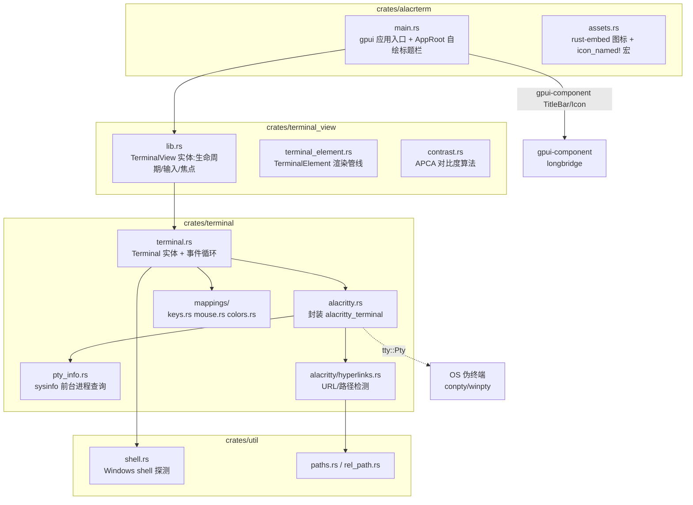
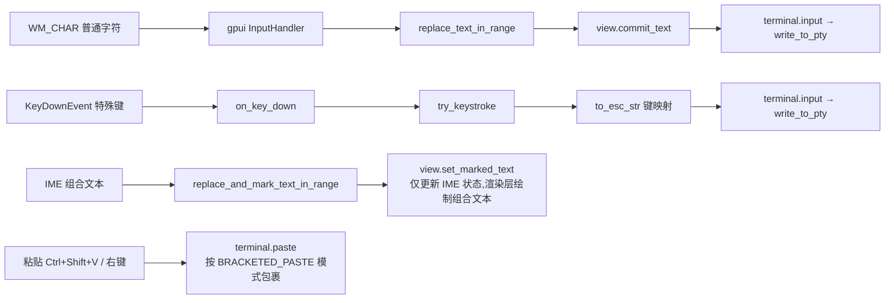

# alacrterm 终端实现分析

> 生成日期:2026-08-06(更新于 2026-08-09)
> 分析对象:工作区 `d:\WorkSpace\alacrterm` 全部源码

---

## 1. 项目概述

`alacrterm` 是一个基于 **zed 官方 `gpui`**(`zed-industries/zed` 仓库)做 UI、**`gpui-component`**(`longbridge/gpui-component`,自绘组件库)做标题栏等组件、**`alacritty_terminal 0.26`**(Alacritty 的纯终端仿真核心)做仿真的独立终端模拟器,由 Zed 的 `terminal` / `terminal_view` crate 精简而来。

**核心特征:**

- 移除 Zed 的 `settings` crate 依赖:`TerminalColors` 本地定义(XTerm 深色默认)、`CursorShape` / `AlternateScroll` 本地枚举
- `TerminalBuilder::new` 精简签名:`new(working_directory, shell, env, cx) -> Task<Result<TerminalBuilder>>`,PTY 在后台线程就绪后经 `subscribe(cx)` 启动事件循环
- 渲染完全由 gpui 的 `StyledText` / `paint_quad` 逐 cell 驱动,与 Alacritty 网格模型通过 `Content` 快照解耦
- 集成 `gpui-component` 自绘标题栏(`TitleBar`),隐藏系统标题栏,标题随终端 OSC 0 同步
- 保留完整功能:事件循环、批量事件处理、选择/复制、vi mode、超链接、鼠标协议、进程标题检测

**依赖栈:**

| 依赖 | 用途 |
|---|---|
| `gpui` / `gpui_platform`(git:`zed-industries/zed`,启用 `font-kit`) | UI 框架、窗口、文本布局、事件分发 |
| `gpui-component`(git:`longbridge/gpui-component`) | 自绘标题栏、图标(`icon_named!`)、主题系统 |
| `alacritty_terminal 0.26` | VT 序列解析、网格模型、PTY 封装(`tty` 模块) |
| `portable-pty 0.9` | 经 alacritty `tty` 间接使用的跨平台 PTY |
| `sysinfo 0.39` | 前台进程信息 / 工作目录 / 标题检测 |
| `rust-embed` | 内嵌 `assets/icons` 资源(图标、主题等) |
| `windows 0.62`(Windows) | `SearchPathW` 路径解析、`GetProcessId` |
| `futures 0.3` / `parking_lot 0.12` | 事件循环 `select_biased!` 批处理、`FairMutex` Term 锁 |
| `schemars` / `serde` | `TerminalColors` 等配置结构的 JSON Schema 支持 |

---

## 2. 整体架构



### 目录结构

```
Cargo.toml                      # workspace 根,统一依赖版本(resolver = "3", edition 2024)
assets/
  icons/                        # rust-embed 内嵌的图标资源(含 SquareTerminal 等)
  keymaps/ settings/            # 保留自 Zed 的配置模板(当前未使用)
crates/
  alacrterm/                    # 应用层:main.rs(AppRoot + 窗口) / assets.rs / build.rs
  terminal_view/                # 视图层(独立 crate):
    src/
      lib.rs                    # TerminalView:终端创建/事件订阅/键盘输入/焦点/IME/滚动
      terminal_element.rs       # TerminalElement:三阶段渲染管线(核心,约 1800 行)
      contrast.rs               # APCA 最小对比度算法(自 Zed 移植)
  terminal/                     # 核心层:终端仿真 + PTY + 事件循环
    src/
      terminal.rs               # Terminal 实体、事件系统、输入/鼠标/滚动逻辑(约 2600 行)
      alacritty.rs              # alacritty_terminal 的桥接层(类型别名 + 转换函数)
      alacritty/hyperlinks.rs   # OSC 8 / URL 正则 / 路径猜测
      pty_info.rs               # sysinfo 进程信息查询
      mappings/                 # keys.rs(按键→转义) mouse.rs(鼠标协议) colors.rs
  util/                         # shell 探测、路径工具(shell.rs / paths.rs / rel_path.rs / util.rs)
```

---

## 3. 启动与初始化流程

### 3.1 应用入口(`main.rs`)

```rust
fn main() {
    gpui_platform::application()
        .with_assets(assets::Assets)          // rust-embed 嵌入 assets/icons
        .run(|cx: &mut App| {
            gpui_component::init(cx);                    // 初始化组件库(主题、图标等)
            Theme::change(ThemeMode::Dark, None, cx);    // 终端为深色背景,标题栏跟随暗色主题

            let bounds = Bounds::centered(None, size(px(900.), px(600.)), cx);
            cx.open_window(
                WindowOptions {
                    window_bounds: Some(WindowBounds::Windowed(bounds)),
                    // 隐藏系统标题栏(macOS/Windows),改用 gpui_component 自绘标题栏
                    titlebar: Some(TitleBar::title_bar_options()),
                    #[cfg(target_os = "linux")]
                    window_decorations: Some(gpui::WindowDecorations::Client),
                    ..Default::default()
                },
                |window, cx| {
                    let terminal_view =
                        cx.new(|cx| TerminalView::new(None, Shell::System, window, cx));
                    cx.new(|cx| AppRoot::new(terminal_view, cx))   // 根视图 = 标题栏 + 终端
                },
            )
            .expect("failed to open window");

            cx.on_window_closed(|cx, _| { if cx.windows().is_empty() { cx.quit(); } }).detach();
            cx.activate(true);
        });
}
```

**`AppRoot`(根视图)**:

```rust
struct AppRoot {
    terminal_view: Entity<TerminalView>,
    title: SharedString,
}

impl AppRoot {
    fn new(terminal_view: Entity<TerminalView>, cx: &mut Context<Self>) -> Self {
        let title = terminal_view.read_with(cx, |view, _| view.title());
        // 终端标题变化(OSC 0 等)时同步更新标题栏文本
        cx.observe(&terminal_view, |this, terminal_view, cx| {
            let title = terminal_view.read_with(cx, |view, _| view.title());
            if title != this.title {
                this.title = title;
                cx.notify();
            }
        }).detach();
        Self { terminal_view, title }
    }
}

impl Render for AppRoot {
    fn render(&mut self, _window: &mut Window, cx: &mut Context<Self>) -> impl IntoElement {
        div().v_flex().size_full()
            .child(TitleBar::new().child(          // 自绘标题栏(拖拽窗口/按钮由组件库处理)
                h_flex().w_full().px(px(8.)).gap(px(8.)).items_center()
                    .child(Icon::new(IconName::SquareTerminal).small())  // 终端图标
                    .child(div().text_size(px(13.))
                        .text_color(cx.theme().secondary_foreground)
                        .child(self.title.clone())),
            ))
            .child(self.terminal_view.clone())
    }
}
```

要点:

- 窗口 900×600,默认 shell 为 `Shell::System`;`gpui_component::init` 必须先于任何组件渲染调用
- `TitleBar::title_bar_options()` 返回隐藏系统标题栏的 `WindowOptions` 片段;Linux 额外用 `WindowDecorations::Client` 走客户端装饰
- `assets.rs` 中 `icon_named!(IconName, "../../assets/icons")` 宏扫描 `assets/icons` 生成图标枚举,并实现 `From<IconName> for AnyElement` / `RenderOnce` 使其可作组件渲染
- `AppRoot` 通过 `cx.observe(&terminal_view)` 监听 `TerminalView` 的标题变化(`TerminalView::title()` 返回 `SharedString`),OSC 0 设置标题时标题栏同步刷新
- 全部窗口关闭即退出应用

### 3.2 Terminal 异步创建(`TerminalView::new`)

采用**后台任务 + 异步事件订阅**模式:

```rust
let builder = TerminalBuilder::new(working_directory, shell, env, cx);   // 后台任务
cx.spawn(|this: WeakEntity<Self>, cx: &mut AsyncApp| {
    let mut cx = cx.clone();
    async move {
        let builder = match builder.await { ... };                       // 等待 PTY 就绪
        let terminal = cx.new(|cx| builder.subscribe(cx));               // 启动事件循环
        let subscription = cx.subscribe(&terminal, |_t, event, cx| ...); // 订阅 Event
        cx.update(|app| { ... });                                        // 写回视图
    }
}).detach();
```

**`TerminalBuilder::new` 的后台流程**(`cx.background_spawn`):

1. 移除 `SHLVL`(让子 shell 自己初始化为 1,对齐 iTerm2/Kitty/Alacritty 行为)
2. `LANG` 缺失时兜底 `en_US.UTF-8`
3. 注入 `TERM=xterm-256color`、`COLORTERM=truecolor`(`insert_zed_terminal_env`)
4. `Shell::System` 在 Windows 下解析为 `get_windows_system_shell()`(见 §7);Unix 下为 `None`(直接用用户登录 shell)
5. 计算 `shell_kind`(决定 `tty_escape_args`),`pty_options` 传入前台线程的信号掩码(保证后台创建 PTY 时 Ctrl-C 等信号仍正常)
6. `open_pty` 打开 PTY(滚动历史 `DEFAULT_SCROLL_HISTORY_LINES = 10_000`)→ `new_term` 创建 `Term<ZedListener>` → `spawn_event_loop` 启动 IO 线程(返回 `pty_tx`)
7. 组装 `Terminal` 结构(含 `TerminalPty`、`PtyProcessInfo`、`CopyTemplate` 等),返回 `TerminalBuilder { terminal, events_rx }`

### 3.3 关键异步约定

- `cx.spawn` 中必须**先在闭包内 `clone` 再进 `async` 块**,否则 lifetime 报错
- 错误路径:`builder.await` 失败时通过 `this.update` 写回 `error` 字段并 `cx.notify()`,UI 显示红色错误文本
- `TerminalBuilder::subscribe(cx)` 启动事件循环后返回 `Terminal` 实体;事件循环 task 存在 `event_loop_task` 字段中

---

## 4. 核心数据流

### 4.1 读取路径(PTY → 屏幕)

```mermaid
sequenceDiagram
    participant PTY as 子进程/PTY
    participant IO as alacritty EventLoop IO线程
    participant TERM as Term<ZedListener>
    participant CH as UnboundedChannel
    participant LOOP as subscribe 事件循环
    participant V as TerminalView

    PTY->>IO: 输出字节
    IO->>TERM: 解析 VT 序列写入网格(Processor)
    TERM->>CH: ZedListener.send_event(TerminalBackendEvent)
    CH->>LOOP: 批量收集(4ms 窗口 / 100 条上限)
    LOOP->>V: cx.emit(Event::Wakeup)
    V->>V: cx.notify() → 触发 render
```

**事件循环的双缓冲批处理**(`TerminalBuilder::subscribe`)是性能关键设计:

```rust
// ① 先同步处理第一个事件,降低首帧延迟
terminal.process_pty_event(event, cx)?;
// ② 进入批处理窗口:4ms 定时器 + futures::select_biased!
//    期间堆积事件,超过 100 条提前 break;Wakeup 事件单独标记(wakeup 标志)
//    若窗口内无事件且无 wakeup → yield_now 并退出外层循环
// ③ 批处理完后统一 update:先处理 Wakeup,再逐个 process_pty_event
//    最后 yield_now().await 让出线程,避免独占 UI 线程
```

> 批处理窗口默认 4ms,事件上限 100 条。`Wakeup` 与其他事件分两条路径处理,保证渲染通知不因批量堆积而延迟。

### 4.2 渲染路径(网格 → 屏幕)

`TerminalView::render()` 触发路径:`Event::Wakeup` / `SelectionsChanged` → `cx.notify()` → `render()`:

```rust
fn render(&mut self, window: &mut Window, cx: &mut Context<Self>) -> impl IntoElement {
    if !self.focus_handle.is_focused(window) { window.focus(&self.focus_handle, cx); }  // 聚焦兜底
    window.set_window_title(&self.title);    // 同步原生窗口标题(与自绘标题栏双轨)
    let focused = self.focus_handle.is_focused(window);
    let cursor_visible = self.should_show_cursor(focused, cx);   // 闪烁相位判断
    // 根 div:bg(terminal_background) + track_focus + on_key_down + on_mouse_down(右键)
    //   └─ TerminalElement::new(terminal, view, focus, focused, cursor_visible, settings)
}
```

> `set_window_title`(不是 `set_title`)在视图层同步原生标题;`AppRoot` 的 `TitleBar` 则通过 `cx.observe` 读取 `TerminalView::title()` 显示同一份文本。

**`TerminalElement::prepaint` 内(`self.terminal.update`)执行**:

```rust
terminal.set_size(dimensions);   // 对比新旧行列数,变化才排队 Resize(避免拖动窗口刷屏)
terminal.sync(window, cx);       // ① 处理 InternalEvent 队列 ② 快照网格
```

**`sync()` 两阶段**(`terminal.rs`):
1. `while let Some(e) = self.events.pop_front()` 逐个执行 `process_terminal_event`(`InternalEvent` 向下事件)
2. `make_content(&terminal, &self.last_content)` 把 Alacritty 网格(持 `FairMutex` 锁)快照成自有 `Content` 结构

**`set_size` 防抖细节**:比较 `num_lines / num_columns / cell_width / line_height`,任一变化才入队 `Resize`;若队尾已有 pending 的 `Resize` 则**原地覆盖**它(`events.back_mut()`),避免窗口拖动时产生大量 SIGWINCH。

`Content` 快照字段:`cells`(所有 `IndexedCell`)、`mode`(TermMode 位集)、`display_offset`、`selection`、`cursor` + `cursor_char`、`terminal_bounds`、`scrolled_to_top/bottom`、`last_hovered_word` 等。渲染层完全基于快照、不触碰 `Term` 锁(只有 `sync` 短暂持锁)。

**逐 cell 渲染**(`layout_grid`,详见 `docs/terminal-view-rendering.md` §4):

- 每个 `IndexedCell` 转成一个 `TextRun`,按行 `chunk_by(point.line)` 遍历,相邻同风格 cell 合并进同一个 `BatchedTextRun`(减少 shape 调用)
- **宽字符占位跳过**:`ic.cell.is_wide_char_spacer()` 直接跳过不渲染(中文占两列,占位格是空格)
- gap 与行尾用空格补齐到 `num_columns`
- 渲染优先级叠加:inverse(交换 fg/bg)→ 光标块(光标格 = 背景色作前景 + 终端背景作背景)→ 选中(半透明覆盖)→ 块字符矩形
- 每个 run 的 `len` 必须精确等于字符 UTF-8 字节数(gpui `StyledText::with_runs` 硬性要求)
- 零宽字符(`cell.zerowidth()`)追加进同一 run 但不计 cell 数

**cell 尺寸测量**(`TerminalElement::prepaint`):
- `cell_width = text_system.advance(font_id, font_size, 'm')` —— 字体中 `m` 的 advance 宽度
- `line_height = font_size × line_height_multiplier`(默认 15px × 1.3),渲染层按设备像素取整对齐

> 历史注记:早期版本曾用 `shape_text("M")` 测量 + `(ascent+descent)×1.2` 保险系数(为容纳 fallback 中文字形),并给每行 `div().h(line_height).line_height(line_height)` 防重叠 —— 现已在 `TerminalElement` 内部统一处理,不再依赖行 div 样式。

### 4.3 输入路径(按键 → PTY)



**`TerminalElement` 的关键技巧**:`window.handle_input` 只能在 `paint` 阶段调用(debug 断言 `DrawPhase::Paint`),而 `render()` 是 Prepaint 阶段。因此自定义 `TerminalElement` 元素,在 `paint()` 中注册 `InputHandler` 后再委托内部 div 的 `request_layout / prepaint / paint`。

**InputHandler 实现**:
- `replace_text_in_range` → `view.clear_marked_text` + `view.commit_text(text)` → `terminal.input`(普通字符直写 PTY)
- `replace_and_mark_text_in_range` → `view.set_marked_text`(只更新 `ime_state`,组合文本由渲染层绘制,不写 PTY)
- `selected_text_range` 恒返回 `0..0`(IME 候选窗定位锚点);`bounds_for_range` 用光标矩形 + 列偏移定位候选窗

**`try_keystroke` 流程**(`TerminalView::on_key_down` → `terminal.try_keystroke`):
1. Ctrl+Shift+V → 读剪贴板走 `terminal.paste`(直接处理并 `stop_propagation`)
2. vi mode 开启 → `vi_motion`
3. 否则 `to_esc_str(keystroke, mode, option_as_meta)` 把 gpui `Keystroke` 转成 ANSI 转义:
   - 方向键按 `APP_CURSOR` 模式区分 `\x1b[A`(普通)与 `\x1bOA`(应用模式)
   - 修饰组合:`enter+shift → \x0a`、`tab+shift → \x1b[Z`、`ctrl+space → \x00`、`ctrl+backspace → \x08`
   - Ctrl 字母 → caret 记号(`ctrl+a → \x01` …)
   - **普通字符(无修饰)→ 返回 `None`**,交回 InputHandler 的 WM_CHAR 路径 —— 这就是必须注册 input handler 才能输入的原因
4. 处理成功则 `stop_propagation`,避免 gpui 其他元素再消费按键

**`Terminal::input` 的副作用**:入队 `InternalEvent::Scroll(Scroll::Bottom)` + `SetSelection(None)`(输入即回到底部并清空选择),置 `keyboard_input_sent = true`,再 `write_to_pty`。`keyboard_input_sent` 用于 Shell 关闭判定(见 §6)。

**粘贴双路径**:Ctrl+Shift+V 与鼠标右键都从剪贴板读文本 → `terminal.paste`。`paste()` 按 `BRACKETED_PASTE` 模式决定是否包裹 `\x1b[200~ ... \x1b[201~`,非 bracketed 模式把 `\r\n` / `\n` 统一成 `\r`。

### 4.4 鼠标路径

| 事件 | 行为 |
|---|---|
| `mouse_down`(左键) | 点击即 `window.focus`;左键按 `click_count` 决定选择类型(1=Simple, 2=Semantic 词选择, 3=Lines 行选择);shift+点击 → `UpdateSelection` 扩展选择;**mouse 协议模式**(vim/tmux 开启)下编码成 X10/SGR 报告写入 PTY;`modifier+点击` 命中超链接则记录 `mouse_down_hyperlink` |
| `mouse_down`(右键) | `TerminalView::on_mouse_down`:非鼠标模式下右键粘贴(读剪贴板 → `paste`);鼠标模式下交给 `TerminalElement` 上报给应用 |
| `mouse_move` | mouse 模式 → `mouse_moved_report`;否则按住 modifier 时做**节流超链接检测**(移动 >5px 或距上次 >100ms 才入队 `FindHyperlink`) |
| `mouse_drag` | 自动滚屏(`drag_line_delta`:距离的 1.1 次幂平滑、clamp ±3 行)+ 去重排队 `UpdateSelection`(先移除旧 UpdateSelection 再入队,对齐 Alacritty 顺序) |
| `mouse_up` | 选择结束时自动复制(`COPY_ON_SELECT = true`,保留选择);按下/抬起在同一超链接 → `ProcessHyperlink`(打开);否则 modifier+点击 → 查找并打开;普通点击命中 cell 内联超链接 → `cx.open_url` |
| `scroll_wheel` | 触控板像素滚动累积(`scroll_px %= height` 防方向切换迟钝);优先级:mouse 协议 → alt screen 的 alternate scroll(`alt_scroll`)→ 普通 `Scroll::Delta`;`determine_scroll_lines` 按 `touch_phase` 分派:`Started` 清零、`Moved` 计算增量、`Ended | Cancelled` 返回 `None`(不滚动) |

**超链接检测**(`hyperlinks.rs`)三来源:
1. OSC 8 超链接(Alacritty `Hyperlink`)
2. `URL_REGEX` 正则(`https://`、`file://`、`mailto:`、`git://` 等)
3. 文件路径猜测(`path_match`,配合 `PathStyle` 判断绝对/相对路径 + 行号 `file.rs:1:23`)

结果缓存于 `RegexSearches`(上限 5000)。

### 4.5 标题 / 进程信息(`pty_info.rs`)

- `ProcessIdGetter`:Unix 用 `tcgetpgrp` 取前台进程组;Windows 用 `GetProcessId(handle)`,为 0 时回落 `fallback_pid`
- `emit_title_changed_if_changed`(每次 `Wakeup` 触发):后台用 `sysinfo` 刷新进程信息,比较 `cwd` / `name` 变化后才发 `Event::TitleChanged`
- Windows 特判:`shell_program == title` 时忽略 shell 自身的 OSC 标题事件(否则 breadcrumb 会显示 `pwsh.exe` 路径)

---

## 5. 事件系统

**向下事件**(`InternalEvent`,排入 `self.events` 队列,`sync()` 时消费):

`Resize` / `Clear` / `Scroll` / `ScrollToPoint` / `SetSelection` / `UpdateSelection` / `Copy` / `FindHyperlink` / `ProcessHyperlink` / `ToggleViMode` / `ViMotion` / `MoveViCursorToPoint`

**向上事件**(`Event`,`cx.emit` 给视图):

`TitleChanged` / `BreadcrumbsChanged` / `CloseTerminal` / `Bell` / `Wakeup` / `BlinkChanged` / `SelectionsChanged` / `NewNavigationTarget` / `Open`

**后端事件**(`TerminalBackendEvent`,alacritty 回调 → channel):

`MouseCursorDirty` / `Title` / `ResetTitle` / `ClipboardStore` / `ClipboardLoad` / `ColorRequest` / `PtyWrite` / `TextAreaSizeRequest` / `CursorBlinkingChange` / `Wakeup` / `Bell` / `Exit` / `ChildExit`

> **顺序敏感设计**:`ColorRequest`(OSC 4/10/11 颜色查询)必须在事件循环里处理而不是 `sync()`,否则响应乱序 —— 例如应用发送 `OSC 11;?ST`(颜色请求)后紧跟 `CSI c`(设备属性请求),后者的响应会先到。

**视图层消费**(`TerminalView::handle_terminal_event`):

| Event | 处理 |
|---|---|
| `Wakeup` / `SelectionsChanged` | 仅 `cx.notify()` 触发重绘 |
| `TitleChanged` / `BreadcrumbsChanged` | 读 `terminal.breadcrumb_text`(空则回退 `"终端"`)写入 `self.title` 并 `notify` → 原生标题 + 自绘标题栏同步 |
| `CloseTerminal` | `cx.quit()` 退出应用 |

---

## 6. 关键实现细节与坑

| 主题 | 实现 |
|---|---|
| **Term 锁** | `Arc<FairMutex<Term>>`,后台线程与 UI 线程共享;渲染只读快照不持锁 |
| **resize 防抖** | `set_size` 只比较行/列/cell 尺寸,变化才合并进队尾 `Resize`(覆盖前一个 pending),避免拖动窗口时疯狂 SIGWINCH |
| **行列数浮点精度** | `num_lines() / num_columns()` 用 `raw.next_up().floor()`,防止 `N*h/h == N-ε` 时少算一行 |
| **写输出 LF→CRLF** | `write_output` 手动转换:非 PTY 管道输出只带 `\n` 时,Alacritty 光标会下移不回列首 |
| **bracketed paste** | 粘贴文本中转义 `\x1b`,包裹 `\x1b[200~` / `\x1b[201~` |
| **退格差异** | `backspace → \x7f`(DEL),`ctrl+backspace → \x08`(BS),对齐 Alacritty 行为 |
| **颜色体系** | `TerminalColors::dark()` 本地 XTerm 深色默认;256 色映射含 6×6×6 立方体(公式 `index = 16+36r+6g+b` 求逆)与 24 级灰阶(8..238 步长 10);NamedColor 变体来自 vte 0.15(Black..BrightWhite / Foreground / Background / Cursor / Dim* / BrightForeground / DimForeground) |
| **vi mode** | `Terminal::vi_motion` 支持 `h/j/k/l/w/b/e/%/$/0/^/H/M/L` 移动;`g→Top`、`G→Bottom`、`ctrl+b/f→PageUp/PageDown`、`ctrl+d/u→半页滚动`;`v` 进入选择、`y` 复制、`i` 退出。每次移动先入队 `UpdateSelection(cursor_pos)`(把光标换算成像素坐标)再入队 `ViMotion`,保证选择起点正确 |
| **焦点** | 每次 render 检查 `focus_handle.is_focused` 再 `window.focus()`,比首次设置一次可靠;焦点进出经 `FOCUS_IN_OUT` 模式向应用发 `\x1b[I` / `\x1b[O` |
| **窗口标题** | `window.set_window_title(&str)`(不是 `set_title`);自绘标题栏文本通过 `TerminalView::title()` + `cx.observe` 双轨同步 |
| **标题栏集成** | `TitleBar::title_bar_options()` 用于 `WindowOptions`;Linux 需配合 `window_decorations: Client`;`gpui_component::init` 必须在 `run` 回调开头调用,`Theme::change(Dark)` 保证终端深色背景与标题栏配色一致 |
| **Shell 关闭判定** | `register_task_finished`:用户输入过(`keyboard_input_sent`)或退出码为 0 才 `CloseTerminal`(区分用户主动退出与 spawn 失败) |
| **Drop 清理** | `pty_tx.shutdown()` + `terminate_child_process()`(Unix `killpg(SIGTERM)`),100ms 后 `kill_child_process()` 兜底强杀 |
| **OSC 52 剪贴板** | `ClipboardStore` → `cx.write_to_clipboard`;`ClipboardLoad` → 读剪贴板经格式化回调写回 PTY |
| **ANSI 文本工具** | `parse_ansi_text` / `strip_ansi_text` 用 vte `Processor<StdSyncHandler>` 解析,`PlainAnsiTextHandler` 正确处理 `\r` 截断 |

---

## 7. Windows 特有逻辑

### 7.1 Shell 探测(`util/src/shell.rs`)

`get_windows_system_shell()` 查找顺序(全部缓存到 `LazyLock`):

1. `ProgramFiles\PowerShell\` 下版本号目录中最大的 `pwsh.exe`
2. `ProgramFiles(x86)\PowerShell\`(32 位备选)
3. MSIX 安装(`LOCALAPPDATA\Microsoft\WindowsApps\Microsoft.PowerShell_*\pwsh.exe`)
4. Preview 版本(ProgramFiles → MSIX)
5. scoop shim `pwsh.exe`
6. `which pwsh.exe` / `which powershell.exe`
7. 兜底 `cmd.exe`

另有 `get_windows_bash()` 优先找 scoop / git 自带的 bash;`ShellKind` 用于确定 tty 转义参数(Windows 下传入 `tty::Options.escape_args`)。

### 7.2 路径解析

`TerminalBuilder::resolve_path` 用 `SearchPathW`(Windows API)解析 shell 程序路径,非含分隔符路径加 `\\?\` 前缀。

### 7.3 构建脚本

`build.rs`(仅 Windows)用 `embed-resource 3.0` 编译手写的 `.rc` 内容:图标 + `VERSIONINFO` 资源(FileDescription/FileVersion/ProductName 等,CompanyName 为 `zeal`)。`assets/app-icon.ico` 不存在时跳过 `ICON` 行避免 `RC2135` 编译错误;debug 构建版本号追加 `-dev`。

---

## 8. 数据流总览

```mermaid
flowchart TD
    A[alacritty EventLoop IO线程] -->|TerminalBackendEvent| B[unbounded channel]
    B --> C[subscribe 事件循环<br/>4ms 批处理 / 100 条上限]
    C -->|Event::Wakeup| D[TerminalView.handle_terminal_event]
    D -->|cx.notify| E[render]
    E -->|set_size + sync| F[InternalEvent 队列处理]
    F -->|make_content| G[Content 快照]
    G --> H[layout_grid 逐 cell → runs/rects/blocks]
    H --> I[TerminalElement.paint<br/>注册 InputHandler + 绘制]

    J[键盘/IME] --> K[InputHandler / try_keystroke]
    K -->|to_esc_str| L[write_to_pty]
    M[鼠标] -->|mouse_down/move/up/scroll| N[选择/超链接/鼠标协议]
    N --> L

    E -->|window.set_window_title| T[原生标题]
    E -.cx.observe.-> B2[AppRoot TitleBar 自绘标题栏]
```

---

## 9. 总结

该终端本质上是 **Zed terminal 的"最小可用裁剪版 + 自绘标题栏"**:

- **保留**:完整的事件循环、4ms 批量事件处理、选择/复制(含自动复制)、vi mode、超链接(OSC 8 + 正则 + 路径猜测)、鼠标协议(SGR/X10)、滚动(含 alternate scroll)、进程标题检测、OSC 52 剪贴板、颜色查询
- **砍掉**:settings 依赖、主题系统、搜索 UI、多标签、远程终端
- **替换**:本地 `TerminalColors`(XTerm 深色默认)+ 手写 Windows shell 探测替代 Zed 的 settings 依赖;`BlinkManager` / `HighlightedRange` 等 editor 依赖用本地 `paint_quad` 实现替代
- **新增**:`gpui-component` 自绘标题栏(`AppRoot` + `TitleBar`),标题随 OSC 0 同步;隐藏系统标题栏(Windows/macOS `titlebar` 选项,Linux `WindowDecorations::Client`)

**架构精髓**:`Term` 网格与 UI 渲染通过 `Content` 快照解耦 —— UI 线程每次 render 只做一次 `make_content` 快照克隆,`sync()` 中消费 `InternalEvent` 队列,后台 IO 线程与 UI 线程通过 unbounded channel + 4ms 批处理窗口通信,使 UI 线程几乎不阻塞在仿真器锁上。

---

## 附录:常用命令

```bash
cargo run -p alacrterm        # 运行终端
cargo check --workspace       # 编译检查
cargo build -p alacrterm      # 构建(Windows 下 build.rs 生成版本资源)
```

## 附录:仓库记忆要点(历史修复)

- 渲染重叠修复:行高 = (ascent+descent)×1.2;行 div 需 `.h(line_height).line_height(line_height)`
- 宽字符 spacer cell 跳过渲染只 `col+1`
- `window.handle_input` 只能在 paint 阶段调用 → 自定义 Element 在 `paint()` 注册
- `terminal.input` 参数是 `impl Into<Cow<'static, [u8]>>`,`String` 需 `.into_bytes()`
- zed 源码本地缓存:`D:\Compilers\Rust\.cargo\git\checkouts\zed-*`(gpui/gpui_platform 来自 `zed-industries/zed`)
- gpui-component 源码缓存:`D:\Compilers\Rust\.cargo\git\checkouts\gpui-component-*`(来自 `longbridge/gpui-component`)
- 标题栏集成三要素:`gpui_component::init` → `Theme::change(ThemeMode::Dark)` → `WindowOptions.titlebar = Some(TitleBar::title_bar_options())`(Linux 加 `window_decorations: Client`)
- 标题同步双轨:`window.set_window_title`(原生)+ `AppRoot` 经 `cx.observe(&terminal_view)` 读 `TerminalView::title()`(自绘标题栏)
- 滚动 `touch_phase`:`Ended | Cancelled` 均返回 `None`,只 `Moved` 计算滚动增量
