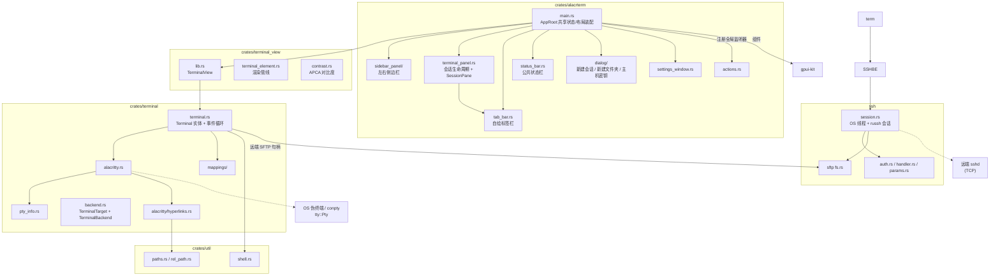
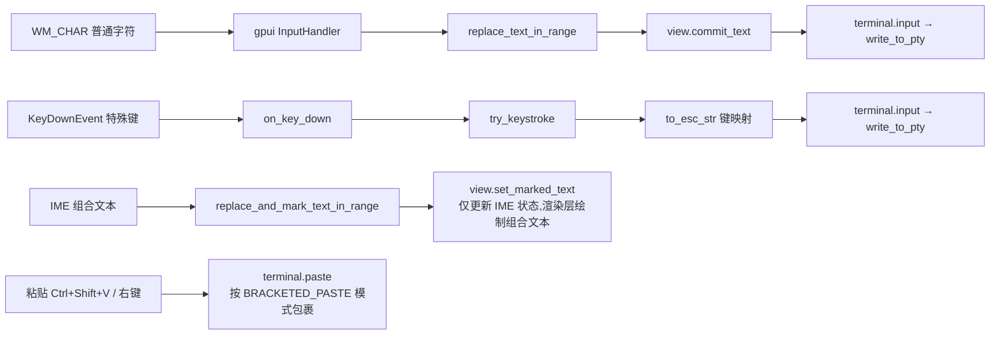
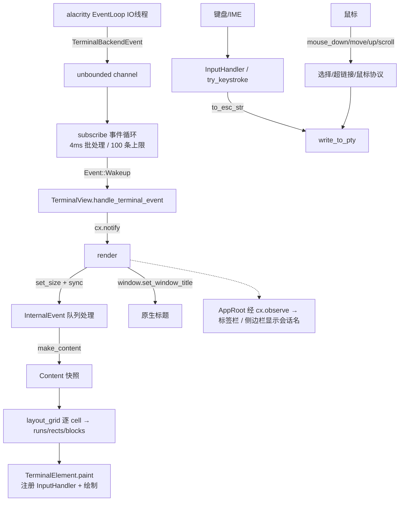

# alacrterm 终端实现分析

> 分析对象:`crates/` 全部源码（含 `crates/ssh`，内建 SSH 客户端）。本文只写**结论与契约**:模块职责、数据结构、必须遵守的约束(⚠️ = 易错 / 必须这样写)。
> §3 = 应用外壳(多会话 / 侧边栏 / 标签栏 / 弹窗 / 状态栏),§4 起 = 终端核心(仿真 / 渲染 / 事件循环),§5 起含远端会话(SSH)。

---

## 1. 项目概述

`alacrterm` = **`gpui-pre 0.3`**(依赖名仍为 `gpui`)做 UI + **`gpui-kit 0.6`**(包名 `gpui-component`,自绘组件库)做组件 + **`alacritty_terminal 0.26`** 做仿真。终端核心由 Zed 的 `terminal` / `terminal_view` 精简而来,应用外壳(多会话 + 远程连接)自建。

**核心特征:**

- 终端核心:去掉 Zed `settings` 依赖 / 主题系统 / 搜索 UI,保留事件循环、4ms 批量事件、选择复制、vi mode、超链接、鼠标协议、进程标题检测
- 渲染由 gpui 的 `StyledText` / `paint_quad` 逐 cell 驱动,与 Alacritty 网格通过 `Content` 快照解耦(§4.2)
- `TerminalBuilder::new(working_directory, target, env, cx) -> Task<Result<TerminalBuilder>>`:`target` 决定本地 PTY 还是远端 russh(见 §5.2);就绪后经 `subscribe(cx)` 接上事件
- 多会话外壳:两侧可拖拽侧边栏(默认折叠)夹着中间 dock 会话区(自绘标签栏 + 终端),会话可全部关掉(全关显示欢迎页,**启动时也是这个状态**——不自动开终端);底部三条并列状态栏(左右两条属于对应侧边栏并放该视图的按钮,**中间那条是空条**——曾放会话指标,已移除)
- 远程连接:走**内建 SSH 客户端**(`crates/ssh`,基于 russh),不调用外部 `ssh` 命令。「新建会话」对话框收集 IP / 端口 / 名称 / 用户名 / 密码,**只往侧边栏的会话列表里加一条记录**(IP / 名称 / 用户名必填);双击那条记录才按它开终端(密码参与认证但只存在内存记录里);首次连接未知主机弹**「未知主机密钥」**对话框让用户核对指纹
- 独立设置窗口 + 自绘标题栏;Action 风格右键菜单
- 会话显示名:用户填的名称优先,否则回退终端 OSC 标题;进程结束只标记「已断开」(标签与内容保留)、不退出应用

**依赖栈:**

| 依赖 | 用途 |
|---|---|
| `gpui`(`gpui-pre 0.3`) | UI 框架、窗口、文本布局、事件分发 |
| `gpui-kit`(`features = ["component"]`) | 标题栏 / Sidebar / Tabs / StatusBar / Settings / Resizable、`icon_named!`、主题系统 |
| `alacritty_terminal 0.26` | VT 解析、网格模型、PTY 封装(`tty`) |
| `russh 0.63` + `russh-sftp 3`(`crates/ssh`) | 内建 SSH 客户端(终端通道 + SFTP 列远端目录);⚠️ **必须关掉默认的 `aws-lc-rs`** 改用 `ring`,否则 Windows 上要 NASM |
| `portable-pty 0.9` | 经 alacritty `tty` 间接使用的跨平台 PTY |
| `sysinfo 0.39` | 前台进程 / 工作目录 / 标题检测(仅 `crates/terminal`,应用层已不再依赖) |
| `rust-embed` | 内嵌 `assets/icons` |
| `windows 0.62` | `SearchPathW`、`GetProcessId` |
| `futures` / `parking_lot` | 事件循环 `select_biased!` 批处理、`FairMutex` Term 锁 |
| `schemars` / `serde` | `TerminalColors` 等配置的 Schema;自定义 Action 的 `Deserialize` |

---

## 2. 整体架构



### 目录结构

```
Cargo.toml                      # workspace 根(resolver = "3", edition 2024)
assets/
  icons/                        # rust-embed 内嵌(含 SquareTerminal 等)
  keymaps/ settings/            # 保留自 Zed 的配置模板(未使用)
crates/
  alacrterm/                    # 应用层(§3)
    src/
      main.rs                   # 入口 + AppRoot(根视图:跨组件共享状态 + 布局装配)
      terminal_panel.rs         # 会话生命周期 + SessionRequest + Session + SessionPane
      tab_bar.rs                # 自绘标签栏
      status_bar.rs             # 公共状态栏(空条);STATUS_BAR_HEIGHT 统一三条高度
      sidebar_panel/            # 左右侧边栏(§3.2)
        mod.rs                  # Sidebar 实体(标签/折叠/宽度 + Render) + toggle_button + SidebarContent
        tabs.rs                 # 顶部视图标签条(点选 + 拖动换位 / 拖到另一条侧边栏)
        shared.rs               # 两棵树共用:行骨架 / 缩进 / 省略号标签 / RowCache / 拖拽预览卡片
        sessions.rs             # SessionsState(记录模型 + 文件夹树 + 增删改 + 摊平成 SessionsItem)
        files.rs                # FilesState(文件管理器:远端 SFTP 目录树 + 摊平成 FilesItem)
      dialog/                   # 对话框(§3.4)
        mod.rs                  # 共同约定(表单实体先建 / 页脚自拼 / on_ok 兜底校验)
        connection.rs           # 「新建会话」:只加一条 SSH 记录
        folder.rs               # 「新建文件夹」:会话列表分组
        host_key.rs             # 「未知主机密钥」:首次连接让用户核对指纹
      welcome.rs                # 无会话时中间列的欢迎页
      settings_window.rs        # 独立设置窗口
      actions.rs                # 自定义 Action + 全局监听器
      assets.rs                 # 图标资产
  terminal_view/                # 视图层
    src/
      lib.rs                    # TerminalView:创建(本地 / SSH)/订阅/输入/焦点/IME/滚动
      terminal_element.rs       # TerminalElement:三阶段渲染管线(约 1800 行)
      contrast.rs               # APCA 最小对比度
  terminal/                     # 核心层:仿真 + PTY + 事件循环
    src/
      terminal.rs               # Terminal 实体、事件系统、输入/鼠标/滚动(约 2600 行)
      alacritty.rs              # alacritty_terminal 桥接层 + PtySender(往本地 PTY 写输入)
      backend.rs                # 后端抽象:TerminalTarget(连什么) + TerminalBackend(谁搬字节)
      pty_info.rs               # sysinfo 进程查询
      alacritty/hyperlinks.rs   # OSC 8 / URL 正则 / 路径猜测
      pty_info.rs               # sysinfo 进程查询(Pty / None 两种 PID 来源)
      mappings/                 # keys.rs mouse.rs colors.rs
  util/                         # shell 探测、路径工具
crates/ssh/                      # 内建 SSH 客户端(russh)
  src/
    lib.rs                      # 模块文档:边界、运行时、认证顺序、主机密钥
    session.rs                  # 专属 OS 线程 + tokio 运行时;命令/事件两条通道
    auth.rs                     # agent → 私钥文件 → 密码
    handler.rs                  # 主机密钥校验(Ask / AcceptNew / Strict)+ 确认请求
    params.rs                   # SshParams / SshAuth / HostKeyPolicy / SshSize
    fs.rs                       # SshFs:SFTP 子系统(另开一条连接,懒连接)
    error.rs                    # SshError(连不上哪个地址 / 认证 / 主机密钥变更…)
  examples/local_server.rs      # 本机验证用的假服务端(玩具 shell + 只读 sftp 子系统)
```

---

## 3. 应用外壳:启动、布局与会话

### 3.1 应用入口(`main.rs`)

```rust
fn main() {
    gpui_kit::application()
        .with_assets(assets::Assets)
        .with_quit_mode(QuitMode::LastWindowClosed)   // 全部窗口关闭即退出
        .run(|cx: &mut App| {
            gpui_kit::init(cx);                       // 必须先于任何组件渲染
            config::install(cx);                      // 配置三步(顺序固定):
            config::load_themes(cx);                  //   ① 解析 config/*.json ② 登记主题库
            config::apply_saved_themes(cx);           //   ③ 按 app.json 挂主题槽位
            config::change_theme(ThemeMode::Dark, cx); // 投影主题 + 重新压 sidebar_border 覆盖

            let bounds = Bounds::centered(None, size(px(1100.), px(700.)), cx);
            cx.open_window(
                WindowOptions {
                    window_bounds: Some(WindowBounds::Windowed(bounds)),
                    ..TitleBar::window_options()      // 隐藏系统标题栏,改自绘
                },
                |window, cx| {
                    let root = cx.new(|cx| AppRoot::new(window, cx));  // 启动不建会话(首屏欢迎页)
                    AppRoot::register_actions(root.downgrade(), cx);   // 全局 action 监听器
                    cx.new(|cx| Root::new(root, window, cx))           // 外层包 gpui-kit Root
                },
            )
            .expect("failed to open window");
        });
}
```

- 窗口 1100×700;`Assets` 来自 `assets.rs` 的 `icon_named!(IconName, "../../assets/icons")`(扫描图标目录生成枚举,并实现 `From<IconName> for AnyElement` / `RenderOnce`)
- **启动形态**:不建任何会话,两侧边栏默认折叠(`Sidebar::new` 里 `visible: false`)⇒ 首屏 = 标题栏 + 中间列的欢迎页 + 状态栏,终端由用户自己开(欢迎页「新建终端」/ 标签栏 `+` / 双击会话记录)
- `Root` 是弹窗 / 通知 / 焦点恢复的宿主,但**不会自动渲染 Dialog 层**:需在渲染树里显式 `.children(Root::render_dialog_layer(window, cx))`
- `TitleBar::window_options()` 内部为 `appears_transparent` + `app_owns_titlebar_drag`
- 标题栏内容区(`TitleBar::new().child(..)`,见 §3.5)三段:左端 = 「设置」文字按钮([`AppRoot::open_settings_window`]),中段 = `flex_1` 的标题「Alacrterm」,右端 = 两枚侧边栏折叠开关(`sidebar_panel::toggle_button`,左 / 右各一枚)。⚠️ 内容区整体是窗口拖拽区(`WindowControlArea::Drag`),其中的按钮都必须包 `div().occlude()`,否则点击被当成「拖标题栏」而收不到

### 3.2 布局装配(左右侧边栏 / 分栏 / dock 会话面板 / 底部三条状态栏)

`AppRoot::render` 只负责装配:`h_resizable("right-split")[h_resizable("main-split")[左栏, 中间列], 右栏]`;容器渲染方法统一返回 `AnyElement`(edition 2024 下 `impl Trait` 会捕获 `&mut Context` 生命周期,同一渲染树里连续 `&mut cx` 会借用冲突)。

**状态与渲染都归子组件**:一条侧边栏 = 一个实体(`Entity<Sidebar>`,左右各一个,见 `sidebar_panel/mod.rs`),它自带标签 / 折叠 / 期望宽度 / 那一组 `ResizableState`,并**自己实现 `Render`**(整列 = 视图标签条 + 当前视图内容 + 底部状态栏);根视图只把它 `.child(..)` 摆进分栏面板、把 `sidebar_panel::toggle_button` 摆进标题栏。各视图内容是两个实体:「会话」`Entity<SessionsState>` 与文件管理器 `Entity<FilesState>` —— 两者都**不实现 `Render`**:各自把「要摆哪些项」摊成**一行一项**(`SessionsItem` / `FilesItem`)交给侧边栏内容区(它才是虚拟列表),两条侧边栏共用同一份。`AppRoot` 只剩跨组件的共享状态(终端表 `terminals` / `active` / `dock` / 设置窗口句柄 / 指标采样器 / 背景焦点)。⚠️ `Entity::read(cx)` 会把 `cx` 借到返回值活着的整段时间,所以「既要读状态又要 `cx.listener`」的地方先把它拷成小值(`Pixels` / `Entity` 句柄 / `.downgrade()`)。⚠️ 两条侧边栏互持 `sibling` 弱引用,标签跨栏拖动靠它。⚠️ 整棵树还没上 `.cached()`,每帧重建(见 `docs/gpui-architecture.md` §10)。

- **两侧边栏**(`sidebar_panel`):列容器 `v_flex[Sidebar(flex_1), 本栏状态栏(w_full)]`,宽度同步靠同列布局完成。**顶部都有视图标签条**(`Sidebar::header` 里的 `tab_bar`,见 `sidebar_panel/tabs.rs`),固定不滚动、随侧边栏折叠一起隐藏;⚠️ **只有一个标签也照画**。标签样式照 **VS Code 面板标签**(纯文字、无边框、按内容宽度左对齐,悬停 / 选中才有圆角浅灰底):手绘 `h_flex`(`tab_element`;选中 = `tokens.accent` 底 + `accent_foreground` 字,圆角 = 主题 `radius`),不用 `ToggleGroup` / `TabBar`(两者都拖不动)。⚠️ 标签条容器必须显式 `.h(TAB_HEIGHT)`:标签可能一个都没有(全被拖走),空 flex 容器高度会塌成 0 ⇒ 兜底落点悬停不到。⚠️ 每个标签常驻一条透明左边框(`border_l_2` + `accent.opacity(0)`),拖动悬停时点亮成插入提示,免得高亮把标签尺寸顶变。**标签可在两条侧边栏之间拖动**:同栏内拖 = 换位(落在第 i 个标签上 = 占它现在的位置);拖到另一栏 = 把视图搬过去并选中;落点 = 每个标签自己(载荷 `DragSidebarTab{side,index}`)+ 标签条空白区兜底(追加末尾,目标栏为空时也只能拖到这里)。两侧顺序与选中项各存在自己的 `Sidebar` 实体里(各一份 `SidebarTabs`),**同一视图可出现在任一侧**;内容项**为空**时(标签全被拖走,或只剩本地会话下不摆的「文件管理器」)内容列表就是空的 —— 留白,不塞任何占位文案。视图只有 `Sessions`(会话)与 `Files`(文件管理器)两种,各一个文件;`sidebar_panel/mod.rs` 只管外壳(容器装配 / 两端按钮 / 折叠开关)。⚠️ **「文件管理器」只对远端(SSH)会话摆出来**:根视图每帧按当前会话是不是远端调 `Sidebar::set_files_enabled`,为假时该视图的**标签与内容一起不摆**(选中的下标不动,会话换回远端时它自己回来);本地目录用系统自己的文件管理器打开就好,应用里再摆一份既多余、又只能看到本机目录。

#### 会话列表(文件夹树:记录 + 拖放)

> 状态在 `sidebar_panel/sessions.rs` 的 `SessionsState` 实体里(记录模型 + 展开状态 + 摊平后的行清单);渲染交给 `SidebarContent::Sessions(SessionsItem)` —— **一行一项**摆进侧边栏内容位。

列表内容是**会话记录**(连接配置),与终端实例**完全无关**:一条记录有没有在跑终端,取决于用户是否双击过它;关掉终端也不影响列表。形态参考 MobaXterm —— **没有自动生成的根文件夹**,顶层直接就是用户自己建的文件夹(可嵌套)与记录;文件夹行只显示名字(**不显示「里面有几条」**)。

- **数据**:`SessionsState::entries: Vec<SessionEntry>`(私有,读写都经 `SessionsState` 的方法),`enum SessionEntry { Folder(SessionFolder), Session(SessionRecord) }`;路径用 `SessionPath = Vec<usize>`(从顶层开始的下标链,`[]` = 顶层本身)。
- **加条目**:状态栏**左下角**文件夹图标(`NewFolder`,落顶层)、**右下角** `+`(`NewSession`,落顶层);文件夹行右键可以「在这里新建会话 / 新建子文件夹」(带 `folder` / `parent` 参数落进那个文件夹)。新条目一律**追加到目标目录末尾**,并顺手展开目标文件夹(否则新条目看不见)。
- **删条目**:记录行右键「删除会话」、文件夹行右键「删除文件夹」(**连带**里面的内容)。两条都只改列表,不动已开的终端。
- **开终端**:双击记录行(单击只选中)、或右键「打开会话」→ `OpenSession` → `AppRoot::open_session_record`(**跨组件:**向 `SessionsState` 要参数、再 `spawn_session`)。同一条记录可以开任意多个终端。
- **拖放**:记录行与文件夹行都能拖(载荷 `DragSessionEntry{path,label}` + 共用预览卡片 `shared::DragPreview`);落在**文件夹行**上 = 放进该文件夹,落在**会话行**上 = 放进它所在的那个目录,落在列表下方那条 16px 空白落点(`#session-tree-top-level-drop`)上 = **提到顶层**;`drag_over` 用 `tokens.accent` 高亮落点。合法性由 `SessionsState::move_entry` 把关:目标必须存在、且不能是**自己或自己的子孙**(否则会把子树拖成环)。⚠️ 取出源条目会让同目录里排在它后面的下标前移一位,所以目标路径要按「取出后」算(`shift_path_after_removal`)。
- **行**(`session_row_element`,返回 `AnyElement` 因为它把右键菜单包在外面):**同一目录下文件夹与会话同级**——两行都从 `pl(8px + depth × 16px)` 开始(不给会话行多加一个 caret 宽度的缩进,否则会话看上去低一级)。文件夹行 = 有子项时才画的 caret + 文件夹图标 + 名字;会话行 = 地球图标 + 名字(记录目前只有 SSH 一种)。caret 只看「有没有子项」(`SessionRow::has_children`):空文件夹没有 caret、点了也只选中。
- **展开状态存在 `SessionsState::expanded`**(`Vec<u64>`,存的是条目 **id**),由行点击经 `SessionsState::activate_row` 改;改完 `RowCache::bump` 让摊平缓存失效。⚠️ 用**稳定 id** 而不是下标链:增删 / 拖动搬家都不会让展开状态串到邻居身上(早先按路径存时,删除后同目录里排在后面的标记都得跟着挪。那套 `shift_paths_after_removal` 已经删掉)。
- ⚠️ **虚拟化靠外层侧边栏的列表**:与「文件管理器」同一套(机制见下节 §3.2「文件管理器」)—— 把条目树**摊平成一行一项**(`SessionsState::sidebar_items` → `SessionsItem`),交给侧边栏自己的虚拟列表,自己**不再嵌套** gpui-kit 的 `Tree`。摊平结果与行骨架走共用模块 `sidebar_panel/shared.rs`(`RowCache` 缓存 + `row_shell` / `row_content`),只在增删改 / 展收后重建。列表末尾固定一条 `SessionsItem::TopLevelDrop`(《拖到顶层》的那条 16px 空白落点)。
- ⚠️ 与文件树相同:`SessionsState` **不再自己实现 `Render`** ⇒ 它的 `cx.notify()` 落不到窗口上,靠 `Sidebar::new` 里的 `cx.observe(&sessions, ..)` 转发重绘。
- **选中**:`SessionsState::selected`(行点击设置),不跟当前终端挂钩(「当前会话」由标签栏体现)。⚠️ `ListItem` 默认的 `list_active` 选中底色太淡(主题把它压到 6% 不透明度),分不出悬停 ⇒ [`config::change_theme`] 里关掉 `list.active_highlight`,改用 `accent`(与侧边栏顶部选中的视图标签同色),配 `font_medium` + `sidebar_accent_foreground` 文字色。
- **右键菜单**挂在**行元素自己**身上(`ContextMenuExt::context_menu`,⚠️ 必须放链尾;记录行 / 文件夹行各一套);**列表为空**时改摆 `SessionsItem::Empty`(gpui-kit `Empty` 组件,`sidebar_panel::empty_state`)。
- `Sidebar::children` 只吃单一类型 ⇒ 两个视图的项用 `SidebarContent` 枚举统一(`Collapsible + SidebarItem` 转发,`render` 直接转调 `SessionsItem` / `FilesItem::render`)。两层都不套 `SidebarGroup`(它会固定渲染一行 `h_8()` 段标题,标题已在顶部标签上)。`Sidebar` 的 id 带侧与当前视图名。
- **两条侧边状态栏**:显示「会话」视图的那条两端各一枚按钮(左下 = 新建文件夹,右下 = 新建会话),其余情况是空条(只为与中间那条等高);两栏都不放折叠开关(已移到标题栏)。宽度与那一组 `ResizableState` 都在各自的 `Sidebar` 实体里(每帧在 `AppRoot::render` 开头调 `Sidebar::pin_width` 钉回期望宽度)。**两条侧边栏默认折叠**(`visible: false`),展开只能靠标题栏右端那两枚开关(`sidebar_panel::toggle_button`)。
- **中间列**:`v_flex[终端区 dock, 公共状态栏]`;公共状态栏在 dock 外面且常驻。**无会话时整块 dock 换成欢迎页**(`welcome`:内容居中、列宽 `max_w(420px)`,「新建终端」(直接开一个本地终端)/「打开设置」两行操作)——**启动时就是这个状态**(不自动开会话)。
- **分两层嵌套**:`main-split` = 左栏 | 中间列,`right-split` = 内层 | 右栏(面板宽度按下标存在 `ResizableState`,三面板同组会互相挤)。
- **终端区 = dock,只用 center**(左右侧边栏不进 dock):每个会话一块 `SessionPane`,`add_panel_view(.., DockPlacement::Center, ..)` 挂入;`AppRoot::build_dock` 里 `set_locked(false)`。面板覆写 `title_bar(false)` / `inner_padding(false)` / `zoomable(false)` / `zoom_control() -> None`,`closable` 为真。⚠️ 注册必须走 `panel_handle`(裸 `Entity<P>` 时 skin 取不到表现层 trait,标签会退化成只写 `panel_name` 的标题栏)。
- **拖动**:组内横向拖 = 换位;拖到终端区边缘 = 把 center 分成两个标签组(各带一条标签栏与自己的 `+`)。dock 里最后一块面板拖不动 ⇒ 只有一个会话时拖不起来;面板拖不出 center。
- ⚠️ 分屏后 `add_panel_view` 只塞进 center 的**第一个**标签组:标签栏 `+` 先 `AppRoot::set_pending_session_group`,由 `spawn_session` 取用后 `move_panel` 过去。
- **标签栏自绘**:`tab_bar.rs::TerminalDockSkin` 只换标签栏,区级外观全部委托 `DockSkin`。可用接口只有 `DockAreaRenderer::tab_group_renderer()` 与 `TabGroupRenderer::render_tab_bar()`(`TabGroupSkin` 未导出、`DockSkin::shared()` 是 `pub(crate)`,皮肤不可继承)。
- **`TerminalTabBar` 内容**:标签条(`h_flex` + `overflow_x_scroll` + 自持 `ScrollHandle`,活动标签变化时 `scroll_to_item`)+ 右端工具栏(`group.active_panel()` 的 `Panel::toolbar_buttons` = `+`)。标签定宽 200px:图标 + 单行省略名 + 固定 16px 关闭槽位;选中 `tab_active` / `tab_active_foreground` 且底色盖掉栏底 1px 线,未选中 `tab_foreground`、hover 变 `muted`;相邻竖线按 zed `TabPosition` 规则。⚠️ `render_active_panel` 必须自己写:`tab-content` + `overflow_*` + `panel.cached(StyleRefinement::default().absolute().size_full())`。
- **关闭按钮只在悬停 / 选中时出现**(gpui-pre 无 `visible_on_hover`):标签 `on_hover` 把下标记进 `TabBarState::hovered`(`Cell`)。⚠️ 重绘只能通知**根视图**(`DockArea::notify()` 不重绘标签组);⚠️ 别用 `div().occlude()` 包关闭按钮(会吃掉标签的 hover-leave),用 `cx.stop_propagation()`。
- **接线**(`TabGroupContext` 是只读快照):点标签 → `select_tab(ix, ..)`;拖 → `on_drag(group.drag_panel(ix, cx)?)` + 自绘 `TabDragPreview`;落点 → `drag_over::<DragPanel>(..)` + `on_drop` 调 `group.drop_panel(drag.clone(), Some(ix), true, ..)`;中键 → 关会话。
- **关会话三条路**:标签 `×` / 中键 / 侧边栏右键菜单(按下标)。前两条走 [`AppRoot::close_panel_id`](`AppRoot::close_panel_id`)(按面板 id 找下标);不走 dock 的 `TabGroup::close_panel`(它拒绝关最后一块面板,而本应用要支持全关到欢迎页)。
- **会话表是 dock 的镜像**:`AppRoot::terminals` 顺序 = `dock.layout(Center).panels()`,成员 = dock 里还在的面板,由 `sync_sessions_with_dock` 在 `DockEvent::LayoutChanged` 与新建 / 关闭后同步。
- **公共状态栏**(`status_bar::empty_status_bar`):**空条**,只为与两侧边栏那条等高。⚠️ 侧边栏可见性**只由标题栏右端那两枚开关**改变(状态栏里没有「展开」入口)。
- **三条状态栏等高**:`status_bar::STATUS_BAR_HEIGHT` = 28px;状态栏里带图标的按钮要显式 `h(px(16.))`(gpui-kit `Button` 最小 20px,会把状态栏撑高——目前两侧那条已无任何内容)。
- **分栏竖线只由拖拽条画**:侧边栏状态栏都不画 `border_*_1`,主题的 `sidebar_border` 置透明(`config::change_theme` 里设)。⚠️ 换主题必须走 `config::change_theme(mode, cx)`;⚠️ `sidebar_border` 兼作侧边栏菜单「嵌套项缩进导线」的颜色,会一起消失。

#### 文件管理器(远端会话的目录树)

> 状态在 `sidebar_panel/files.rs` 的 `FilesState` 实体里(远端句柄 + 根目录 + 目录项缓存 + 展开状态 + 摊平后的行清单);渲染交给 `SidebarContent::Files(FilesItem)` —— **一行一项**摆进侧边栏内容位(它自己的虚拟列表)。默认停在**右侧边栏**(左栏是「会话」),两条侧边栏共用同一个实体,**且只对远端会话可见**(见 §3.2)。

- **只在远端会话下摆出来**:本地目录用系统自己的文件管理器打开就好。`AppRoot::render` 每帧同步两件事:可用性(`Sidebar::set_files_enabled(remote)`)与**数据源**(当前会话的 `SshFs` 句柄,来自 `TerminalView::remote_fs(cx)`)。
- **数据源是 SFTP**(`ssh::SshFs`,见 §5.3):起始根目录 = 远端家目录(`home_dir()`);远端 shell 的 `cd` 拿不到(要改远端 prompt),所以根目录**不跟随终端**,由用户自己跳。
- ⚠️ **必须等会话连上再给句柄**(`TerminalView::is_connected`):连上之前主机密钥可能还没确认,而 SFTP 那条连接**没有确认通道**(`ClientHandler::new` 传 `None`)⇒ 只会失败。判断放在句柄那一层,`FilesState::sync` 自己只比较 `Option<SshFs>`(`Arc::ptr_eq`)。
- **按需加载**:展开一个还没读过的目录时 `FilesState::spawn_load` 用 `background_spawn` 调 `list_dir`(一层),回填前核对**代次**(`generation`,换根目录 / 换会话时 +1 ⇒ 在途结果直接丢掉)。排序由 `SshFs` 负责:目录在前、名字不区分大小写。
- **展开的目录还没读回来时**,摊平会在它后面插一行「加载中…」占位(`RowKind::Loading`),这样它看起来仍是可展开的父节点。
- 行有四种形态(都由 `RowKind` 决定):目录展开(`ChevronDown` + `FolderOpen`) / 目录收起(`ChevronRight` + `Folder`) / 文件(`File` 图标) / 占位(灰字,不接点击)。视图**只读** —— 行点击只展开 / 收起(文件行只记选中),不打开文件。
- 展开状态存 `FilesState::expanded`(下标链),由 `FilesState::activate_row` 自己改;改完 `RowCache::bump` 让摊平缓存失效。
- 顶部一行是一条**路径输入框**(整行铺满),**根目录就显示在它里面**(唯一的显示处,⚠️ 不要再另加一行「当前根目录」——那是重复且白占一行高度),与「显示中的根目录」双向对齐:改内容就尝试跳过去(`navigate_to`,先 `fs.is_dir()` 问远端,**只认确实是目录的路径**——不存在 / 不是目录 / 为空时什么都不动,否则打字中途那些不成立的中间态会把树清空);根目录变了时把新路径写回输入框(`sync_path_input`,用 `InputState::set_value`,它内部关掉事件发射 ⇒ 不会回环触发 `navigate_to`)。⚠️ **还没有根目录时(没有远端会话 / 正在问家目录)这条输入框整个不摆**,只留空占位。⚠️ 输入框用组件**默认尺寸**(`Size::Medium`,高 32px)且关掉清除按钮(`cleanable(false)`)⇒ 那一行是**自己的** `PATH_ROW_HEIGHT = 36px`,**不能**复用它上面标签条的 `TAB_HEIGHT`(24px,输入框会溢出到树上)。两条容易踩的机制:**(a) 写回要推迟到下一帧**(`path_input_pending`,由 `FilesState::sync` 每帧补一次):根目录是后台异步问回来的(`home_dir`),那条回调里没有窗口、写不进输入框;⚠️ 但不能每帧无条件写,否则会把用户正在敲的内容顶掉。**(b) 跳转请求带序号**(`nav_seq`):输入框每敲一个字符就发一次 `is_dir` 查询,只有**最新**那次的回答算数,否则先发的短路径后回来会把树拽回上级目录。
- 失败要**说清原因**:连不上 SFTP(认证被拒 / 服务端没开 sftp 子系统)时把 `SshError` 的话显示在空占位上;某个目录读不到(没权限 / 连接断了)则显示成「这个目录是空的」+ 一句原因。⚠️ 连接能在下次请求时重连(`SshFs` 内部),所以这里的错误只是**当时**的结果。
- ⚠️⚠️ **虚拟化靠外层的侧边栏列表,不要再嵌内层虚拟列表**。侧边栏内容区是 gpui-kit `Sidebar` 自己的虚拟列表(`#inner` 里 `list(list_state).size_full()`,高度确定 ⇒ 只渲染可见项 + overdraw),所以文件树是把整棵树**摊平成一行一项**(`FilesState::sidebar_items` → `FilesItem`)交给它。早先的做法是把整棵树(`gpui-kit` 的 `Tree`)塞成**一项**、并按行数给它 `.h(行数 × 28)`,于是内层 `uniform_list` 的「视口」= 那一项的高度 = 整棵树 ⇒ 它的可见区间按**自身 bounds 高度**算(`last_visible_element_ix = ceil((-scroll_offset.y + bounds.height) / item_height)`,**不看 `content_mask`**)⇒ 每帧构建 / 布局**所有**行元素,目录一大就卡,且卡顿与条目数成正比。
- 摊平结果与行骨架走共用模块 `sidebar_panel/shared.rs`(`RowCache` 缓存 + `row_shell` / `row_content` / `ellipsis_label` / `indent`):侧边栏每帧都会来要一次行清单,不缓存就会每帧 `O(总节点数)`。
- ⚠️ 文件树**不再自己实现 `Render`** ⇒ 它的 `cx.notify()` 落不到窗口上(`App::notify` 只失效「正在渲染该实体」的窗口),所以 `Sidebar::new` 用 `cx.observe(&files, ..)` 把变化转成侧边栏自己的重绘。

### 3.3 会话模型(`Session` / `SessionRequest`)

```rust
// crates/alacrterm/src/terminal_panel.rs —— 终端实例那条线
enum SessionRequest {                       // 建会话要的全部信息
    name: Option<SharedString>,
    target: TerminalTarget,                 // 本地 shell / 远端 SSH(见 §5.2)
}
struct Session { view: Entity<TerminalView>, pane: Entity<SessionPane> }

// crates/alacrterm/src/sidebar_panel/sessions.rs —— 记录那条线(纯数据 + 该视图的增删改/拖放)
enum SessionEntry { Folder(SessionFolder), Session(SessionRecord) }
struct SessionFolder { id: u64, name: SharedString, children: Vec<SessionEntry> }
struct SessionRecord { id: u64, name: SharedString, user: String, host: String, port: u16, password: Option<String> }
type SessionPath = Vec<usize>;   // 记录树里条目位置的下标链(见 §3.2 会话列表)
```

- **代码位置与归属**(没有单独的 `session.rs`):`SessionRequest` 与运行时句柄 `Session` 同在 `terminal_panel.rs`(终端实例那条线);`SessionEntry` / `SessionFolder` / `SessionRecord` / `SessionPath` 与**视图状态 `SessionsState`** 同在 `sidebar_panel/sessions.rs`(记录那条线:数据 + 增删改 + 拖放 + 树同步);`main.rs` 只留程序入口 + 根视图 `AppRoot`(跨组件共享状态 + 装配)。
- **连接目标直接复用 `TerminalTarget`**(`terminal::TerminalTarget`):`SessionRequest` 只需 `name` + `target`,不必再自己造一个枚举。会话表里只留一个 `is_remote` 布尔(`SessionPane`),因为「文件管理器只服务远端会话」只需要这一位。
- `Session::target(cx)` 转调 `pane`(`SessionPane` 持有显示名 + 连接目标:文件管理器据此判断远端 / 本地)。标题取自终端 **OSC 标题**(`breadcrumb_text`),不是 shell 的 `title_override` ⇒ 自定义名称必须自己存。
- 新建统一走 `AppRoot::spawn_session(SessionRequest)`:`TerminalView::new(None, target, host_key, settings, ..)` 是**唯一入口**(本地 / 远端只差 `target`,见 §3.8);之后包成 `SessionPane` 挂进 dock,再 `move_panel` 到该进的标签组(§3.2)。
- ⚠️ **两条线不要混**:`SessionsState::entries`(会话记录:配置,§3.2 会话列表)与 `AppRoot::terminals`(终端实例:dock 面板)彼此独立 —— 记录可以 0 个终端,终端也可以不属于任何记录(标签栏 `+` 开的本地终端)。
- 生命周期:`close_terminal`(→ `DockArea::remove_panel`)、`close_panel_id`(标签 `×` / 中键)、`sync_sessions_with_dock`;下标访问一律先 `get()`(允许会话为空)。dock 点标签会回调面板的 `set_active`,它用 `AppRoot::defer_after_update` 回写 `active`。
- 进程结束(本地 shell 退出 / SSH 断开):只标记 `exited` 并 `notify`,标签与终端内容保留(断开原因写在网格里,见 §5.2),用户自己决定关掉还是重开(§5)。

### 3.4 对话框(`dialog/connection.rs` / `dialog/folder.rs` / `dialog/host_key.rs`)

**「新建会话」**(`dialog/connection.rs`)

- 触发:侧边栏状态栏右下角 `+`(`NewSession{folder: None}`)、文件夹行右键「在这里新建会话」(`NewSession{folder: Some(path)}`)→ 全局监听器 → `AppRoot::open_new_session_dialog(folder, ..)`
- 表单 5 字段:IP / 端口(默认 22,**必须能解析成 `u16`**,否则「添加」禁用并提示) / 名称 / 用户名 / 密码(`.masked(true)` 只影响渲染,`value()` 返回明文)
- ⚠️ **只支持 SSH**:IP、名称、用户名三项必填(`ConnectionForm::is_valid` 同时驱动「添加」的禁用态与下方的红字提示,`on_ok` 里再兜一次校验,缺项不关对话框);**IP 留空不再是「本地终端」**(本地终端请用标签栏 `+` / 欢迎页)
- **「添加」只往列表加一条记录,不开终端**:`build()` → `add_record(record, folder)`;密码**进内存里的记录**(不落盘),双击那条记录时才交给 `SshAuth::Password`(§5.1)
- ⚠️ 输入框实体必须在打开对话框**之前**创建(构建闭包是 `Fn`,每帧调用);页脚用 `DialogFooter` + `DialogClose` / `DialogAction`(`Dialog` 不会自动生成确定 / 取消按钮)

**「新建文件夹」**(`dialog/folder.rs`)

- 触发:侧边栏状态栏左下角文件夹图标(`NewFolder{parent: None}`)、文件夹行右键「新建子文件夹」(`NewFolder{parent: Some(path)}`)
- 只有一个「名称」输入框:空名字禁用「创建」,`on_ok` 里再兜一次;创建后追加到目标目录末尾并展开它

**「未知主机密钥」**(`dialog/host_key.rs`)

- 触发链:SSH 握手 → `ssh::HostKeyPrompt` → `terminal::Event::HostKeyPrompt` → `terminal_view::HostKeyPromptHandler` → `AppRoot::defer_after_update` → `window.open_dialog`
- 正文:端点(`user@host:port`)、密钥算法、**独占一行**的指纹(长串横排会被对话框裁掉)、一句说明。按钮 = 「不信任」(`DialogClose`) / 「信任并继续」(primary)
- ⚠️ **握手线程在等回答**(最多 `ssh::HOST_KEY_TIMEOUT` = 120s),所以回调里必须**尽快弹出来**,不能阻塞;关闭 / 取消都算**不信任**(`HostKeyPrompt::respond` 只认第一次回答)
- ⚠️ 回调发生在终端事件处理过程中(窗口仍在更新栈上)⇒ 必须经 `AppRoot::defer_after_update`,直接 `open_dialog` 拿不到窗口
- 只处理「没见过的主机」;**密钥变了**(与 `known_hosts` 记录不一致)一律直接拒绝,不走这里(要用户自己清理 `known_hosts`)

### 3.5 设置窗口(`settings_window.rs`)

- **入口两个**:主窗口标题栏右侧的文字按钮「设置」、快捷键 `Ctrl+,`(`actions::OpenSettings`,绑在 `None` context);窗口句柄存 `AppRoot::settings_window`,重复点击只 `activate_window`。
- ⚠️ 标题栏里的按钮要包一层 `div().occlude()`:`TitleBar` 内容区带 `WindowControlArea::Drag`,否则点击会被当成「拖标题栏」。
- 独立顶层窗口(`WindowKind::Normal`):任务栏有独立条目、不模态、可单独最小化。⚠️ 不要用 `WindowKind::Dialog`(owner + `EnableWindow(parent,false)`,会锁住主窗口)。
- ⚠️ 主程序退出要一并关掉设置窗口:`SettingsWindow::new` 记下主窗口句柄,`App::on_window_closed` 里 `App::quit()`(`Subscription` 必须存为视图字段)。
- ⚠️ 暗色应用不要用系统标题栏(颜色跟随系统深浅色设置),用 `appears_transparent` + 自绘 `TitleBar`。
- 内容 = gpui-kit `Settings`,两页:**主题**(深浅模式开关 + 两个配色下拉框,首项「跟随 gpui-kit」)、**终端**(字体 / 字号 / 字重 / 行高倍数 / 最小对比度 / 光标形状 / 光标闪烁)。
- ⚠️ 组件要铺满客户区:外层只留 `flex_1().min_h_0()`,**不要 `p_*`**。

#### 设置项的读写路径

`SettingField` 的取值闭包签名是 `Fn(&App) -> T`(拿不到 Entity),所以可配置项放在 gpui `Global`(`config::Settings`);设值闭包拿 `&mut App`,需要 Entity 的副作用只能另外借:

```
点一下设置项 ──▶ config::settings_mut(cx).render ← 新值        ① 全局(设置字段取值读它)
                  ├─ config::save_render_settings()            ② 落盘 config/terminal.json
                  └─ AppRoot::apply_render_settings()          ③ 推给所有存活会话(终端参数存在
                        └─ WeakEntity<AppRoot>                     每个 TerminalView 里,要逐个 update)
```

- ⚠️ `WeakEntity<AppRoot>` 由 `open_settings_window` 建窗时传入(`cx.entity().downgrade()`);三步缺一不可(只改全局 ⇒ 存量会话不变;只落盘 ⇒ 要重启)。
- 主题是全局状态(`Theme::global`),`cx.refresh_windows()` 会让两个窗口一起重绘 ⇒ 走 `config::set_theme` 即可,不需要 `WeakEntity`。
- 落盘只覆盖界面负责的键(`config::save_render_settings`):颜色与手写的其它键原样保留(读写整份 JSON、不重新序列化整个结构)。
- ⚠️ f32 参数写进 JSON / 显示到输入框前要过 `config::as_number()`。

#### 数字字段

四个数字字段(字号 / 字重 / 行高倍数 / 最小对比度)直接用 gpui-kit 内置的 `SettingField::number_input`(`min` / `max` / `step` 各写一次,包一层 `render_item`);取值走 `config::as_number(…)`、设值走 `update_render`,每敲一键即时生效。没有 `number_item` 之类的包装函数。

⚠️ **必须用 git main 的 gpui-kit**:crates.io 的 `0.6.0` 里 `NumberField` 的 `step` 不生效(点一次只 ±1)。`Cargo.toml` 指向 git main,由 `Cargo.lock` 锁定。

### 3.6 状态栏(`status_bar.rs`)

- 三条等高(`status_bar::STATUS_BAR_HEIGHT` = 28px):左右两条属于各自侧边栏(「会话」视图那条两端放新建文件夹 / 新建会话按钮,其余情况空条),**中间那条是空条**。
- ⚠️ **中间那条曾放会话指标**(连接状态 / 连接目标 / 进程 CPU / 内存 / 系统网络速率,每 1.5s 采样),整块已按需求移除,连同 `status_metrics.rs` 采样任务(`start_metrics_sampling` / `SystemMonitor` / `SessionMetrics`)与 `alacrterm` 的 `sysinfo` 依赖。⇒ 不要为了「再加一个指标」把它装回来;真要加,注意那次每 1.5s 的 `cx.notify()` 会让**整棵树**重建(§9 的优化清单)。
- ⚠️ 状态栏里带图标的按钮要显式 `h(px(16.))`(gpui-kit `Button` 最小 20px,会把状态栏撑高)。

### 3.7 右键菜单与 Action(`actions.rs`)

- 菜单项写法 `menu.menu("标签", Box::new(SomeAction))`,由菜单 `dispatch_action` 派发
- 零字段 action 走宏:`actions!(alacrterm, [NewLocalTerminal, OpenSettings])`;带数据的必须**手写**并派生 `Deserialize`(`#[action(namespace = .., no_json)]` 免掉 schemars),⚠️ 写进 `actions!` 会与宏生成的 unit 结构体撞名(E0428):`NewSession{folder}` / `NewFolder{parent}` / `OpenSession{path}` / `MoveEntry{from,into}` / `RemoveEntry{path}`(后四个的数据都是 [`SessionPath`],见 §3.2 会话列表)
- 快捷键在 `main` 建窗时 `cx.bind_keys` 注册:`ctrl-,` → `OpenSettings`(绑在 `None` context ⇒ 焦点在终端里也能触发)
- 接收方用全局监听器 `App::on_action`(action 冒泡阶段必然触发,不依赖焦点)
- 需要窗口的操作(打开对话框、建终端实体)配 `defer_after_update`;不需要窗口的直接 `root.update(cx, ..)`
- ⚠️ 不要嵌套 `context_menu`(父容器与子条目都挂会同时弹出两个菜单);目前只有会话条目(记录行 / 文件夹行)有右键菜单,且由 `Tree::context_menu` 统一挂

### 3.8 Terminal 异步创建(`TerminalView::new`)

采用**后台任务 + 异步事件订阅**模式:

```rust
let builder = TerminalBuilder::new(working_directory, target, env, cx); // 后台任务
cx.spawn(|this: WeakEntity<Self>, cx: &mut AsyncApp| {
    let mut cx = cx.clone();
    async move {
        let builder = match builder.await { ... };                       // 等待后端就绪
        let terminal = cx.new(|cx| builder.subscribe(cx));               // 接上事件
        let subscription = cx.subscribe(&terminal, |_t, event, cx| ...); // 订阅 Event
        cx.update(|app| { ... });                                        // 写回视图
    }
}).detach();
```

**`TerminalBuilder::new` 的后台流程**(`cx.background_spawn`):

1. 移除 `SHLVL`(让子 shell 自己初始化为 1)
2. `LANG` 缺失时兜底 `en_US.UTF-8`
3. 注入 `TERM=xterm-256color`、`COLORTERM=truecolor`(`insert_zed_terminal_env`)
4. 建 `term_config`、事件通道、`Term<ZedListener>`（两条路都一样）
5. `match &target` 分派（这是唯一分叉点，见 §5.2）:
   - `TerminalTarget::Ssh(params)`：拉一条 `SshSession`（不等待连上），得 `TerminalBackend::Ssh`
   - `TerminalTarget::Local(shell)`：`Shell::System` 在 Windows 下解析为 `get_windows_system_shell()`(见 §7)；然后算 `shell_kind` / `pty_options` → `open_pty`(滚动历史 `DEFAULT_SCROLL_HISTORY_LINES = 10_000`) → `spawn_event_loop` 启动 IO 线程，得 `TerminalBackend::Pty { pty_tx, info }`
6. 组装 `Terminal`(含 `backend` / `ssh_events` / `ssh_pending` / `connected` / `CopyTemplate { target, env }`)，返回 `TerminalBuilder { terminal, events_rx }`

### 3.9 关键异步约定与 gpui 坑

- `cx.spawn` 里必须先在闭包内 `clone` 再进 `async` 块(否则 lifetime 报错)
- `builder.await` 失败时通过 `this.update` 写回 `error` 并 `cx.notify()`,UI 显示红色错误文本
  - ⚠️ **远端会话不会走到这条**:SSH 分支只把会话线程拉起来(失败都从事件流里报,见 §5.1)⇒ `TerminalView::new` 里 `builder.await` 对远端恒为 `Ok`
- `subscribe(cx)` 返回 `Terminal` 实体,事件 task 存在 `event_loop_task` 字段；**两条路各一个泵**:本地是 alacritty 事件的 4ms 批处理循环,远端是 `SshEvent` 循环(调 `Terminal::process_ssh_event`，见 §5.2)
- ⚠️ 回调里不要直接 `update_in`(目标窗口仍在更新栈上,会返回 `Err("entity has no current window")`;同帧的 `window.defer` 也一样)⇒ 统一用 `AppRoot::defer_after_update`(`App::spawn` + 1ms 定时器 + `update_in`)
- 不需要窗口的定时任务用 `update` 即可
- gpui-kit 的 `h_flex()` 默认交叉轴居中:放在里面的满高列要显式 `.h_full()`

### 3.10 渲染配置(`config/terminal.json`,启动时解析一次)

分工:**文件解析在 `alacrterm`(`config.rs` 的「终端渲染参数」一节),`terminal_view` 只负责使用**——
`TerminalView::new(working_directory, shell, settings, window, cx)` 接收应用层构造好的
`Arc<RenderSettings>`(`terminal_view::RenderSettings`,即 `TerminalRenderSettings` 的重导出)。

```
config/terminal.json ──(alacrterm::config::load_render_settings)──▶ TerminalRenderSettings
        │                                                            │
        └── 缺失/字段缺省/取值非法 ⇒ 逐项回退到 default()              └── AppRoot.render_settings: Arc<..>
                                                                              └── spawn_session → TerminalView::new
```

- 查找顺序:`<可执行文件目录>/config/terminal.json`(发行形态)→ `<仓库根>/config/terminal.json`(开发形态)
- 解析:`serde_json` + 全 `Option` 字段逐项回退 ⇒ 任何情况下都能启动;颜色支持 `#RRGGBB` / `#RRGGBBAA`(`#` 可省),`colors` 的键名就是 `TerminalColors` 字段名,未知键 / 非法值只提示
- 时机:`config::install(cx)` 在 `AppRoot::new` 之前解析一次装进全局;新建会话从全局读,存量会话由 `apply_render_settings` 推送(§3.5)
- 回写:设置窗口「终端」页只写界面负责的键(`config::save_render_settings`),颜色类键不动;每次保存从磁盘重读 JSON 再改键
- ⚠️ 提示用 `eprintln!`(带 `[config]` 前缀):本仓库没装 logger,`log` 宏是空操作

---

### 3.11 界面主题(`themes/*.json`,官方主题库)

主题文件来自 gpui-kit 官方主题库(<https://github.com/longbridge/gpui-kit/tree/main/themes>),直接落在仓库根的 `themes/` 下(整目录扫描,可自由增删)。**解析与登记在 `alacrterm`(`config.rs` 的「界面主题」一节)**,渲染层(gpui-component)只负责投影。

```
themes/*.json ──(config::preload_themes: ThemeRegistry::load_themes_from_str)──▶ 注册表(内置 2 套 + 目录里解析出的)
      │                                                                                          │
      └── ThemeRegistry::watch_dir ▶ 文件改动热重载(只刷新主题库)                                   └── 默认不启用:配色 = gpui-kit 内置主题
```

- 默认不启用任何导入主题(`config/app.json` 里主题名为 `null`),用 gpui-kit 内置的 `Default Dark` / `Default Light`
- 换主题走 `config::set_theme(name, mode, cx)`:挂槽位 → 记全局 → 写回 `config/app.json` → `change_theme` 重新投影 + `refresh_windows`;启动时 `config::apply_saved_themes` 按同一份配置挂槽位(必须在 `load_themes` 之后)
- 文件格式:一个文件 = 一个 `ThemeSet`(`{ name, author, themes: [..] }`),可含多套主题;选择用的是文件内 `themes[].name`
- 目录查找同 §3.10(发行 → 开发);目录不存在就整段跳过
- 先同步 `preload_themes` 再 `watch_dir`(后者的首次装载跑在 `cx.spawn` 里,比首帧晚)
- ⚠️ 热重载会重新投影 `sidebar_border`:在 `config::load_themes` 里**额外注册**一个 `observe_global::<ThemeRegistry>` 把透明覆盖压回去(注册在 `gpui_component::init` 之后,保证它在投影之后跑)
- ⚠️ 主题文件里的 `sidebar.border` 会被我们的透明覆盖盖掉(§3.2)
- ⚠️ 终端 ANSI 调色板来自 `config/terminal.json`,不跟随界面主题
- ⚠️ **主题开关不能带动画**:换模式必须两个窗口同帧变色。「深色主题」用 `settings_window.rs::theme_mode_switch`,把 element id 绑上当前模式(`("theme-mode-switch", usize::from(dark))`)⇒ 弹簧状态新建时直接到位

---

## 4. 核心数据流

### 4.1 读取路径(PTY → 屏幕)

```mermaid
sequenceDiagram
    participant PTY as 子进程/PTY
    participant IO as alacritty EventLoop IO线程
    participant TERM as Term<ZedListener>
    participant CH as UnboundedChannel
    participant LOOP as subscribe 事件循环
    participant V as TerminalView

    PTY->>IO: 输出字节
    IO->>TERM: 解析 VT 序列写入网格(Processor)
    TERM->>CH: ZedListener.send_event(TerminalBackendEvent)
    CH->>LOOP: 批量收集(4ms 窗口 / 100 条上限)
    LOOP->>V: cx.emit(Event::Wakeup)
    V->>V: cx.notify() → 触发 render
```

**事件循环的批处理**(`TerminalBuilder::subscribe`):

```rust
// ① 先同步处理第一个事件(降低首帧延迟)
terminal.process_pty_event(event, cx)?;
// ② 进入批处理窗口:4ms 定时器 + futures::select_biased!
//    超过 100 条提前 break;Wakeup 单独标记(wakeup 标志)
// ③ 统一 update:先处理 Wakeup,再逐个 process_pty_event,最后 yield_now().await
```

> 4ms 窗口 / 100 条上限;`Wakeup` 与其他事件分两条路径处理。

### 4.2 渲染路径(网格 → 屏幕)

`TerminalView::render()` 触发路径:`Event::Wakeup` / `SelectionsChanged` → `cx.notify()` → `render()`:

```rust
fn render(&mut self, window: &mut Window, cx: &mut Context<Self>) -> impl IntoElement {
    // ⚠️ 不在这里自动抢焦点:焦点策略在应用层(见 §4.3 「焦点归属」)
    window.set_window_title(&self.title);   // 同步原生窗口标题(自绘标题栏固定显示 Alacrterm)
    let focused = self.focus_handle.is_focused(window);
    let cursor_visible = self.should_show_cursor(focused, cx);
    // 根 div:bg(terminal_background) + track_focus + on_key_down
    //   + on_mouse_down(左键:聚焦 + stop_propagation;右键:粘贴)
    //   └─ TerminalElement::new(terminal, view, focus, focused, cursor_visible, settings)
}
```

> `set_window_title`(不是 `set_title`)同步**原生窗口标题**;自绘 `TitleBar` 固定显示 `Alacrterm`,终端 OSC 标题只作标签栏 / 侧边栏的会话显示名(`spawn_session` 里对每个 `TerminalView` 做 `cx.observe(.., |_, _, cx| cx.notify())`)。

**`TerminalElement::prepaint` 内(`self.terminal.update`)**:

```rust
terminal.set_size(dimensions);   // 行列/cell 尺寸变化才排队 Resize
terminal.sync(window, cx);       // ① 处理 InternalEvent 队列 ② 快照网格
```

**`sync()` 两阶段**(`terminal.rs`):
1. `while let Some(e) = self.events.pop_front()` 逐个执行 `process_terminal_event`(`InternalEvent` 向下事件)
2. `make_content(&terminal, &self.last_content)` 把 Alacritty 网格(持 `FairMutex` 锁)快照成自有 `Content` 结构

**`set_size` 防抖**:比较 `num_lines / num_columns / cell_width / line_height`,任一变化才入队 `Resize`;队尾已有 pending 的 `Resize` 则**原地覆盖**(`events.back_mut()`)。

`Content` 快照字段:`cells`(`IndexedCell`)、`mode`(TermMode 位集)、`display_offset`、`selection`、`cursor` + `cursor_char`、`terminal_bounds`、`scrolled_to_top/bottom`、`last_hovered_word`。渲染层只基于快照,不碰 `Term` 锁(只有 `sync` 短暂持锁)。

**逐 cell 渲染**(`layout_grid`,详见 `docs/terminal-view-rendering.md` §4):

- 每个 `IndexedCell` 转一个 `TextRun`,按行 `chunk_by(point.line)` 遍历,相邻同风格 cell 合并进同一个 `BatchedTextRun`
- **宽字符占位跳过**:`ic.cell.is_wide_char_spacer()` 不渲染
- gap 与行尾用空格补齐到 `num_columns`
- 优先级叠加:inverse(交换 fg/bg)→ 光标块(背景色作前景 + 终端背景作背景)→ 选中(半透明覆盖)→ 块字符矩形
- 每个 run 的 `len` 必须精确等于字符 UTF-8 字节数(gpui `StyledText::with_runs` 要求)
- 零宽字符(`cell.zerowidth()`)追加进同一 run 但不计 cell 数

**cell 尺寸**(`TerminalElement::prepaint`):`cell_width = text_system.advance(font_id, font_size, 'm')`;`line_height = font_size × line_height_multiplier`(默认 15px × 1.3),按设备像素取整对齐。

### 4.3 输入路径(按键 → PTY)



**`TerminalElement` 的关键约束**:`window.handle_input` 只能在 `paint` 阶段调用(debug 断言 `DrawPhase::Paint`),而 `render()` 是 Prepaint 阶段 ⇒ 自定义 Element 在 `paint()` 里注册 `InputHandler`,再委托内部 div 的 `request_layout / prepaint / paint`。

**InputHandler**:
- `replace_text_in_range` → `view.clear_marked_text` + `view.commit_text(text)` → `terminal.input`(普通字符直写 PTY)
- `replace_and_mark_text_in_range` → `view.set_marked_text`(只更新 `ime_state`,不写 PTY)
- `selected_text_range` 恒返回 `0..0`;`bounds_for_range` 用光标矩形 + 列偏移定位候选窗

**`try_keystroke` 流程**(`on_key_down` → `terminal.try_keystroke`):
1. Ctrl+Shift+V → 剪贴板 → `terminal.paste`,然后 `stop_propagation`
2. vi mode 开启 → `vi_motion`
3. 否则 `to_esc_str(keystroke, mode, option_as_meta)`:方向键按 `APP_CURSOR` 区分 `\x1b[A` / `\x1bOA`;修饰组合 `enter+shift → \x0a`、`tab+shift → \x1b[Z`、`ctrl+space → \x00`、`ctrl+backspace → \x08`;Ctrl 字母 → caret 记号;**无修饰的普通字符返回 `None`**,交回 InputHandler 的 WM_CHAR 路径
4. 处理成功则 `stop_propagation`

> ⚠️ **Tab / Shift+Tab 归终端**(焦点在终端时):`Root` 在 `"Root"` context 里把 `tab` / `shift-tab` 绑为焦点切换,而键位派发在 key listener 之前且动作命中后停传播 ⇒ 终端收不到 Tab。
> 做法:`TerminalView` 根 div 注册 `"Terminal"` context 并 `bind_keys(KeyBinding::new("tab", NoAction, Some("Terminal")))`——`NoAction` 压掉更浅的那条绑定,按键回落到焦点元素的 key listener。焦点不在终端时不影响焦点遍历。
> ⚠️ 代价:终端聚焦时 Tab 不做应用内焦点跳转;⚠️ 不要追加自己的转发动作(会绕开正常输入路径)。

#### 焦点归属

| 情形 | 行为 |
|---|---|
| 点击终端区域 | `TerminalView` 左键聚焦终端并 `stop_propagation` |
| 点击终端之外 | `AppRoot` 根节点把焦点交给 `AppRoot::background_focus` |
| 新建会话 | `spawn_session` 里 `window.focus(新会话的 focus_handle)` |
| Tab / Shift+Tab | 焦点在终端归终端;不在终端则由 `Root` 做焦点遍历 |

- ⚠️ **不能用 `Window::blur` 代替 `background_focus`**:完全失焦时 `focus_next` 没有起点,Tab 会失效。
- `TerminalView::render` 不自动抢焦点;启动聚焦由 `spawn_session` 显式做。
- 「点击终端之外」靠终端内的 `stop_propagation` 判断;若点击处自己拿到了焦点,`background_focus` 不会去抢。

**`Terminal::input` 的副作用**:入队 `InternalEvent::Scroll(Scroll::Bottom)` + `SetSelection(None)`(输入即回到底部并清空选择),置 `keyboard_input_sent = true`,再 `write_to_pty`。`keyboard_input_sent` 用于 Shell 关闭判定(见 §6)。

**粘贴双路径**:Ctrl+Shift+V 与鼠标右键都从剪贴板读文本 → `terminal.paste`。`paste()` 按 `BRACKETED_PASTE` 模式决定是否包裹 `\x1b[200~ ... \x1b[201~`,非 bracketed 模式把 `\r\n` / `\n` 统一成 `\r`。

### 4.4 鼠标路径

| 事件 | 行为 |
|---|---|
| `mouse_down`(左键) | 点击即 `window.focus`;左键按 `click_count` 决定选择类型(1=Simple, 2=Semantic 词选择, 3=Lines 行选择);shift+点击 → `UpdateSelection` 扩展选择;**mouse 协议模式**(vim/tmux 开启)下编码成 X10/SGR 报告写入 PTY;`modifier+点击` 命中超链接则记录 `mouse_down_hyperlink` |
| `mouse_down`(右键) | `TerminalView::on_mouse_down`:非鼠标模式下右键粘贴(读剪贴板 → `paste`);鼠标模式下交给 `TerminalElement` 上报给应用 |
| `mouse_move` | mouse 模式 → `mouse_moved_report`;否则按住 modifier 时做**节流超链接检测**(移动 >5px 或距上次 >100ms 才入队 `FindHyperlink`) |
| `mouse_drag` | 自动滚屏(`drag_line_delta`:距离的 1.1 次幂平滑、clamp ±3 行)+ 去重排队 `UpdateSelection`(先移除旧 UpdateSelection 再入队,对齐 Alacritty 顺序) |
| `mouse_up` | 选择结束时自动复制(`COPY_ON_SELECT = true`,保留选择);按下/抬起在同一超链接 → `ProcessHyperlink`(打开);否则 modifier+点击 → 查找并打开;普通点击命中 cell 内联超链接 → `cx.open_url` |
| `scroll_wheel` | 触控板像素滚动累积(`scroll_px %= height` 防方向切换迟钝);优先级:mouse 协议 → alt screen 的 alternate scroll(`alt_scroll`)→ 普通 `Scroll::Delta`;`determine_scroll_lines` 按 `touch_phase` 分派:`Started` 清零、`Moved` 计算增量、`Ended | Cancelled` 返回 `None`(不滚动) |

**超链接检测**(`hyperlinks.rs`)三来源:
1. OSC 8 超链接(Alacritty `Hyperlink`)
2. `URL_REGEX` 正则(`https://`、`file://`、`mailto:`、`git://` 等)
3. 文件路径猜测(`path_match`,配合 `PathStyle` 判断绝对/相对路径 + 行号 `file.rs:1:23`)

结果缓存于 `RegexSearches`(上限 5000)。

#### 交互类 `InternalEvent` 的消费时机

`mouse_down` / `mouse_drag` / `scroll_wheel` 都只做一件事:往 `Terminal::events` 队列里排一条 `InternalEvent`(如 `UpdateSelection`)并 `cx.notify()` —— **通知的是 `Terminal` 实体,不是视图**;而队列只在 `TerminalElement::prepaint` 调用的 `Terminal::sync` 里被消费。所以「鼠标操作生效」的前提是 **`TerminalView` 自己也重绘** ⇒ `TerminalView::new` 里两条线都要挂:`subscribe`(收 `Event::Wakeup` / `SelectionsChanged`)+ `observe`(收 `notify`,鼠标交互走这条)。

⚠️ 只挂 `subscribe` 会导致拖选不跟手(收不到 `notify`,队列要等别的重绘才被顺带消费)。

> 完整时序见 `docs/terminal-view-rendering.md` §7.4;每帧成本的量级与优化方向见 `docs/gpui-architecture.md` §10。

### 4.5 标题 / 进程信息(`pty_info.rs`)

- `ProcessIdGetter`:Unix 用 `tcgetpgrp` 取前台进程组;Windows 用 `GetProcessId(handle)`,为 0 时回落 `fallback_pid`
- **本地进程信息的缺失是「后端」表达的**:只有 `TerminalBackend::Pty` 变体里才有 `PtyProcessInfo` ⇒ `Terminal::pid` / `title` / `working_directory` 等一律走 `self.backend.local_process_info()?`。⚠️ 不要给远端会话造一个「假 PTY」:unix 的 `tcgetpgrp(0)` / `killpg(0, ..)` 操作的是**本进程的进程组**(会杀到自己),`Drop` 里的 `terminate_child_process` 会直接拿它开刀 —— 后端枚举从源头就不会走到那儿(见 §5.2)。
- `emit_title_changed_if_changed`(每次 `Wakeup` 触发):后台用 `sysinfo` 刷新进程信息,比较 `cwd` / `name` 变化后才发 `Event::TitleChanged`
- Windows 特判:`shell_program == title` 时忽略 shell 自身的 OSC 标题事件(否则 breadcrumb 会显示 `pwsh.exe` 路径)
- **已移除的 shell 集成**(曾占一整个 `platform.rs`,文件整体 `#![cfg(windows)]`):PowerShell 的 `cd`(`Set-Location`)只改 `$PWD`、**不动进程的当前目录**,所以曾靠启动 PowerShell(`pwsh` / `powershell`,且用户没自带参数)时追加 `-NoExit -EncodedCommand <base64(UTF-16LE 脚本)>` 注入一段 prompt 包装:画提示符前发一条 `ESC ] 2 ; alacrterm-cwd:<路径> BEL`,再由 `Terminal` 从标题里解析出来。**整段已删除**(文件管理器不再跟随本地终端目录):`Terminal::working_directory()` 只剩 PTY 前台进程 cwd 一个来源(`client_side_working_directory`),`Event::PwshPathChanged` 与 `Terminal::shell_reported_cwd` 都不再有;`ShellParams::new` 也不再给 PowerShell 追加参数。留在 `#[cfg(windows)]` 里的只有「忽略 shell 自身的 OSC 标题」与 `resolve_path`(`SearchPathW`,判 `shell_program`)。

---

## 5. 事件系统与远端会话(SSH)

**向下事件**(`InternalEvent`,排入 `self.events` 队列,`sync()` 时消费):

`Resize` / `Clear` / `Scroll` / `ScrollToPoint` / `SetSelection` / `UpdateSelection` / `Copy` / `FindHyperlink` / `ProcessHyperlink` / `ToggleViMode` / `ViMotion` / `MoveViCursorToPoint`

**向上事件**(`Event`,`cx.emit` 给视图):

`TitleChanged` / `BreadcrumbsChanged` / `CloseTerminal` / `Bell` / `Wakeup` / `BlinkChanged` / `SelectionsChanged` / `NewNavigationTarget` / `Open` / `HostKeyPrompt`

**后端事件**(`TerminalBackendEvent`,**只**来自本地 PTY 的 alacritty 回调):

`MouseCursorDirty` / `Title` / `ResetTitle` / `ClipboardStore` / `ClipboardLoad` / `ColorRequest` / `PtyWrite` / `TextAreaSizeRequest` / `CursorBlinkingChange` / `Wakeup` / `Bell` / `Exit` / `ChildExit`

**SSH 事件**(`SshEvent`,只来自远端会话,由 `Terminal::process_ssh_event` 处理,见 §5.2):

`Status`(进度行) / `Data`(远端字节) / `Connected` / `HostKeyPrompt` / `Closed { exit_status, reason }`

> **顺序敏感**:`ColorRequest`(OSC 4/10/11 颜色查询)必须在事件循环里处理,不能放到 `sync()`。

**视图层消费**(`TerminalView::handle_terminal_event`):

| Event | 处理 |
|---|---|
| `Wakeup` / `SelectionsChanged` | 仅 `cx.notify()` 触发重绘 |
| `TitleChanged` / `BreadcrumbsChanged` | 读 `terminal.breadcrumb_text`(空则 `"终端"`)写入 `self.title` 并 `notify` |
| `CloseTerminal` | 标记 `exited = true` 并 `notify()`(不退出应用);标签与网格内容保留,断开原因就在屏幕上 |
| `HostKeyPrompt` | 交给应用层的 `HostKeyPromptHandler`(弹「未知主机密钥」对话框,§3.4) |

### 5.1 远端会话的连接与认证(`crates/ssh`)

- **独立 crate、独立线程**:`crates/ssh` 自带一个 OS 线程(线程内跑 current-thread tokio 运行时),跨边界只有两条**执行器无关**的通道(命令 `tokio::mpsc`、事件 `futures::mpsc`)⇒ 宿主不需要 tokio,`ssh` 也不需要知道 gpui。
- **认证顺序**(照 OpenSSH):ssh-agent → 私钥文件(`~/.ssh/id_{ed25519,ecdsa,rsa}`,RSA 要 `best_supported_rsa_hash`)→ **密码**(仅当 `SshAuth::Password` 给了密码)。全都失败才报 `SshError::Auth{tried, reason}`(`reason` 是排查的唯一线索)。密码来源就是「新建会话」对话框填的那一个(**只在内存记录里,不落盘**)。
- **连接参数**:`SshParams`(host / port / user / auth / host_key / term / key_files / known_hosts);`SshAuth` **手写 `Debug`** 不打印密码。
- **失败不让建终端失败**:连不上 / 认证失败 / 主机密钥被拒都只从事件流里报出来,会话以「已断开」留在标签页(网格里写着原因)。

### 5.2 连什么(`TerminalTarget`)与谁搬字节(`TerminalBackend`)

两条路的差别不只是「数据从哪来」,还是**谁在驱动模拟器**（`crates/terminal/src/backend.rs`）:

| | 本地 PTY | 远端 SSH |
|---|---|---|
| 谁写 `term` | alacritty 的 `EventLoop` 自己读 PTY 并写入 | **没人** ⇒ `Terminal::process_ssh_event` 亲手 `advance` |
| 本地进程信息 | `Arc<PtyProcessInfo>`（pid / 前台进程 / cwd） | 没有 ⇒ `local_process_info()` 返回 `None` |
| 写输入 / 改尺寸 / 关连接 | `PtySender`（alacritty notifier） | `SshSession::{write, resize, disconnect}` |
| 远端目录 | 无（走 `working_directory()`） | `SshFs`（SFTP，见 §5.3） |

- `TerminalBackend` 枚举就是抽象本身：`write` / `resize` / `shutdown` / `local_process_info() -> Option<..>` / `remote_fs() -> Option<SshFs>`。⚠️ **不要**为「统一输入口」再抽一层 trait + `Box<dyn>`——枚举分派已经够，而且 `local_process_info` 的 `Option` 正是「远端没有本地进程」的准确表达。
- **远端字节的坑（两个）**：
  1. **进度行**：建连 + 认证要好几秒，期间远端没有任何输出。进度写成屏幕上的一行（`\r\x1b[2K` + 暗色），远端一开口就擦掉；断开原因用红字留在屏幕上。
  2. ⚠️ **首次真实尺寸之前要攒字节**（`feed_remote_bytes` + `ssh_pending` / `resized_once` / `SSH_PENDING_LIMIT = 256 KiB`）：建会话时网格还是 `TerminalBounds::default()` 的占位尺寸（100×6），此时写进去的内容会被第一次重排顶出可视区（alacritty `Grid::grow_lines` 在没历史行时整体上滚）。所以先攒着，等第一次 `Resize` 处理完再补写。申请 PTY 的**初值**也因此固定为 `INITIAL_PTY_SIZE = 80×24`（不是 100×6：远端 readline 看到 6 行会重排甚至清屏）。
- **`Connected` 事件**：握手 / 认证 / 申请 PTY 与 shell 全部成功后由 `ssh` crate 发出 ⇒ `Terminal::is_connected()` 变真。**这是使用同一份参数的其它连接（如 SFTP）的前置条件**（§3.2 文件管理器）——`HostKeyPolicy::Ask` 下否则会撞上「没有确认通道」。
- ⚠️ `HostKeyPolicy::Ask` 的确认请求也走这条流：`SshEvent::HostKeyPrompt` → `Event::HostKeyPrompt` → 界面弹窗；握手线程在等回答（超时 120s 就放弃）。
- ⚠️ **主机密钥是 Windows 之外唯一要注意的坑**：`crates/ssh` 必须用 `ring` 后端（`default-features = false, features = ["ring", ...]`），默认的 `aws-lc-rs` 在 Windows 上要 NASM。

### 5.3 远端文件系统(`crates/ssh/src/fs.rs`)

- **另开一条连接走 sftp 子系统**(不复用终端那条):russh 开新通道要 `&mut Handle`,而终端那条连接一直在自己的线程里 `select!` 搬字节 —— 塞进去要么让列目录卡住键盘输入,要么加一层互斥与任务调度。代价是多一次认证(密码在加密信道里再送一遍),所以连接是**懒的**:第一次真正列目录时才建。
- 线程模型与 `session.rs` 同一套(自带 OS 线程 + current-thread 运行时 + `tokio::mpsc` 请求 / `futures::oneshot` 应答);发送失败(线程已退出)会**清掉句柄重试一次**。
- API:`home_dir()`(远端家目录)/ `list_dir(path)`(一层,排序 = 目录在前、名字不区分大小写)/ `is_dir(path)`;错误统一翻成一句中文(`远端没有这个路径` / `拒绝访问` / `响应超时` / …)。
- ⚠️ **状态错误不丢连接**(没有这个路径 / 没权限只是那一条路径的事),只有 IO / 超时 / 协议错误才丢连接让下次重连。
- ⚠️ 未知主机 + 这条连接**没有确认通道** ⇒ 直接失败并提示「请先打开这台主机的终端会话,在那里信任它的主机密钥」(不能干等)。

---

## 6. 关键实现细节与坑

| 主题 | 实现 |
|---|---|
| **Term 锁** | `Arc<FairMutex<Term>>`,后台线程与 UI 线程共享;渲染只读快照不持锁 |
| **resize 防抖** | `set_size` 只比较行/列/cell 尺寸,变化才合并进队尾 `Resize` |
| **行列数浮点精度** | `num_lines() / num_columns()` 用 `raw.next_up().floor()` |
| **写输出 LF→CRLF** | `write_output` 手动转换(非 PTY 管道输出只带 `\n` 时光标不回列首) |
| **bracketed paste** | 粘贴文本中转义 `\x1b`,包裹 `\x1b[200~` / `\x1b[201~` |
| **退格** | `backspace → \x7f`(DEL),`ctrl+backspace → \x08`(BS) |
| **颜色体系** | `TerminalColors::dark()` 为本地 XTerm 深色默认;256 色含 6×6×6 立方体(`index = 16+36r+6g+b` 求逆)与 24 级灰阶;NamedColor 变体来自 vte 0.15 |
| **vi mode** | `vi_motion` 支持 `h/j/k/l/w/b/e/%/$/0/^/H/M/L`;`g/G` 顶/底、`ctrl+b/f` 翻页、`ctrl+d/u` 半页;`v` 选择、`y` 复制、`i` 退出。每次移动先入队 `UpdateSelection(cursor_pos)` 再入队 `ViMotion` |
| **焦点** | 应用层掌握(§4.3);焦点进出经 `FOCUS_IN_OUT` 向应用发 `\x1b[I` / `\x1b[O` |
| **窗口标题** | `window.set_window_title(&str)` 同步原生标题;自绘标题栏固定 `Alacrterm` |
| **标题栏集成** | `WindowOptions` 用 `TitleBar::window_options()`;`gpui_kit::init` 必须在 `run` 回调开头,`Theme::change(Dark)` |
| **Shell 关闭判定** | `register_task_finished`:输入过(`keyboard_input_sent`)或退出码为 0 才 `CloseTerminal` |
| **Drop 清理** | `pty_tx.shutdown()` + `terminate_child_process()`(Unix `killpg(SIGTERM)`),100ms 后 `kill_child_process()` 兜底 |
| **OSC 52 剪贴板** | `ClipboardStore` → `cx.write_to_clipboard`;`ClipboardLoad` → 读剪贴板写回 PTY |
| **ANSI 文本工具** | `parse_ansi_text` / `strip_ansi_text` 用 vte `Processor<StdSyncHandler>` |

---

## 7. Windows 特有逻辑

### 7.1 Shell 探测(`util/src/shell.rs`)

`get_windows_system_shell()` 查找顺序(全部缓存到 `LazyLock`):

1. `ProgramFiles\PowerShell\` 下版本号目录中最大的 `pwsh.exe`
2. `ProgramFiles(x86)\PowerShell\`(32 位备选)
3. MSIX 安装(`LOCALAPPDATA\Microsoft\WindowsApps\Microsoft.PowerShell_*\pwsh.exe`)
4. Preview 版本(ProgramFiles → MSIX)
5. scoop shim `pwsh.exe`
6. `which pwsh.exe` / `which powershell.exe`
7. 兜底 `cmd.exe`

另有 `get_windows_bash()` 优先找 scoop / git 自带的 bash;`ShellKind` 用于确定 tty 转义参数(Windows 下传入 `tty::Options.escape_args`)。

### 7.2 路径解析

`TerminalBuilder::resolve_path` 用 `SearchPathW` 解析 shell 程序路径,非含分隔符路径加 `\\?\` 前缀。

### 7.3 构建脚本

无 `build.rs`(不再向 exe 嵌图标与 `VERSIONINFO`)。⚠️ `assets/app-icon.ico` 仍保留,供安装包 / 快捷方式使用。

### 7.4 ConPTY 后端(`conpty_backend.rs`)——必须带 `conpty.dll`

`alacritty_terminal` 在 Windows 上建伪控制台时先 `LoadLibraryW("conpty.dll")`:命中就用 Windows Terminal 的 OpenConsole,否则退回系统自带的 ConPTY——后者在「窗口纵向缩到极小再放大」时会让壳侧整片重绘,表现为**上方内容丢失**。

本仓库随包分发 `conpty.dll` + `OpenConsole.exe`:

- 二进制在 `assets/windows/conpty/{conpty.dll,OpenConsole.exe}`;
- `main()` 在**建第一个 PTY 之前**调 `conpty_backend::ensure()`:exe 同级有 `conpty.dll` 就全路径预加载(发行形态),否则用 `SetDllDirectoryW` 把仓库 `assets/windows/conpty/` 加进搜索路径;都没有则告警退回系统 ConPTY;
- 预加载让后续按基名的 `LoadLibraryW` 命中同一模块(加载器按模块名去重),不受 PATH 影响。


---

## 8. 数据流总览



---

## 9. 总结

本终端 = **Zed terminal 的裁剪版 + 自建多会话外壳**:

- **保留**:事件循环 + 4ms 批处理、选择 / 复制、vi mode、超链接、鼠标协议、滚动、进程标题检测、OSC 52 剪贴板、颜色查询
- **砍掉**:Zed 的 `settings` 依赖、主题系统、搜索 UI
- **替换**:本地 `TerminalColors` + 手写 Windows shell 探测;editor 依赖用本地 `paint_quad` 实现
- **新增**:应用外壳(§3)——标题栏、侧边栏 / 分栏、dock 会话区与自绘标签栏、`dialog` 三个对话框、设置窗口、右键菜单;远端会话(§5.1-5.3)——内建 SSH 客户端 + SFTP 文件管理器

**架构核心**:`Term` 网格与 UI 通过 `Content` 快照解耦——UI 线程每次 render 只做一次 `make_content` 快照,`sync()` 中消费 `InternalEvent` 队列,IO 线程与 UI 线程用 unbounded channel + 4ms 批处理通信。

---

## 附录:常用命令

```bash
cargo run -p alacrterm        # 运行终端
cargo test -p alacrterm       # 单元测试(格式化等纯函数)
cargo check --workspace       # 编译检查
cargo build -p alacrterm      # 构建

# 内建 SSH 客户端(本地假服务端,含只读 sftp 子系统)
cargo test -p ssh --test roundtrip
# 手工验收:起假服务端(用户 tester / 密码 alacrterm-test),再在界面里建一条指向 127.0.0.1:2299 的会话
cargo run -p ssh --example local_server -- 2299
```

## 附录:仓库记忆要点(易踩的几处)

- `window.handle_input` 只能在 paint 阶段调用 ⇒ 自定义 Element 在 `paint()` 里注册 InputHandler
- `terminal.input` 参数是 `impl Into<Cow<'static, [u8]>>`,`String` 需 `.into_bytes()`
- 依赖来源:`gpui` / `gpui-kit` 都是 **git 依赖**(gpui-kit 需要 main 上的数字字段修复,§3.5);`ssh` crate 的 russh **必须关掉 `aws-lc-rs` 换 `ring`**(§5.2)
- 标题栏集成三要素:`gpui_kit::init` → `Theme::change(ThemeMode::Dark)` → `WindowOptions` 用 `TitleBar::window_options()`
- 窗口标题双轨:`window.set_window_title`(原生)+ 标签栏 / 侧边栏显示 `Session::title()`;自绘 `TitleBar` 固定 `Alacrterm`
- SSH 的「已连上」(`Terminal::is_connected`)是**使用同一份参数做别的连接**(SFTP 文件管理器)的前置条件(§3.2 / §5.2)
- 假 SSH 服务端(`ssh/examples/local_server.rs`)里 **`data` 回调要按通道过滤**:russh 会把**所有**通道的数据都送到 `Handler::data`,不限住的话 sftp 那条通道的协议包会被玩具 shell 当成键盘输入回显回去
