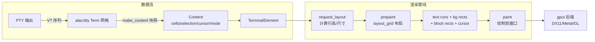
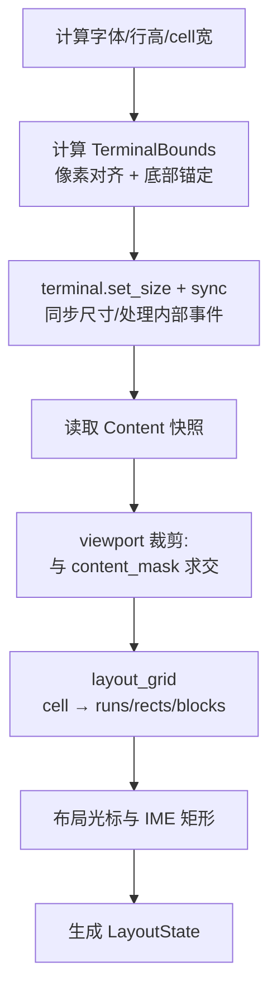
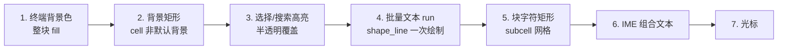
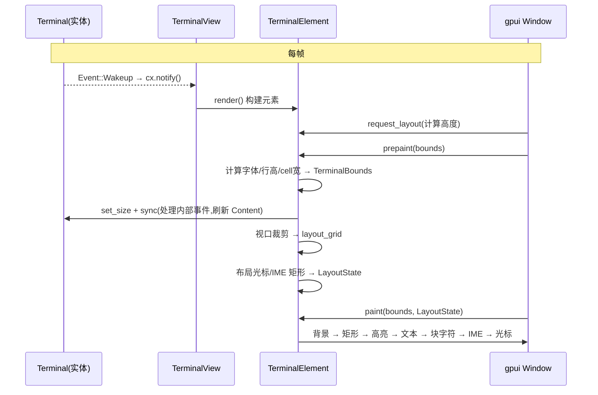

# terminal_view 渲染原理分析

> 生成日期:2026-08-06
> 分析对象:`terminal_view/`(从 Zed 直接拷贝的终端视图 crate,核心为 `src/terminal_element.rs`)
> 关联:`crates/terminal`(Terminal 实体)与 `docs/terminal-architecture.md`

---

## 1. 总览

`terminal_view` 是 Zed 中终端面板的**视图层**,负责把 `Terminal` 实体(alacritty_terminal 仿真核心)的网格快照(`Content`)绘制到 gpui 窗口上。渲染核心是 `TerminalElement` —— 一个自定义的 gpui `Element`,实现了 `request_layout` / `prepaint` / `paint` 三阶段管线。

**核心思想:**

- 终端内容是**逻辑网格**(行 x 列,固定 cell 尺寸),渲染时把网格映射为三类图元:
  - **文本段**(`BatchedTextRun`):连续同风格 cell 合并成一个文本 run,一次整形、一次绘制
  - **背景矩形**(`LayoutRect`):非默认背景色的 cell 合并为矩形,用 `paint_quad` 绘制
  - **块字符矩形**(`BlockElementLayoutRect`):`█▀▄▌` 等装饰字符按 subcell 网格拆成矩形,不走字体
- 所有绘制坐标都是**像素对齐**的(对齐到设备像素),避免缩放/滚动时字形抖动
- 每帧只渲染**视口内可见**的 cell(与 `content_mask` 求交)



---

## 2. 坐标系与网格模型

### 2.1 逻辑网格 → 像素

```rust
// TerminalBounds 定义(crates/terminal)
pub struct TerminalBounds {
    pub cell_width: Pixels,   // 一个 cell 的宽
    pub line_height: Pixels,  // 一行的高
    pub bounds: Bounds<Pixels>, // 终端区域的原点与尺寸
}
```

| 概念 | 含义 |
|---|---|
| `num_lines()` | `floor(height / line_height)`,行数(带 `next_up()` 容差防浮点丢行) |
| `num_columns()` | `floor(width / cell_width)`,列数 |
| `cell_width` | 用 `text_system.advance(font, size, 'm')` 测得,即字体中 `m` 的 advance 宽度 |
| `line_height` | `font_size × line_height_multiplier`,Zed 默认乘数来自终端设置 |

### 2.2 滚动与行号

alacritty 网格的行号以**屏幕顶部为 0**,向上滚动显示历史时 `display_offset > 0`,可见 cell 的行号为**负数**:

```
display_offset = 2 时:
-2,0 -2,1 ...     ← 历史最旧行
-1,0 -1,1 ...     ← 历史
 0,0  0,1 ...     ← 屏幕第一行(当前显示)
 1,0  1,1 ...
```

渲染时把每个 cell 的 `point.line + display_offset` 归一化到**视口坐标**,再乘以 `line_height` 得到像素 Y。负数行号因此也能正确绘制,且**裁剪逻辑按视口行号过滤**。

---

## 3. 三阶段渲染管线

### 3.1 `request_layout` —— 决定高度

```rust
// TerminalElement::request_layout
let height = match content_mode {
    ContentMode::Inline { displayed_lines, .. } => {
        // 内嵌模式(Agent 面板等):高度 = 显示行数 × 行高(向上取整到整设备像素)
        px((displayed_lines as f32 * line_height * scale).ceil() / scale)
    }
    ContentMode::Scrollable => relative(1.), // 独立终端:撑满父容器
};
```

`ContentMode` 由 `TerminalView::content_mode` 决定:

- `Standalone`(独立终端)→ `Scrollable`
- `Embedded`(内嵌)→ 内容不足 1000 行时 `Inline`,否则回退 `Scrollable`;未聚焦时截断到 `max_lines_when_unfocused`

### 3.2 `prepaint` —— 布局(核心)

`prepaint` 完成**所有几何计算**,输出 `LayoutState` 供 `paint` 直接绘制。流程:



#### 3.2.1 像素对齐与底部锚定

```rust
// Standalone 模式:行高与可用高度都按设备像素取整,
// 余出的 padding 放在顶部(锚定底部),避免 resize 时整屏抖动
let rows = (available_height_device_px / line_height_device_px) as usize;
let snapped_height_device_px = rows * line_height_device_px;
let padding_device_px = available_height_device_px - snapped_height_device_px;
if should_anchor_to_bottom { origin.y += padding; }
```

`should_anchor_to_bottom`:ALT_SCREEN 或 (已在底部 且 底部行有内容) 时锚定底部 —— 终端应用(如 vim、top)通常在底部输出。

#### 3.2.2 视口裁剪(性能关键)

```rust
// 终端 bounds 与当前 content_mask(所有父级裁剪后的可见区)求交
let visible_bounds = window.content_mask().bounds;
let intersection = visible_bounds.intersect(&content_bounds);

// 完全不可见 → 跳过所有 cell 处理
// 完全可见   → 快路径,直接流式处理全部 cell
// 部分可见   → 按屏幕行号 skip/take,只处理可见行
cells.iter().chunk_by(|c| c.point.line)
    .into_iter().skip(rows_above_viewport).take(visible_row_count)
    .flat_map(|(_, line_cells)| line_cells)
```

**注意**:裁剪按"枚举的行组索引(屏幕位置)"过滤,而不是 cell 内部行号 —— 因为滚动时行号可能是负数。

### 3.3 `paint` —— 绘制

绘制顺序(从底到顶):



另外 `paint` 阶段还负责:

- 注册 `InputHandler`(`window.handle_input`,**只能在 paint 阶段调用**)
- 注册鼠标事件监听(`register_mouse_listeners`:点击/拖拽/中键/滚轮/鼠标模式)
- 设置光标样式(悬停链接时 `PointingHand`,否则 `IBeam`)
- 监听修饰键变化(Alt 悬停刷新超链接)

---

## 4. `layout_grid` —— 网格→图元转换(渲染心脏)

```rust
fn layout_grid<T: TerminalLayoutCell>(
    grid: impl Iterator<Item = T>,
    start_line_offset: i32,
    text_style: &TextStyle,
    hyperlink: Option<(HighlightStyle, &Range)>,
    minimum_contrast: f32,
    cx: &App,
) -> (Vec<LayoutRect>, Vec<BatchedTextRun>, Vec<BlockElementLayoutRect>)
```

### 4.1 第一遍:遍历 cell,积累图元

按行分组遍历(`chunk_by(point.line)`),对每个 cell:

1. **前景/背景**:`cell.foreground()` / `cell.background()`,`is_inverse()` 时交换
2. **背景矩形**:非默认背景色 → 生成/扩展 `BackgroundRegion`(同色同行相邻则向右延伸)
3. **宽字符占位**:`is_wide_char_spacer()` 的 cell 跳过(宽字符第二格的占位)
4. **组合字符后的空格**:跳过紧跟 zerowidth 字符的空格(emoji 变体序列)
5. **文本 run**:非空 cell → 计算 `TextRun` 样式,尝试追加到当前 `BatchedTextRun`(见下)
6. **块字符**:命中块字符表 → 拆成 subcell 矩形,并 flush 当前 run

### 4.2 `BatchedTextRun` —— 文本批处理

```rust
struct BatchedTextRun {
    start_point: LayoutPoint, // 起始 (line, column)
    text: String,             // 累积的文本
    cell_count: usize,        // 占多少个 cell(不含 zerowidth)
    style: TextRun,           // 批内统一样式
    font_size: AbsoluteLength,
}
```

**合并条件**(`can_append`):

- 字体、颜色、背景色、下划线、删除线全部相同
- 与批起始点**在同一行且列连续**(`start.column + cell_count == cell.column`)

`append_char` 时同步维护 `style.len`(UTF-8 字节数)与 `cell_count`;zerowidth 字符追加但不计 cell。

绘制时整批一次 `shape_line` + `paint`:

```rust
fn paint(&self, origin, dimensions, window, cx) {
    let pos = point(
        origin.x + self.start_point.column as f32 * dimensions.cell_width,
        origin.y + self.start_point.line as f32 * dimensions.line_height,
    );
    window.text_system().shape_line(
        self.text.clone().into(),
        self.font_size.to_pixels(window.rem_size()),
        slice::from_ref(&self.style),
        Some(dimensions.cell_width), // max_width:按 cell 宽度约束换行
    ).paint(pos, dimensions.line_height, TextAlign::Left, None, window, cx);
}
```

> **性能收益**:一段 `echo hello` 若 11 个 cell 同风格,就从 11 次整形合并为 1 次。终端每帧几千 cell,批处理是渲染性能的关键。

### 4.3 `merge_background_regions` —— 矩形合并

`BackgroundRegion` 记录 (start/end line, start/end col, color)。两遍式合并:

1. **收集时**:同一行、同色、`end_col + 1 == col` 的相邻 cell 直接向右延伸
2. **收集后**:迭代合并 —— 水平相邻(同行 `end+1==start`)或垂直相邻(同列跨度 `end+1==start`)且同色的区域合并,直到无法再合并

最后把每个多行区域**按行拆分**为 `LayoutRect`(单行矩形):

```rust
for region in merged_regions {
    for line in region.start_line..=region.end_line {
        rects.push(LayoutRect::new(
            LayoutPoint::new(line, region.start_col),
            region.end_col - region.start_col + 1, // cell 数
            region.color,
        ));
    }
}
```

> **性能收益**:`ls --color` 大量同色背景/前景块合并成少量矩形,大幅减少 GPU quad 提交。

### 4.4 块字符 —— subcell 网格

某些字符用字体渲染会破坏"无缝拼接"(cell 间留缝、颜色混叠),Zed 改为**纯矩形绘制**。

**网格**:每个 cell 划分成 8 列 × 24 行 subcell(LCM of 8-way splits 与 sextant 的 3-way splits):

```rust
const BLOCK_SUBCELL_COLUMNS: i32 = 8;
const BLOCK_SUBCELL_LINES: i32 = 24;
```

| 字符族 | 处理方式 |
|---|---|
| Block Elements `▀▁▄█▉▐▔▕`(U+2580..U+2595) | `block_char_to_rect` 映射为单一矩形(如 `▀` = 上 12 行) |
| Quadrant `▘▝▖▗▚▞▛▜▙▟`(U+2596..U+259F) | `quadrant_char_to_filled_bits` → 2x2 象限填充 |
| Sextant `U+1FB00..U+1FB3B` | `sextant_char_to_filled_bits` → 2x3 位图(QR 渲染用) |
| Shade `░▒▓` | `shade_char_to_opacity` → 整 cell 用前景色降低透明度填充 |
| Powerline 分隔符(PUA E0B0..) | 归入 `is_decorative_character`,保留精确颜色(不做对比度调整) |

相邻同色块矩形同样走 `merge_background_regions` 合并(如 QR 码的一长串 `█`)。绘制用 `window.paint_quad(fill(...))`,坐标是 subcell 网格坐标 × subcell 尺寸。

### 4.5 `cell_style` —— cell → TextRun

```rust
fn cell_style(point, cell, fg, bg, colors, text_style, hyperlink, minimum_contrast) -> TextRun {
    let skip_contrast = is_app_chosen_exact_color(&fg); // 24-bit 真彩 / 256 色(>=16)不调对比度
    let mut fg = convert_color(&fg, colors);
    let bg = convert_color(&bg, colors);

    if !skip_contrast && !is_decorative_character(cell.character()) {
        fg = ensure_minimum_contrast(fg, bg, minimum_contrast); // APCA 对比度
    }
    if cell.is_dim() { fg.a *= 0.7; }   // dim 变体降低透明度

    // 下划线:cell 下划线 / 超链接 / undercurl(波浪)
    // 删除线:strikeout
    // 字重:bold → FontWeight::BOLD
    // 字形:italic → FontStyle::Italic

    // 超链接命中:覆盖颜色与下划线为链接样式
}
```

#### 对比度调整(APCA)

`ensure_minimum_contrast` 使用 **APCA**(Accessible Perceptual Contrast Algorithm,0.0.98G-4g):

- `srgb_to_y`:线性化 + 加权亮度
- 极性感知:暗字浅底 / 亮字深底分别用不同指数与缩放
- 先调 lightness(二分搜索,保留 hue/saturation);不足再降饱和;最后退化为纯黑/白
- 默认阈值 45(ARC Bronze 大字号下限);设为 0 关闭

**跳过对比度调整的情形**(避免颜色被"洗掉"):

- 应用显式指定的 24-bit 真彩色(`\e[38;2;R;G;Bm`)与 256 色(≥16)
- 装饰字符(Box Drawing / Block / Powerline 等) —— 它们需要与相邻背景精确匹配

#### 颜色转换(`convert_color`)

```rust
match fg {
    Color::Named(named) => match named {
        NamedColor::Red => colors.terminal_ansi_red,
        // ... 16 ANSI + Bright* + Dim* + Foreground/Background/Cursor 等
    },
    Color::Spec(rgb) => rgba_color(rgb.r, rgb.g, rgb.b),       // 24-bit
    Color::Indexed(i) => get_color_at_index(i, theme),          // 8-bit 索引
}
```

---

## 5. 光标渲染

### 5.1 光标矩形与宽度

```rust
// 光标字符整形(用于 Block 光标内显示字符)
let cursor_text = shape_line(cursor_char.to_string(), ...);

// 空白字符用 cell 宽度;普通字符取 整形宽度 与 cell 宽度 的较大者(覆盖宽字符/emoji)
let cursor_width = if cursor_char.is_whitespace() {
    cell_width
} else {
    cursor_text.width.max(cell_width)
};
```

### 5.2 光标形状

`CursorShape`(Block / Underline / Bar / HollowBlock / Hidden)映射到 gpui 光标类型:

| 终端形状 | 聚焦 | 未聚焦 |
|---|---|---|
| Block | 实心块 + 字符 | Hollow(空心框) |
| Underline | 下划线 | Hollow |
| Bar | 竖线 | Hollow |
| HollowBlock | Hollow | Hollow |
| Hidden | 不绘制 | 不绘制 |

光标矩形**始终布局**(IME 需要它定位候选窗),但 `cursor_visible`(闪烁控制)为 false 时不绘制。

### 5.3 光标闪烁

`BlinkManager`(editor crate)+ 终端 `BlinkChanged` 事件:

- 设置 `blinking`:Off → 常亮;On → 按 500ms 周期闪烁;TerminalControlled → 由终端 OSC 序列控制
- 焦点进入/键盘输入时暂停闪烁(恢复常亮),`focus_out` 时禁用闪烁并切换空心光标

---

## 6. 高亮渲染(选择 / 搜索)

### 6.1 数据准备

```rust
// 搜索匹配(terminal.matches)与选择范围都转为 "相对高亮范围"
let mut relative_highlighted_ranges = Vec::new();
for search_match in search_matches {
    relative_highlighted_ranges.push((search_match, match_color));
}
if let Some(selection) = selection {
    relative_highlighted_ranges.push((selection.point_range(), player_color.selection));
}
```

### 6.2 范围 → 行矩形

`to_highlighted_range_lines` 把 (start,end) 范围转换为逐行像素段:

1. **归一化**:`line + display_offset` 变视口坐标
2. **裁剪**:完全在视口外返回 None;否则 clamp 到视口行范围
3. **跨行拆分**:每个受影响行生成 `HighlightedRangeLine { start_x, end_x }`,首尾行按列裁剪

### 6.3 绘制

```rust
// HighlightedRange::paint
// 每行一个圆角矩形(rounded_selection 设置控制圆角半径,默认 0.15 × line_height)
// 半透明颜色叠加在背景矩形之上
```

---

## 7. 输入处理

### 7.1 文本输入(InputHandler)

```rust
// TerminalInputHandler(paint 阶段注册)
impl InputHandler for TerminalInputHandler {
    fn selected_text_range(...)   // IME 定位:始终返回 0..0
    fn marked_text_range(...)     // IME 组合文本范围
    fn replace_text_in_range(...) // 普通字符 → view.commit_text → terminal.input
    fn replace_and_mark_text_in_range(...) // IME 组合 → set_marked_text
    fn bounds_for_range(...)      // IME 候选窗锚点:cursor_bounds + 列偏移
}
```

`cursor_bounds`(IME 光标矩形)在 prepaint 中计算,`bounds_for_range` 用它 + `range.start * cell_width` 定位候选窗。

### 7.2 特殊键

`TerminalView::key_down` → `try_keystroke`(箭头、回车、Ctrl 组合等)→ `to_esc_str` 转义序列 → `terminal.input`。

### 7.3 鼠标

- 普通模式:左键选择(点击定位、拖拽扩展)、右键菜单、滚轮滚动
- 鼠标模式(应用开启 SGR/UTF8 鼠标协议):事件编码为转义序列写回 PTY
- Alt 悬停:刷新超链接检测,命中显示 tooltip

---

## 8. 滚动

```rust
// TerminalScrollHandle(ui::ScrollableHandle 实现)
struct ScrollHandleState {
    line_height, total_lines, viewport_lines, display_offset,
}
```

- `max_offset` = (总行数 - 视口行数) × 行高
- `offset` = -(max - display_offset) × 行高(负值,向上滚)
- `set_offset` → 换算为 `future_display_offset`,`TerminalView::render` 时应用为 `scroll_up_by/down_by`

---

## 9. 与 Zed 依赖的耦合点(精简时需处理)

| Zed 依赖 | 用途 | 精简替代方案 |
|---|---|---|
| `editor::{CursorLayout, HighlightedRange, BlinkManager}` | 光标/高亮/闪烁绘制 | 自实现:`paint_quad` 绘制光标与高亮矩形,`BackgroundExecutor::timer` 闪烁 |
| `ui::utils::ensure_minimum_contrast` | APCA 对比度 | 移植 `apca_contrast.rs`(纯 gpui `Hsla` 算法,约 200 行) |
| `theme::Theme` | ANSI 颜色表 | `terminal::TerminalColors`(本地已定义 XTerm 默认) |
| `theme_settings::ThemeSettings` / `settings` | 字体/行高/对比度设置 | 本地 `TerminalRenderSettings` 结构 + 默认值 |
| `workspace::Workspace` | 路径/URL hover tooltip、上下文菜单 | 删除(独立终端不需要) |
| `terminal_panel` / `persistence` | 面板管理、会话持久化 | 删除 |
| `project` / `task` | 任务、远程 | 删除 |

---

## 10. 渲染流程图(汇总)


