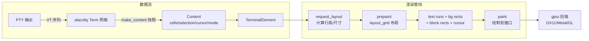
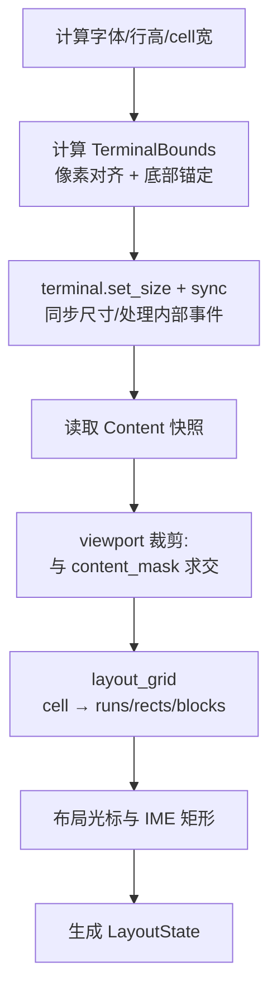
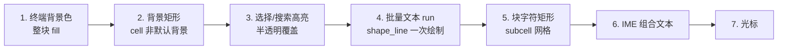

# terminal_view 渲染原理分析

> 分析对象:`crates/terminal_view`(移植精简自 Zed 的 `terminal_view`)。
> 文件结构:`src/lib.rs`(TerminalView 生命周期 / 输入)、`src/terminal_element.rs`(三阶段渲染管线)、`src/contrast.rs`(APCA 对比度)。
> 关联:`crates/terminal`(Terminal 实体)与 [`terminal-architecture.md`](./terminal-architecture.md)。

---

## 1. 总览

`terminal_view` 是 Zed 中终端面板的**视图层**,负责把 `Terminal` 实体(alacritty_terminal 仿真核心)的网格快照(`Content`)绘制到 gpui 窗口上。渲染核心是 `TerminalElement` —— 一个自定义的 gpui `Element`,实现了 `request_layout` / `prepaint` / `paint` 三阶段管线。

**核心思想:**

- 终端内容是**逻辑网格**(行 x 列,固定 cell 尺寸),渲染时把网格映射为三类图元:
  - **文本段**(`BatchedTextRun`):连续同风格 cell 合并成一个文本 run,一次整形、一次绘制
  - **背景矩形**(`LayoutRect`):非默认背景色的 cell 合并为矩形,用 `paint_quad` 绘制
  - **块字符矩形**(`BlockElementLayoutRect`):`█▀▄▌` 等装饰字符按 subcell 网格拆成矩形,不走字体
- 所有绘制坐标都是**像素对齐**的(对齐到设备像素),避免缩放/滚动时字形抖动
- 每帧只渲染**视口内可见**的 cell(与 `content_mask` 求交)



**模块职责划分**:

| 文件 | 职责 |
|---|---|
| `lib.rs` | `TerminalView` 实体:终端创建(`TerminalBuilder`)、事件订阅、键盘输入(`try_keystroke` / 粘贴)、右键粘贴、焦点管理、IME 状态、光标闪烁相位、`title()` 访问器 |
| `terminal_element.rs` | `TerminalElement`:三阶段渲染管线、`layout_grid` 图元转换、光标/高亮/IME 绘制、鼠标监听注册、`TerminalInputHandler` |
| `contrast.rs` | `ensure_minimum_contrast`(APCA 0.0.98G-4g,自 Zed `ui::utils` 移植,纯 gpui `Hsla` 算法) |

---

## 2. 坐标系与网格模型

### 2.1 逻辑网格 → 像素

```rust
// TerminalBounds 定义(crates/terminal/src/terminal.rs)
#[derive(Clone, Debug)]
pub struct TerminalBounds {
    pub line_height: Pixels,    // 一个 cell 的行高
    pub cell_width: Pixels,     // 一个 cell 的宽
    pub bounds: Bounds<Pixels>, // 终端区域的原点与尺寸
}
```

| 概念 | 含义 |
|---|---|
| `num_lines()` | `floor(height / line_height)`,行数(带 `next_up()` 容差防浮点丢行) |
| `num_columns()` | `floor(width / cell_width)`,列数 |
| `cell_width` | 用 `text_system.advance(font, size, 'm')` 测得,即字体中 `m` 的 advance 宽度 |
| `line_height` | `font_size × line_height_multiplier`,默认 `15px × 1.3` |

### 2.2 滚动与行号

alacritty 网格的行号以**屏幕顶部为 0**,向上滚动显示历史时 `display_offset > 0`,可见 cell 的行号为**负数**:

```
display_offset = 2 时:
-2,0 -2,1 ...     ← 历史最旧行
-1,0 -1,1 ...     ← 历史
 0,0  0,1 ...     ← 屏幕第一行(当前显示)
 1,0  1,1 ...
```

渲染时把每个 cell 的 `point.line + display_offset` 归一化到**视口坐标**,再乘以 `line_height` 得到像素 Y。负数行号因此也能正确绘制,且**裁剪逻辑按视口行号过滤**。

---

## 3. 三阶段渲染管线

### 3.1 `request_layout` —— 决定尺寸

```rust
// TerminalElement::request_layout
// 独立终端(本项目的唯一模式):高度/宽度均撑满父容器
let height: Length = relative(1.).into();
let layout_id = self.interactivity.request_layout(..., |mut style, window, cx| {
    style.size.width = relative(1.).into();
    style.size.height = height;
    window.request_layout(style, None, cx)
});
```

> 本项目只有 `Standalone` 独立终端一种模式(无 Zed 的 `ContentMode::Inline`),`request_layout` 恒返回 `relative(1.)`。

### 3.2 `prepaint` —— 布局(核心)

`prepaint` 完成**所有几何计算**,输出 `LayoutState` 供 `paint` 直接绘制。流程:



#### 3.2.0 字体与 cell 测量(每次 prepaint 重新计算)

```rust
let text_style = TextStyle {
    font_family: settings.font_family,      // 默认 "JetBrainsMono Nerd Font"
    font_features: FontFeatures::disable_ligatures(),  // 终端禁止连字(避免粘连歧义)
    font_size: font_size.into(),            // 默认 15px
    line_height: px(f32::from(font_size) * settings.line_height_multiplier).into(), // 1.3
    background_color: Some(colors.terminal_background),
    color: colors.terminal_foreground,      // 每 cell 覆盖
    ..Default::default()
};

let font_id = text_system.resolve_font(&text_style.font());
let cell_width = text_system.advance(font_id, font_size, 'm').unwrap().width; // 'm' 的 advance
let line_height_px = f32::from(font_size) * line_height_multiplier;
```

#### 3.2.1 像素对齐与底部锚定

```rust
// 行高与可用高度都按设备像素取整,余出的 padding 放在顶部(锚定底部),
// 避免 resize 时整屏抖动(行数是整数,高度必须落在行边界上)
let scale_factor = window.scale_factor();
let line_height_device_px = (f32::from(line_height_px) * scale_factor).round().max(1.0) as i32;
let available_height_device_px = (f32::from(available_height) * scale_factor).floor().max(0.0) as i32;

let rows = ((available_height_device_px / line_height_device_px) as usize).max(1);
let snapped_height_device_px = (rows as i32) * line_height_device_px;
let padding_device_px = (available_height_device_px - snapped_height_device_px).max(0);
if should_anchor_to_bottom { origin.y += padding; }

// 原点也对齐到设备像素,避免缩放/滚动时字形抖动
origin.x = snap_px(origin.x);
origin.y = snap_px(origin.y);
```

`should_anchor_to_bottom` 计算(读取 `Content` 快照):

```rust
let should_anchor_to_bottom = {
    let content = self.terminal.read(cx).last_content();
    content.mode.contains(Modes::ALT_SCREEN)
        || (content.scrolled_to_bottom && content.bottom_row_occupied)
};
```

即:**ALT_SCREEN**(vim/top 等全屏 TUI,内容通常从底部向上输出),或**停在最新内容(`display_offset == 0`)且视口最下面那一行确实被占用**时锚定底部 —— 保证新输出紧贴视口底部、不跳动;否则(正在回滚里看历史,或内容还没填到底部)顶端固定。

`bottom_row_occupied` 在 `terminal/src/alacritty.rs::make_content` 中算出:视口最下面那一行的行号 `bottom_line = screen_lines - 1 - display_offset`,满足 `光标所在行 >= bottom_line`,或该行存在非空格字符,即为 `true`。

⚠️ 这一条不能省:屏幕空、内容很短时底部行是空的,若仍锚定底部,不足一行的余量就会随窗口高度在顶部来回移动(看起来就是「内容随缩放上下挪动」)。

#### 3.2.2 视口裁剪(性能关键)

```rust
// 终端 bounds 与当前 content_mask(所有父级裁剪后的可见区)求交
let content_bounds = dimensions.bounds;
let visible_bounds = window.content_mask().bounds;
let intersection = visible_bounds.intersect(&content_bounds);

// 三种路径:
// 1. 无交集(高或宽 ≤ 0)→ 直接返回空图元,跳过全部 cell 处理
// 2. 完全可见(intersection == content_bounds)→ 快路径,流式处理全部 cell
// 3. 部分可见 → 按屏幕行号 skip/take,只处理可见行:
let rows_above_viewport =
    f32::from((intersection.top() - content_bounds.top()).max(px(0.)) / line_height_px) as usize;
let visible_row_count = f32::from((intersection.size.height / line_height_px).ceil()) as usize + 1;
cells.iter().chunk_by(|c| c.point.line)
    .into_iter().skip(rows_above_viewport).take(visible_row_count)
    .flat_map(|(_, line_cells)| line_cells)
```

**注意**:裁剪按"枚举的行组索引(屏幕位置)"过滤,而不是 cell 内部行号 —— 因为滚动时行号可能是负数;部分可见时还需把 `rows_above_viewport` 作为 `start_line_offset` 传给 `layout_grid` 以对齐显示行号。

### 3.3 `paint` —— 绘制

绘制顺序(从底到顶):



另外 `paint` 阶段还负责:

- **内容遮罩**:`window.with_content_mask(Some(ContentMask { bounds }))` 包裹全部绘制,限制绘制区
- 注册 `InputHandler`(`window.handle_input`,**只能在 paint 阶段调用**,debug 断言 `DrawPhase::Paint`)
- 注册鼠标事件监听(`register_mouse_listeners`:左/中/右键、拖拽、滚轮、鼠标模式附加处理)
- 设置光标样式(悬停链接且按 Alt 时 `PointingHand`,否则 `IBeam`)
- 监听修饰键变化(`window.on_key_event` 在 `DispatchPhase::Bubble` 时调 `try_modifiers_change` 刷新超链接悬停状态)
- **IME 组合文本**:绘制前先 `paint_quad` 用终端背景色覆盖底层文本,再绘制带下划线的组合文本;有 IME 文本时**跳过光标绘制**
- **光标绘制条件**:`cursor_visible`(闪烁相位)&& 无 IME 文本 && 光标形状非 Hidden

---

## 4. `layout_grid` —— 网格→图元转换(渲染心脏)

```rust
fn layout_grid(
    grid: impl Iterator<Item = &'a IndexedCell>,
    start_line_offset: i32,
    text_style: &TextStyle,
    hyperlink: Option<(HighlightStyle, &Range)>,
    minimum_contrast: f32,
    colors: &TerminalColors,
    cx: &App,
) -> (Vec<LayoutRect>, Vec<BatchedTextRun>, Vec<BlockElementLayoutRect>)
```

> **性能细节**:按 `grid.size_hint()` 预分配容量 —— 预估 `~10 cell/run`、`~20 cell/背景区域`,减少重分配;按行 `chunk_by(point.line)` 分组遍历,行边界处 flush 当前批。

### 4.1 第一遍:遍历 cell,积累图元

按行分组遍历(`chunk_by(point.line)`),对每个 cell:

1. **前景/背景**:`cell.foreground()` / `cell.background()`,`is_inverse()` 时交换
2. **背景矩形**:非默认背景色 → 生成/扩展 `BackgroundRegion`(同色同行相邻则向右延伸)
3. **宽字符占位**:`is_wide_char_spacer()` 的 cell 跳过(宽字符第二格的占位)
4. **组合字符后的空格**:跳过紧跟 zerowidth 字符的空格(emoji 变体序列)
5. **文本 run**:非空 cell → 计算 `TextRun` 样式,尝试追加到当前 `BatchedTextRun`(见下)
6. **块字符**:命中块字符表 → 拆成 subcell 矩形,并 flush 当前 run

### 4.2 `BatchedTextRun` —— 文本批处理

```rust
struct BatchedTextRun {
    start_point: LayoutPoint, // 起始 (line, column)
    text: String,             // 累积的文本
    cell_count: usize,        // 占多少个 cell(不含 zerowidth)
    style: TextRun,           // 批内统一样式
    font_size: AbsoluteLength,
}
```

**合并条件**(`can_append`):

- 字体、颜色、背景色、下划线、删除线全部相同
- 与批起始点**在同一行且列连续**(`start.column + cell_count == cell.column`)

`append_char` 时同步维护 `style.len`(UTF-8 字节数)与 `cell_count`;zerowidth 字符追加但不计 cell。

绘制时整批一次 `shape_line` + `paint`:

```rust
fn paint(&self, origin, dimensions, window, cx) {
    let pos = point(
        origin.x + self.start_point.column as f32 * dimensions.cell_width,
        origin.y + self.start_point.line as f32 * dimensions.line_height,
    );
    window.text_system().shape_line(
        self.text.clone().into(),
        self.font_size.to_pixels(window.rem_size()),
        slice::from_ref(&self.style),
        Some(dimensions.cell_width), // max_width:按 cell 宽度约束换行
    ).paint(pos, dimensions.line_height, TextAlign::Left, None, window, cx);
}
```

> 批处理让连续同风格 cell 只整形一次(终端每帧几千 cell,这是渲染性能的关键)。

### 4.3 `merge_background_regions` —— 矩形合并

`BackgroundRegion` 记录 (start/end line, start/end col, color)。两遍式合并:

1. **收集时**:同一行、同色、`end_col + 1 == col` 的相邻 cell 直接向右延伸
2. **收集后**:迭代合并 —— 水平相邻(同行 `end+1==start`)或垂直相邻(同列跨度 `end+1==start`)且同色的区域合并,直到无法再合并

最后把每个多行区域**按行拆分**为 `LayoutRect`(单行矩形):

```rust
for region in merged_regions {
    for line in region.start_line..=region.end_line {
        rects.push(LayoutRect::new(
            LayoutPoint::new(line, region.start_col),
            region.end_col - region.start_col + 1, // cell 数
            region.color,
        ));
    }
}
```

> 同色区域合并成少量矩形,减少 GPU quad 提交。

### 4.4 块字符 —— subcell 网格

某些字符用字体渲染会留缝 / 颜色混叠,改为**纯矩形绘制**。

**网格**:每个 cell 划分成 8 列 × 24 行 subcell(LCM of 8-way splits 与 sextant 的 3-way splits):

```rust
const BLOCK_SUBCELL_COLUMNS: i32 = 8;
const BLOCK_SUBCELL_LINES: i32 = 24;
```

| 字符族 | 处理方式 |
|---|---|
| Block Elements `▀▁▄█▉▐▔▕`(U+2580..U+2595) | `block_char_to_rect` 映射为单一矩形(如 `▀` = 上 12 行) |
| Quadrant `▘▝▖▗▚▞▛▜▙▟`(U+2596..U+259F) | `quadrant_char_to_filled_bits` → 2x2 象限填充 |
| Sextant `U+1FB00..U+1FB3B` | `sextant_char_to_filled_bits` → 2x3 位图(QR 渲染用) |
| Shade `░▒▓` | `shade_char_to_opacity` → 整 cell 用前景色降低透明度填充 |
| Powerline 分隔符(PUA E0B0..) | 归入 `is_decorative_character`,保留精确颜色(不做对比度调整) |

相邻同色块矩形同样走 `merge_background_regions` 合并(如 QR 码的一长串 `█`)。绘制用 `window.paint_quad(fill(...))`,坐标是 subcell 网格坐标 × subcell 尺寸。

### 4.5 `cell_style` —— cell → TextRun

```rust
fn cell_style(point, cell, fg, bg, colors, text_style, hyperlink, minimum_contrast) -> TextRun {
    let skip_contrast = is_app_chosen_exact_color(&fg); // 24-bit 真彩 / 256 色(>=16)不调对比度
    let mut fg = convert_color(&fg, colors);
    let bg = convert_color(&bg, colors);

    if !skip_contrast && !is_decorative_character(cell.character()) {
        fg = ensure_minimum_contrast(fg, bg, minimum_contrast); // APCA 对比度
    }
    if cell.is_dim() { fg.a *= 0.7; }   // dim 变体降低透明度

    // 下划线:cell 下划线 / 超链接 / undercurl(波浪)
    // 删除线:strikeout
    // 字重:bold → FontWeight::BOLD
    // 字形:italic → FontStyle::Italic

    // 超链接命中:覆盖颜色与下划线为链接样式
}
```

#### 对比度调整(APCA)

`ensure_minimum_contrast` 使用 **APCA**(Accessible Perceptual Contrast Algorithm,0.0.98G-4g):

- `srgb_to_y`:线性化 + 加权亮度
- 极性感知:暗字浅底 / 亮字深底分别用不同指数与缩放
- 先调 lightness(二分搜索,保留 hue/saturation);不足再降饱和;最后退化为纯黑/白
- 默认阈值 45(ARC Bronze 大字号下限);设为 0 关闭

**跳过对比度调整的情形**(避免颜色被"洗掉"):

- 应用显式指定的 24-bit 真彩色(`\e[38;2;R;G;Bm`)与 256 色(≥16)
- 装饰字符(Box Drawing / Block / Powerline 等) —— 它们需要与相邻背景精确匹配

#### 颜色转换(`convert_color`)

```rust
match fg {
    Color::Named(named) => match named {
        NamedColor::Red => colors.terminal_ansi_red,
        // ... 16 ANSI + Bright* + Dim* + Foreground/Background/Cursor 等
    },
    Color::Spec(rgb) => rgba_color(rgb.r, rgb.g, rgb.b),       // 24-bit
    Color::Indexed(i) => get_color_at_index(i, theme),          // 8-bit 索引
}
```

---

## 5. 光标渲染

### 5.1 光标矩形与宽度

```rust
// 光标字符整形(用于 Block 光标内显示字符)
let cursor_text = shape_line(cursor_char.to_string(), ...);

// 空白字符用 cell 宽度;普通字符取 整形宽度 与 cell 宽度 的较大者(覆盖宽字符/emoji)
let cursor_width = if cursor_char.is_whitespace() {
    cell_width
} else {
    cursor_text.width.max(cell_width)
};
```

### 5.2 光标形状

终端 `CursorShape`(Block / Underline / Bar / HollowBlock / Hidden)在渲染层映射到本地 `CursorKind` 枚举(`terminal_element.rs`,替代 Zed 的 `editor::CursorLayout`):

```rust
enum CursorKind { Block, Underline, Bar, Hollow }   // 本地定义

// 绘制实现(paint_quad 手绘):
// Block      → 实心块 + 光标内字符(用终端背景色整形,Block 聚焦时)
// Underline  → 底部 2px 横线
// Bar        → 左侧 2px 竖线
// Hollow     → 1px 空心框(四条边分别 paint_quad)
```

| 终端形状 | 聚焦 | 未聚焦 |
|---|---|---|
| Block | `Block`(实心块 + 字符) | `Hollow`(空心框) |
| Underline | `Underline` | `Hollow` |
| Bar | `Bar` | `Hollow` |
| HollowBlock | `Hollow` | `Hollow` |
| Hidden | 不绘制 | 不绘制 |

光标矩形**始终布局**(IME 需要它定位候选窗,`cursor_width.ceil()` 防宽字符溢出),但 `cursor_visible`(闪烁控制)为 false 时不绘制。

### 5.3 光标闪烁

**本地实现**(替代 Zed 的 `editor::BlinkManager`):

- `TerminalView::new` 中 `cx.spawn` 一个后台循环:`background_executor().timer(500ms).await` 后翻转 `cursor_phase` 布尔并 `cx.notify()`
- `TerminalView::should_show_cursor` 决定可见性:
  1. 未聚焦 → 恒显示(空心)
  2. ALT_SCREEN(vim 等全屏 TUI)→ 恒显示(避免闪烁干扰)
  3. `settings.cursor_blinks == false` → 恒显示
  4. 否则按 `cursor_phase` 相位闪烁
- 焦点进入(`focus_in`)时重设光标形状为设置值并通知应用(FOCUS_IN_OUT);焦点离开(`focus_out`)时禁用闪烁并切换空心光标

> 终端 `BlinkChanged` 事件(OSC 控制闪烁)在本实现中未接入 —— 闪烁完全由本地 500ms 定时器驱动。

---

## 6. 高亮渲染(选择 / 搜索)

### 6.1 数据准备

```rust
// 搜索匹配(terminal.matches)与选择范围都转为 "相对高亮范围"
let mut relative_highlighted_ranges = Vec::new();
for search_match in search_matches {
    relative_highlighted_ranges.push((search_match, match_color));
}
if let Some(selection) = selection {
    relative_highlighted_ranges.push((selection.point_range(), player_color.selection));
}
```

### 6.2 范围 → 行矩形

`to_highlighted_range_lines` 把 (start,end) 范围转换为逐行像素段:

1. **归一化**:`line + display_offset` 变视口坐标
2. **裁剪**:完全在视口外返回 None;否则 clamp 到视口行范围
3. **跨行拆分**:每个受影响行生成 `HighlightedRangeLine { start_x, end_x }`,首尾行按列裁剪

### 6.3 绘制

```rust
// HighlightedRange::paint
// 每行一个圆角矩形(rounded_selection 设置控制圆角半径,默认 0.15 × line_height)
// 半透明颜色叠加在背景矩形之上
```

---

## 7. 输入处理

### 7.1 文本输入(InputHandler)

```rust
// TerminalInputHandler { terminal_view, cursor_bounds }(paint 阶段经 window.handle_input 注册)
impl InputHandler for TerminalInputHandler {
    fn selected_text_range(...)   // IME 定位:恒返回 Some(UTF16Selection { range: 0..0, reversed: false })
                                  // ALT_SCREEN(vim 等)下也返回有效选择,保证候选窗能定位
    fn marked_text_range(...)     // 读 TerminalView::marked_text_range(组合文本 UTF-16 长度)
    fn text_for_range(...)        // None(终端没有可读文本)
    fn replace_text_in_range(...) // 普通字符 → view.clear_marked_text + view.commit_text → terminal.input
    fn replace_and_mark_text_in_range(...) // IME 组合 → view.set_marked_text(更新 ime_state 并 notify)
    fn unmark_text(...)           // view.clear_marked_text
    fn bounds_for_range(...)      // IME 候选窗锚点:cursor_bounds + range.start × cell_width(来自 terminal_bounds)
    fn character_index_for_point(...) // None
    fn apple_press_and_hold_enabled() // false
}
```

`cursor_bounds`(IME 光标矩形)在 prepaint 中计算(`CursorLayout` 的位置与尺寸),`bounds_for_range` 用它 + `range_utf16.start × cell_width` 水平偏移定位候选窗。

### 7.2 特殊键

`TerminalView::on_key_down` → Ctrl+Shift+V 直接读剪贴板 `paste`;其余按键 → `terminal.try_keystroke`(箭头、回车、Ctrl 组合等)→ `to_esc_str` 转义序列 → `terminal.input`(入队 Scroll(Bottom)+ SetSelection(None) 后 `write_to_pty`)。

### 7.3 鼠标

- 普通模式:左键选择(点击定位、拖拽扩展、右键粘贴、滚轮滚动)
- 鼠标模式(应用开启 SGR/UTF8 鼠标协议):事件编码为转义序列写回 PTY;`register_mouse_listeners` 仅在 `mode.intersects(Modes::MOUSE_MODE)` 时注册中/右键的按下与抬起处理
- Alt 悬停:节流刷新超链接检测(`FindHyperlink`),命中时 `paint` 阶段设置 `PointingHand` 光标样式

### 7.4 拖选(框选)的时序

拖选是**唯一一条「输入改状态」与「重绘」分属两跳的路径**:鼠标事件由 `TerminalElement` 收下并**直接调用模型** `Terminal::mouse_*`,而选区真正生效要等下一帧 `prepaint → Terminal::sync` 消费内部事件队列。因此这里涉及**两座桥**,缺一不可:

| 桥 | 位置 | 作用 |
|---|---|---|
| 通知桥 `observe` | `TerminalView::new` 里 `cx.observe(&terminal, \|_, _, cx\| cx.notify())` | 把 `mouse_drag` 里打在 **`Terminal` 实体**上的 `cx.notify()` 变成「**本视图重绘**」⇒ 队列才会被 `sync` 消费 |
| 事件桥 `subscribe` | `lib.rs:147` `cx.subscribe(&terminal, ..)` → `handle_terminal_event`(`lib.rs:222`) | 收 `Event::Wakeup` / `SelectionsChanged` ⇒ `cx.notify()`(`lib.rs:228`) |

⚠️ **只挂 `subscribe`、不挂 `observe`** 会让拖选失效:`subscribe` 收的是 **`Event`**,收不到 **`notify`** ⇒「排了队列但没人重绘」,队列要等光标闪烁 / 输出等别的重绘才被顺带消费(表现:选区一卡一卡)。dock 面板的 `.cached(...)` 让视图不再「顺便」重绘,这个缺陷才会显形。

```
鼠标拖拽(TerminalElement::on_mouse_down / on_mouse_drag)
  → Terminal::mouse_drag:排 InternalEvent::UpdateSelection + cx.notify()(打给 Terminal)
  → observe 把它变成「视图重绘」→ render → prepaint → terminal.sync(消费队列,真改选区)
  → cx.emit(Event::SelectionsChanged) → subscribe → handle_terminal_event → cx.notify()(画出来)
```

**要点归纳**

1. **输入是「元素 → 模型」**:`TerminalElement` 直接调 `terminal.mouse_down / mouse_drag`,同时把 `cx.notify()` 打在 `Terminal` 上 —— `Terminal` 没有 `impl Render`,它的通知只对观察者有意义。
2. **命令是排队的**:`SetSelection` / `UpdateSelection` / `Copy` / `Scroll` 都进 `Terminal::events`,而**唯一的消费点是 `Terminal::sync`**(`terminal.rs:1826`,`pop_front` 全仓仅此一处),由 `TerminalElement::prepaint`(`:1291`)调用 ⇒ **「鼠标操作生效」⟺「视图重绘一次」**。
3. **两座桥都是「视图主动订阅模型」**:模型不转发、也不知道视图存在 ⇒ 模型改了状态而视图没接到信号,表现就是「操作没反应 / 慢半拍」。
4. **一次拖拽事件 ≈ 一帧**:`sync` 在 `layout_grid` **之前**,所以本轮就画出新选区;`SelectionsChanged` 再触发一次 `notify`(与下一次鼠标事件的重绘合并)。
5. **输出 / 打字 / 滚轮不需要第一座桥**:输出走 `Event::Wakeup`、打字靠 PTY 回显、滚轮在 `TerminalElement::on_scroll_wheel` 里用**视图的** `Context` 调 `cx.notify()`,都直接落到「视图重绘」。

---

## 8. 滚动

滚轮事件经 `register_mouse_listeners` 的 `on_scroll_wheel` 回调 → `TerminalView::scroll_wheel` → `Terminal::scroll_wheel(event, 1.0)`。

`Terminal::scroll_wheel` 的优先级分派:

1. **鼠标协议模式**(应用开启)→ 计算滚动行数后编码为 `scroll_report` 写回 PTY
2. **ALT_SCREEN + ALTERNATE_SCROLL**(vim/tmux 等)→ `alt_scroll` 编码为方向键/PageUp/PageDown 转义写回 PTY
3. 否则 → 入队 `InternalEvent::Scroll(Scroll::Delta(n))` 滚动主屏幕历史

滚动行数由 `determine_scroll_lines` 按 `touch_phase` 计算:

- `Started` → 清零 `scroll_px` 累计值,返回 `None`
- `Moved` → 累加 `delta.pixel_delta × multiplier`,`(scroll_px / line_height) as i32` 前后差值即为滚动行数;每次滚动后 `scroll_px %= terminal_bounds.height()`(触到边界即回绕,方向切换响应快)
- `Ended | Cancelled` → 返回 `None`(不滚动)

> 滚动完全由鼠标滚轮驱动,不提供滚动条 UI(见 §9)。

---

## 9. 与 Zed 依赖的耦合点

- **替换**:`editor::{CursorLayout, HighlightedRange, BlinkManager}` → 自实现(`CursorKind` + `CursorLayout` 手绘、`HighlightedRangeLine`、`cursor_phase` + 500ms 定时器);`ui::utils::ensure_minimum_contrast` → `contrast.rs`;`theme::Theme` → `terminal::TerminalColors`;`theme_settings::ThemeSettings` / `settings` → 本地 `TerminalRenderSettings`(默认 JetBrainsMono Nerd Font / 15px / 1.3 / 对比度 45)。
- **删除**:`workspace::Workspace`(路径 / URL hover tooltip、上下文菜单)、`terminal_panel` / `persistence`、`project` / `task`、`ContentMode::Inline` 与 `ScrollableHandle`(只保留 `Scrollable` 撑满父容器,滚轮直接驱动滚动)、编辑器搜索 UI(保留 `matches` 与高亮渲染)。

---

## 10. 一帧的流程(汇总)

`Event::Wakeup` / `SelectionsChanged`(subscribe)或 `cx.notify`(observe)→ `render()` 构建元素 → `request_layout`(`relative(1.)` 撑满)→ `prepaint`:字体 / 行高 / cell 宽测量 → 设备像素对齐 + 底部锚定 → `set_size` + `sync`(处理 `InternalEvent`)→ 视口裁剪 → `layout_grid` → 光标 / IME 矩形 → `paint`:content_mask → 背景 → 背景矩形 → 高亮 → 文本 → 块字符 → IME → 光标,同时在 paint 里注册 `InputHandler` / 鼠标监听 / 光标样式。

> 拖选的两座桥(observe / subscribe)见 §7.4。

## 附录:渲染关键常量

| 常量 | 值 | 位置 |
|---|---|---|
| 滚动历史默认/上限 | 10_000 / 100_000 行 | `terminal.rs` |
| 事件批处理窗口 | 4ms(上限 100 条) | `terminal.rs subscribe` |
| 光标闪烁周期 | 500ms | `lib.rs CURSOR_BLINK_INTERVAL` |
| 行高乘数 | 1.3 | `TerminalRenderSettings::default` |
| 字号 | 15px | `TerminalRenderSettings::default` |
| 默认字体 | JetBrainsMono Nerd Font | `TerminalRenderSettings::default` |
| APCA 最小对比度 | 45.0(0 关闭) | `TerminalRenderSettings::default` |
| 块字符 subcell 网格 | 8 列 × 24 行 | `terminal_element.rs` |
